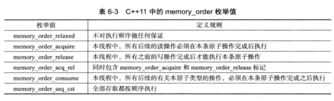

# 内存模型 - 滴水瓦 - 博客园

在C++11标准中，一个重大的更新就是引入了C++多线程内存模型。本文的主要目的在于介绍C++多线程内存模型涉及到的一些原理和概念，以帮助大家理解C++多线程内存模型的作用和意义。

**1\. 顺序一致性模型(Sequential Consistency)**

在介绍C++多线程模型之前，让我们先介绍一下最基本的顺序一致性模型。对多线程程序来说，最直观，最容易被理解的执行方式就是顺序一致性模型。顺序一致性的提出者Lamport给出的定义是：

“… the result of any execution is the same as if the operations of all the processors were executed in some sequential order, and the operations of each individual processor appear in this sequence in the order specified by its program.”

从这个定义中我们可以看出，顺序一致性主要约定了两件事情：

(1).从单个线程的角度来看，每个线程内部的指令都是按照程序规定的顺序(program order)来执行的;

(2).从整个多线程程序的角度来看，整个多线程程序的执行顺序是按照某种交错顺序来执行的，且是全局一致的;

下面我们通过一个例子来理解顺序一致性。假设我们有两个线程(线程1和线程2)，它们分别运行在两个CPU核上，有两个初始值为0的全局共享变量x和y，两个线程分别执行下面两条指令：

[](javascript: "复制代码")

```plain
-Thread 1-
a = 1;
R1 = b;

-Thread 2-
b = 1;
R2 = a;
```

[](javascript: "复制代码")

在不加任何锁或者其他同步措施的情况下，两个线程将会交织执行，但交织执行时指令不发生重排，即线程 1 中的 a = 1 始终在 r1 = b 之前执行，而线程 2 中的 b = 2 始终在 r2= a之前执行 ，因此可能的执行序列共有 4!/(2!\*2!) = 6 种：

<table style="width: 697px; height: 262px"><tbody><tr><td valign="center" width="99"><p class="p" align="center"><strong>情况 <span style="font-family: Times New Roman">1</span></strong>&nbsp;</p></td><td valign="center" width="98"><p class="p" align="center"><strong>情况 <span style="font-family: Times New Roman">2</span></strong></p></td><td valign="center" width="98"><p class="p" align="center"><strong>情况 <span style="font-family: Times New Roman">3</span></strong></p></td><td valign="center" width="98"><p class="p" align="center"><strong>情况 <span style="font-family: Times New Roman">4</span></strong></p></td><td valign="center" width="98"><p class="p" align="center"><strong>情况 <span style="font-family: Times New Roman">5</span></strong></p></td><td valign="center" width="99"><p class="p" align="center"><strong>情况 <span style="font-family: Times New Roman">6</span></strong></p></td></tr><tr><td valign="center" width="99"><p class="p" align="center">a = 1;</p></td><td valign="center" width="98"><p class="p" align="center">b = 2;</p></td><td valign="center" width="98"><p class="p" align="center">a = 1;</p></td><td valign="center" width="98"><p class="p" align="center">a = 1;</p></td><td valign="center" width="98"><p class="p" align="center">b = 2;</p></td><td valign="center" width="99"><p class="p" align="center">b = 2;</p></td></tr><tr><td valign="center" width="99"><p class="p" align="center">R1 = b;</p></td><td valign="center" width="98"><p class="p" align="center">R2 = a;</p></td><td valign="center" width="98"><p class="p" align="center">b = 2;</p></td><td valign="center" width="98"><p class="p" align="center">b = 2;</p></td><td valign="center" width="98"><p class="p" align="center">a = 1;</p></td><td valign="center" width="99"><p class="p" align="center">a = 1;</p></td></tr><tr><td valign="center" width="99"><p class="p" align="center">b = 2;</p></td><td valign="center" width="98"><p class="p" align="center">a = 1;</p></td><td valign="center" width="98"><p class="p" align="center">R1 = b;</p></td><td valign="center" width="98"><p class="p" align="center">R2 = a;</p></td><td valign="center" width="98"><p class="p" align="center">R1 = b;</p></td><td valign="center" width="99"><p class="p" align="center">R2 = b;</p></td></tr><tr><td valign="center" width="99"><p class="p" align="center">R2 = a;</p></td><td valign="center" width="98"><p class="p" align="center">R1 = b;</p></td><td valign="center" width="98"><p class="p" align="center">R2 = a;</p></td><td valign="center" width="98"><p class="p" align="center">R1 = b;</p></td><td valign="center" width="98"><p class="p" align="center">R2 = a;</p></td><td valign="center" width="99"><p class="p" align="center">R1 = b;</p></td></tr><tr><td valign="center" width="99"><p class="p" align="center">R1 == 0, R2 == 1</p></td><td valign="center" width="98"><p class="p" align="center">R1 == 2, R2 == 0</p></td><td valign="center" width="98"><p class="p" align="center">R1 == 2, R2 == 1</p></td><td valign="center" width="98"><p class="p" align="center">R1 == 2, R2 == 1</p></td><td valign="center" width="98"><p class="p" align="center">R1 == 2, R2 == 1</p></td><td valign="center" width="99"><p class="p" align="center">R1 == 2, R2 == 1</p></td></tr></tbody></table>

上面的表格列举了两个线程交织执行时所有可能的执行序列，我们发现，R1,R2 最终结果只有 3 种情况，分别是 R1 == 0, R2 == 1(情况 1)，R1 == 2, R2 == 0(情况2) 和 R1 == 2， R2 == 1(情况 3， 4， 5，6)。结合上面的例子，我想大家应该理解了什么是顺序一致性。

当然，顺序一致性代价太大，不利于程序的优化，现在的编译器在编译程序时通常将指令重新排序（当然前提是保证程序的执行结果是正确的），例如，如果两个变量读写互不相关，编译器有可能将读操作提前（暂且称为预读prefetch 吧），或者尽可能延迟写操作。

假设如下面的代码段：

```plain
int a = 1, b = 2;
void func() {
    a = b + 22;
    b = 22;
}
```

在GCC 4.4 (X86-64)编译条件下，优化选项为 \-O0 时，汇编后关键代码如下：

```plain
movl b(%rip), %eax     //将 b 读入 %eax
addl  $22, %eax        //%eax 加 22, 即 b + 22
movl %eax, a(%rip)     //% 将 %eax 写回至 a, 即 a = b + 22
movl $22, b(%rip)      //设置 b = 22    
```

而在设置 -O2 选项时，汇编后的关键代码如下：

```plain
movl    b(%rip), %eax    //将 b 读入 %eax
movl    $22, b(%rip)     //b = 22
addl    $22, %eax        //%eax 加 22
movl    %eax, a(%rip)    //将 b + 22 的值写入 a,即 a = b + 2
```

上面的例子可以看出，编译器在不同的优化级别下确实对指令进行了不同程度重排，在 -O0(不作优化)的情况下，汇编指令和 C 源代码的逻辑相同，但是在 \-O2 优化级别下，汇编指令和原始代码的执行逻辑不同，由汇编代码可以观察出，b = 22 首先执行，最后才是 a = b + 2， 由此看出，编译器会根据不同的优化等级来适当地对指令进行重排。在单线程条件下上述指令重排不会对执行结果带来任何影响。但是在多线程环境下就不一定了，如果另外一个线程依赖 a，b的值来选择它的执行逻辑，那么上述重排将会产生严重问题。

那么为什么编译器会做这样的乱序优化呢？因为读一个在内存中而不是在cache中的共享变量需要较长的时钟周期，所以编译器就“自作聪明”的让读操作先执行，从而隐藏掉一些指令执行的延迟，从而提高程序的性能。实际上，这种优化是串行时代非常普遍的，因为它对单线程程序的语义是没有影响的。但是在进入多核时代后，编译器缺少语言级的内存模型的约束，导致其可能做出违法顺序一致性规定的多线程语义的错误优化。同样的，多核CPU中的写缓冲区（store buffer）也可能实施乱序优化：它会把要写入内存的值先在缓冲区中缓存起来，以便让该写操作之后的指令先执行，进而出现违反顺序一致性的执行顺序。

编译器优化是一门深奥的技术，但是无论编译器怎么优化，都需要对优化条件作出约束，尤其是在多线程条件下，不能无理由地优化，更不能错误地优化。现代的 CPU 大都支持多发射和乱序执行，在乱序执行时，指令被执行的逻辑可能和程序汇编指令的逻辑不一致，在单线程条件下，CPU 的乱序执行不会带来大问题，但是在多核多线程时代，当多线程共享某一变量时，不同线程对共享变量的读写就应该格外小心，不适当的乱序执行可能导致程序运行错误。

因此，CPU 的乱序执行也需要作出适当的约束。综上所述，我们必须对编译器和 CPU 作出一定的约束才能合理正确地优化你的程序，那么这个约束是什么呢？答曰：内存模型。

C++程序员要想写出高性能的多线程程序必须理解内存模型，编译器会给你的程序做优化(静态)，CPU为了提升性能也有乱序执行(动态)，总之，程序在最终执行时并不会按照你之前的原始代码顺序来执行，因此内存模型是程序员、编译器，CPU 之间的契约，遵守契约后大家就各自做优化，从而尽可能提高程序的性能。

**2\. C++多线程内存模型**

为了更容易的进行多线程编程，程序员希望程序能按照顺序一致性模型执行；但是顺序一致性对性能的损失太大了，CPU和编译器为了提高性能就必须要做优化。对C++程序员来说，随着C++11标准的到来，我们终于可以依赖高级语言内建的多线程内存模型来编写正确的、高性能的多线程程序。

它规定了多个线程访问同一个内存地址时的语义，以及某个线程对内存地址的更新何时能被其它线程看见。

这个模型约定：没有数据竞跑的程序是遵循顺序一致性的。该模型的核心思想就是由程序员用同步原语(例如锁或者C++11中新引入的atomic类型的共享变量)来保证你程序是没有数据竞跑的，这样CPU和编译器就会保证程序是按程序员所想的那样执行的(即顺序一致性)。换句话说，程序员只需要恰当地使用具有同步语义的指令来标记那些真正需要同步的变量和操作，就相当于告诉CPU和编译器不要对这些标记好的同步操作和变量做违反顺序一致性的优化，而其它未被标记的地方可以做原有的优化。编译器和CPU的大部分优化手段都可以继续实施，只是在同步原语处需要对优化做出相应的限制；而且程序员只需要保证正确地使用同步原语即可，因为它们最终表现出来的执行效果与顺序一致性模型一致。由此，C++多线程内存模型帮助我们在易编程性和性能之间取得了一个平衡。

<atomic>中定义的std::memory\_order指定常规的非原子内存访问如何围绕原子操作排序。

 

并非每种memory\_order都可以被atomic的成员使用,通常情况下我们把atomic成员函数可使用memory\_order值分为以下3组:

原子存储操作(store)可使用:memory\_order\_relaxed、memory\_order\_release、memory\_order\_seq\_cst

原子读取操作(load)可使用:memory\_order\_relaxed、memory\_order\_consume、memory\_order\_acquire、memory\_order\_seq\_cst

RMW操作(read-modify-write)即同时读写的操作,如atomic\_flag.test\_and\_set()操作,atomic.atomic\_compare\_exchange()等都是需要同时读写的。可使用:memory\_order\_relaxed、memory\_order\_consume、memory\_order\_acquire、memory\_order\_release、memory\_order\_acq\_rel、memory\_order\_seq\_cst

根据memory\_order使用情况,我们可以将其为 3 类:

顺序一致性模型:std::memory\_order\_seq\_cst

Acquire-Release 模型:std::memory\_order\_consume, std::memory\_order\_acquire, std::memory\_order\_release, std::memory\_order\_acq\_rel

Relax 模型:std::memory\_order\_relaxed

三种不同的内存模型在不同类型的 CPU上(如 X86，ARM，PowerPC等)所带来的代价也不一样。例如，在 X86 或者 X86-64平台下，Acquire-Release 类型的访存序不需要额外的指令来保证原子性，即使顺序一致性类型操作也只需要在写操作(Store)时施加少量的限制，而在读操作(Load)则不需要花费额外的代价来保证原子性。

看一个例子来理解memory\_order对运行结果的影响;

[](javascript: "复制代码")

```plain
#include <iostream>
#include <future>
#include <atomic>

std::atomic<int> x{0};
std::atomic<int> y{0};

void valueSet(int a)
{
    int t = 1;
    x.store(t, std::memory_order_seq_cst);  //1
    y.store(2, std::memory_order_seq_cst);  //2
}

void observer(int a)
{
    std::cout << "x:" << x << " y:" << y << std::endl;
}

int main ()
{
    std::thread t1(valueSet, 0);
    std::thread t2(observer, 0);
    t1.join();
    t2.join();

    return 0;
}
```

[](javascript: "复制代码")

2.1 Sequentially Consistent

原子操作默认的模型,在C++11中的原子类型的变量在线程中总是保持着顺序执行的特性。顺序一致性模型是最简单、直观的序列，但是他也是最昂贵的内存序列，因为它需要对所有线程进行全局同步。在一个多处理系统上，这就需要处理期间进行大量并且费时的信息交换。参数表示为std::memory\_order\_seq\_cst

对于上面的例子，observer打印a,b的时间与valueSet设置a,b的时间可能有多种组合方式，因此输出结果可能为(0,0)(1,2)(1,0),但是不可能为(0,2)。因为遵循顺序一致性,a的赋值操作永远发生在b的赋值操作之前。

2.2 Acquire/Release

若线程A中的一个原子store带memory\_order\_release标签，而线程B中来自同一变量的原子load带memory\_order\_acquire标签，从线程A的视角发生先于原子store的所有内存写入(non-atomic and relaxed atomic)，在线程B中成为可见副作用，一旦线程B中的原子加载完成，则保证线程B能观察到线程A写入内存的所有内容。

同步仅建立在release和acquire同一原子对象的线程之间，其他线程可能看到与被同步线程的一者或两者相异的内存访问顺序。

[](javascript: "复制代码")

```plain
#include <iostream>
#include <future>
#include <atomic>

std::atomic<int> x{0};
std::atomic<int> y{0};

void thread1(int a)
{
    int t = 1;
    x.store(t, std::memory_order_relaxed);
    y.store(2, std::memory_order_release);  //本原子操作前所有的写原子操作必须完成
}

void thread2(int a)
{
    while(y.load(std::memory_order_acquire) != 2);  //本原子操作必须完成才能执行之后所有的读原子操作
    std::cout << x.load(std::memory_order_relaxed) << std::endl;    //1
}

int main ()
{
    std::thread t1(thread1, 0);
    std::thread t2(thread2, 0);
    t1.join();
    t2.join();

    return 0;
}
```

[](javascript: "复制代码")

b.store采用了memory\_order\_release内存序列，这保证了本原子操作前所有的写原子操作必须完成(即a.store操作必须发生于b.store之前)。  

b.load采用了memory\_order\_acquire作为内存序列，这保证了本原子操作必须完成才能执行之后所有的读原子操作(即b.load必须发生在a.load操作之前)。

这样通过确立"先于发生"的关系,我们就保证了代码运行的正确性。

通常其给你看下,先于发生关系总是传递的,比如:原子操作A发生与原子操作B之前,而原子操作B又发生于原子操作C之前的话,则A一定发生于C之前。有了这样的顺序,编译器在重排序指令的时候在不破坏依赖规则的情况下,仅在适当位置插入栅栏,在保证正确执行指令的同时获得最佳的运行性能。

2.3 Consume

若线程A中的原子store带memory\_order\_release标签，而线程B中来自同一原子对象的load带memory\_order\_consume标签，则线程A视角中依赖排序先于原子存储的所有内存写入(non-atomic and relaxed atomic)，会在线程B中该加载操作所携带依赖进入的操作中变成可见副效应，即一旦完成原子加载，则保证线程B中，使用从该加载获得的值的运算符和函数，能见到线程A写入内存的内容。

同步仅在release和consume同一原子对象的线程间建立，其他线程能见到与被同步线程的一者或两者相异的内存访问顺序。

[](javascript: "复制代码")

```plain
#include <iostream>
#include <future>
#include <atomic>
#include <cassert>

std::atomic<std::string*> ptr{nullptr};
std::atomic<int> data{0};

void producer()
{
    std::string *p = new std::string("Hello");
    data.store(42, std::memory_order_relaxed);
    ptr.store(p, std::memory_order_release);
}

void consumer()
{
    std::string* p2;
    while(ptr.load(std::memory_order_consume));
    assert(*p2 == "Hello");
    assert(data.load(std::memory_order_relaxed) == 42);　　//可能断言失败
}

int main ()
{
    std::thread t1(producer);
    std::thread t2(consumer);
    t1.join();
    t2.join();

    return 0;
}
```

[](javascript: "复制代码")

producer函数中使用了memory\_order\_release来为原子类型atomic<string\*>变量ptr存储一个值。

consumer函数中通过memory\_order\_consume的内存顺序来完成变量ptr的读取，这样的内存顺序保证了ptr.load必须发生在\*ptr这样的解引用操作之前。

与memory\_order\_acquire不同的是,该操作并不保证发生在data.load之前,因为data和ptr不是同一个原子类型数据，而memory\_order\_comsume只保证原子操作发生在与ptr有关的原子操作之前。相比与memory\_order\_acquire"先于发生"的关系又被弱化了。  
Comsume模式因为降低了需要在硬件之间同步的数量，所以理论上其执行的速度会比之上面的内存模型块一些，尤其在共享内存大规模数据量情况下，应该会有较明显的差异表现出来。  
在这里，Acquire/Consume~Release这种线程间同步协作的机制就被完全暴露了，通常会形成Acquired/Consume来等待Release的某个状态更新。需要注意的是这样的通信需要两个线程间成对的使用才有意义，同时对于没有使用这个内存模型的第三方线程没有任何作用效果。

2.4 Relaxed

memory\_order\_relaxed标签的原子读或写操没有同步或顺序约束，只保证该操作的原子性和顺序一致性,该指令可以任由编译器重排序和处理器乱序执行。

将上述例子valueSet函数中的1,2处的memory\_order\_seq\_cst替换为memory\_order\_relaxed。这样一来，a,b赋值语句"先于发生"顺序得到了解除,对于observer来说，打印(0,2)这样的结果也就变的合理了。

**总结:**

手册上也这样告诫菜鸟程序员：除非你知道这是什么，需要减弱线程间原子上下文同步的耦合性增加执行效率，才考虑这里的内存模型来优化你的程序，否则还是老老实实的使用默认的memory\_order\_seq\_cst，虽然速度可能会慢点，但是稳妥些，万一由于你不成熟的优化带来问题，是很难去调试的。

---------------------------------------------------


原网址: [访问](https://www.cnblogs.com/DswCnblog/p/6669937.html)

创建于: 2020-09-22 16:19:22

目录: default

标签: `www.cnblogs.com`

