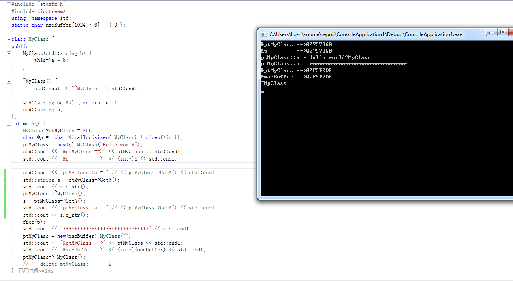

# placement new的用法及用途 - 奔跑吧，蜗牛！ - 博客园

什么是placement new？  
  
所谓placement new就是在用户指定的内存位置上构建新的对象，这个构建过程不需要额外分配内存，只需要调用对象的构造函数即可。  
举例来说:  
class foo{};  
foo\* pfoo = new foo;  
pfoo指向的对象的地址你是不能决定的，因为new已经为你做了这些工作。第一步分配内存，第二步调用类的构造函数。  
而placement new是怎么做的呢，说白了就是把原本new做的两步工作分开来。第一步你自己分配内存，第二步你调用类的构造函数在自己分配的内存上构建新的对象。  
  
  
placement new的好处：  
1）在已分配好的内存上进行对象的构建，构建速度快。  
2）已分配好的内存可以反复利用，有效的避免内存碎片问题。  
  
关于Placement new的标准用法，网上[有一篇文章](http://www.cnblogs.com/felixYeou/archive/2009/04/15/1436209.html)讲得很清楚，我这里再转述一下。  
  

class Foo  
{  
    char cc;  
    float f;  
  
public:  
    void print() { std::cout << "ADDR: " << this << std::endl; }  
    void set\_f( float \_f ) { std::cout << "set f val : " << \_f << std::endl; f \= \_f; }  
    void get\_f() { std::cout << "get f val : " << f << std::endl; }  
};

  
1）分配内存

char\* buff \= new char\[ sizeof(Foo) \* N \];  
memset( buff, 0, sizeof(Foo)\*N );

  
2）构建对象

Foo\* pfoo \= new (buff)Foo;

  
3）使用对象

pfoo\->print();  
  
pfoo\->set\_f(1.0f);  
pfoo\->get\_f();

  
4）析构对象，显式的调用类的析构函数。

pfoo\->~Foo();

  
5）销毁内存

delete \[\] buff;

  
上面5个步骤是标准的placement new的使用方法。  
  
对于buff这块内存可以反复使用，只要重复2）、3）、4）步骤即可。  
  
placement new还可以解决的一个问题是建立带参数的构造函数对象数组。  
代码示例如下：

 1 class CPong  
 2 {  
 3 public:  
 4  CPong( int m ) : v(m) { std::cout << "CPong ctor." << std::endl; }  
 5  6 private:  
 7  int v;  
 8 };  
 9 char\* pong \= new char\[ sizeof(CPong) \* 10 \];  
10 CPong\* pp \= (CPong\*)pong;  
11   
12 for ( int i\=0; i<10; ++i )  
13 {  
14  new (pp+i)CPong(i);  
15 }  
16   
17 for ( int j\=0; j<10; ++j )  
18 {  
19  pp\[j\].~CPong();  
20 }  
21   
22 delete \[\] pong;

参考 http://www.cppblog.com/kongque/archive/2010/02/20/108093.html

---------------------------------------------------

原网址: [访问](https://www.cnblogs.com/xzlq/p/9504851.html)

创建于: 2020-09-22 18:05:59

目录: default

标签: `www.cnblogs.com`

