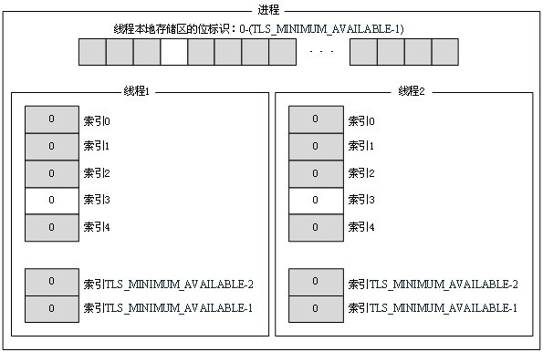

# [TLS--线程局部存储](https://www.cnblogs.com/stli/archive/2010/11/03/1867852.html)

**概念**：线程局部存储（Thread Local Storage，TLS）用来将数据与一个正在执行的指定线程关联起来。

进程中的全局变量与函数内定义的静态(static)变量，是各个线程都可以访问的共享变量。在一个线程修改的内存内容，对所有线程都生效。这是一个优点也是一个缺点。说它是优点，线程的数据交换变得非常快捷。说它是缺点，一个线程死掉了，其它线程也性命不保; 多个线程访问共享数据，需要昂贵的同步开销，也容易造成同步相关的BUG。

 如果需要在一个线程内部的各个函数调用都能访问、但其它线程不能访问的变量（被称为static memory local to a thread 线程局部静态变量），就需要新的机制来实现。这就是TLS。

 线程局部存储在不同的平台有不同的实现，可移植性不太好。幸好要实现线程局部存储并不难，最简单的办法就是建立一个全局表，通过当前线程ID去查询相应的数据，因为各个线程的ID不同，查到的数据自然也不同了。大多数平台都提供了线程局部存储的方法，无需要我们自己去实现：

linux: int pthread\_key\_create(pthread\_key\_t \*key, void (\*destructor)(void\*)); int pthread\_key\_delete(pthread\_key\_t key); void \*pthread\_getspecific(pthread\_key\_t key); int pthread\_setspecific(pthread\_key\_t key, const void \*value);  

 **功能**：它主要是为了避免多个线程同时访存同一全局变量或者静态变量时所导致的冲突，尤其是多个线程同时需要修改这一变量时。为了解决这个问题，我们可以通过TLS机制，为每一个使用该全局变量的线程都提供一个变量值的副本，每一个线程均可以独立地改变自己的副本，而不会和其它线程的副本冲突。从线程的角度看，就好像每一个线程都完全拥有该变量。而从全局变量的角度上来看，就好像一个全局变量被克隆成了多份副本，而每一份副本都可以被一个线程独立地改变。

**分类**：动态TLS和静态TLS。

**用途**：动态TLS和静态TLS这两项技术在创建DLL的时候更加有用，这是因为DLL通常并不知道它们被链接到的应用程序的结构是什么样的。

1． 如果应用程序高度依赖全局变量或静态变量，那么TLS可以成为我们的救生符。因而最好在开发中最大限度地减少对此类变量的使用，更多的依赖于自动变量（栈上的变量）和通过函数参数传入的数据，因为栈上的变量始终都是与某个特定的线程相关联的。如果不使用此类变量，那么就可以避免使用TLS。

2． 但是在编写应用程序时，我们一般都知道自己要创建多少线程，自己会如何使用这些线程，然后我们就可以设计一些替代方案来为每个线程关联数据，或者设计得好一点的话，可以使用基于栈的方法（局部变量）来为每个线程关联数据。

1 动态TLS

系统中每个进程都有一组正在使用标志（in-use flags），每个标志可以被设为FREE或INUSE，表示该TLS元素是否正在被使用。

进程中的线程是通过使用一个数组来保存与线程相关联的数据的，这个数组由TLS\_MINIMUM\_AVAILABLE个元素组成，在WINNT.H文件中该值被定义为64个。也就是说当线程创建时，系统给每一个线程分配了一个数组，这个数组共有TLS\_MINIMUM\_AVAILABLE个元素，并且将这个数组的各个元素初始化为0，之后系统把这个数组与新创建的线程关联起来。每一个线程中都有它自己的数组，数组中的每一个元素都能保存一个32位的值。在使用这个数组前首先要判定，数组中哪个元素可以使用，这将使用函数TlsAlloc来判断。函数TlsAlloc判断数组中一个元素可用后，就把这个元素分配给调用的线程，并保留给调用线程。要为数组中的某个元素赋值可以使用函数TlsSetValue，要得到某个元素的值可以使用TlsGetValue。

 

 一般通过调用一组4个API函数来使用动态TLS：TlsAlloc、TlsSetValue、TlsGetValue和TlsFree。

1）要使用动态TLS，必须先调用TlsAlloc函数：

DWORD WINAPI TlsAlloc(void);

 这个函数让系统对进程中的位标志进行检索并找到一个FREE标志，然后系统会将该标志从FREE改为INUSE并让TlsAlloc返回该标志在位数组中的索引。一个DLL（或应用程序）通常将这个索引保存在一个全局变量中。由于这个值会在整个进程地址范围内使用，而不是在线程范围内使用，因此这种情况下全局变量是一个更好的选择。

如果TlsAlloc无法在列表中找到一个FREE标志，那么它会返回TLS\_OUT\_OF\_INDEXES（在WinBase.h中被定义为0xFFFFFFFF）。

当系统创建一个线程的时候，会分配TLS\_MINIMUM\_AVAILABLE个PVOID值，将它们都初始化为0，并与线程关联起来。每个线程都有自己的PVOID数组，数组中的每个PVOID可以保存任意值。在能够将信息保存到线程的PVOID数组中之前，我们必须知道数组中的哪个索引可供使用\---这就是调用TlsAlloc的目的。TlsAlloc为我们预定了一个索引，如果为2，即TlsAlloc返回值为2，那么无论是进程中当前正在运行的线程，还是今后可能会创建的线程，都不能再使用该索引2了。

2）为了把一个值放到线程的PVOID数组中，应该调用TlsSetValue函数：

BOOL WINAPI TlsSetValue(  
    \_\_in      DWORD dwTlsIndex, //索引值，表示在数组中的具体位置  
 \_\_in\_opt  LPVOID lpTlsValue //要设置的值  
);  

 当一个线程调用TlsSetValue函数成功时，它会修改自己的PVOID数组，但它无法修改另一个线程的TLS值。在调用TlsSetValue时，我们应该总是传入前面在调用TlsAlloc时返回的索引。因为Windows为了效率牺牲了对输入值的错误检测。

3）为了从线程的数组中取回一个值，应该调用函数TlsGetValue：

LPVOID WINAPI TlsGetValue(  
      \_\_in  DWORD dwTlsIndex //索引值  
);  

 这个函数会返回在索引为dwTlsIndex的TLS元素中保存的值。TlsGetValue只会查看属于调用线程的数组。

4）当不再需要一个已经预定的TLS元素时，应该调用TlsFree函数：

BOOL WINAPI TlsFree(  
      \_\_in  DWORD dwTlsIndex //索引值  
);  

这个函数告诉系统已经预定的这个TLS元素现在不需要了，函数会将进程内的位标志数组中对应的INUSE标志重新设回FREE。此外，函数还会将所有线程中该元素的内容设为0.

**使用动态****TLS****：**

通常，如果DLL要使用TLS，那它会在DllMain函数处理DLL\_PROCESS\_ATTACH的时候调用TlsAlloc，在DllMain处理DLL\_PROCESS\_DETACH的时候调用TlsFree。而TlsSetValue和TlsGetValue的调用则最有可能发生在DLL所提供的其他函数中。而向应用程序中添加TLS的一种方法是直到需要时才添加。

下面是在应用程序中使用动态TLS的实例代码：

**示例****1****：**

#include <windows.h\>#include <stdio.h\>  
#define THREADCOUNT 4DWORD dwTlsIndex;  
VOID ErrorExit(LPSTR);   
VOID CommonFunc(VOID)  
{  
   LPVOID lpvData; // Retrieve a data pointer for the current thread.   
 lpvData \= TlsGetValue(dwTlsIndex); if ((lpvData \== 0) && (GetLastError() != ERROR\_SUCCESS))  
      ErrorExit("TlsGetValue error"); // Use the data stored for the current thread.   
 printf("common: thread %d: lpvData=%lx\\n",  
      GetCurrentThreadId(), lpvData);   
   Sleep(5000);  
}   
DWORD WINAPI ThreadFunc(VOID)  
{  
   LPVOID lpvData; // Initialize the TLS index for this thread.   
 lpvData \= (LPVOID) LocalAlloc(LPTR, 256); if (! TlsSetValue(dwTlsIndex, lpvData))  
      ErrorExit("TlsSetValue error");   
   printf("thread %d: lpvData=%lx\\n", GetCurrentThreadId(), lpvData);   
   CommonFunc(); // Release the dynamic memory before the thread returns.   
 lpvData \= TlsGetValue(dwTlsIndex); if (lpvData != 0)  
      LocalFree((HLOCAL) lpvData); return 0;  
} int main(VOID)  
{  
   DWORD IDThread;  
   HANDLE hThread\[THREADCOUNT\]; int i; // Allocate a TLS index.   
 if ((dwTlsIndex \= TlsAlloc()) \== TLS\_OUT\_OF\_INDEXES)  
      ErrorExit("TlsAlloc failed"); // Create multiple threads.   
 for (i \= 0; i < THREADCOUNT; i++)  
   {  
      hThread\[i\] \= CreateThread(NULL, // default security attributes  
 0, // use default stack size  
 (LPTHREAD\_START\_ROUTINE) ThreadFunc, // thread function  
 NULL, // no thread function argument  
 0, // use default creation flags  
 &IDThread); // returns thread identifier // Check the return value for success.  
 if (hThread\[i\] \== NULL)  
         ErrorExit("CreateThread error\\n");  
   } for (i \= 0; i < THREADCOUNT; i++)  
      WaitForSingleObject(hThread\[i\], INFINITE);   
   TlsFree(dwTlsIndex); return 0;  
}  
VOID ErrorExit (LPSTR lpszMessage)  
{  
   fprintf(stderr, "%s\\n", lpszMessage);  
   ExitProcess(0);  
}  

示例二：

#include <stdio.h\>#include <windows.h\>#include <process.h\>  
  
// 利用TLS记录线程的运行时间  
  
DWORD g\_tlsUsedTime;  
void InitStartTime();  
DWORD GetUsedTime();  
  
  
UINT \_\_stdcall ThreadFunc(LPVOID)  
{ int i; // 初始化开始时间  
 InitStartTime(); // 模拟长时间工作  
 i \= 10000\*10000; while(i\--) { } // 打印出本线程运行的时间  
 printf(" This thread is coming to end. Thread ID: %-5d, Used Time: %d \\n",   
            ::GetCurrentThreadId(), GetUsedTime()); return 0;  
}  
  
int main(int argc, char\* argv\[\])  
{  
  UINT uId; int i;  
  HANDLE h\[10\]; // 通过在进程位数组中申请一个索引，初始化线程运行时间记录系统  
 g\_tlsUsedTime \= ::TlsAlloc(); // 令十个线程同时运行，并等待它们各自的输出结果  
 for(i\=0; i<10; i++)  
  {  
    h\[i\] \= (HANDLE)::\_beginthreadex(NULL, 0, ThreadFunc, NULL, 0, &uId);  
  } for(i\=0; i<10; i++)  
  {  
    ::WaitForSingleObject(h\[i\], INFINITE);  
    ::CloseHandle(h\[i\]);  
  } // 通过释放线程局部存储索引，释放时间记录系统占用的资源  
 ::TlsFree(g\_tlsUsedTime); return 0;  
}  
  
// 初始化线程的开始时间  
void InitStartTime()  
{ // 获得当前时间，将线程的创建时间与线程对象相关联  
 DWORD dwStart \= ::GetTickCount();  
  ::TlsSetValue(g\_tlsUsedTime, (LPVOID)dwStart);  
}// 取得一个线程已经运行的时间  
DWORD GetUsedTime()  
{ // 获得当前时间，返回当前时间和线程创建时间的差值  
 DWORD dwElapsed \= ::GetTickCount();  
  dwElapsed \= dwElapsed \- (DWORD)::TlsGetValue(g\_tlsUsedTime); return dwElapsed;  
}

 下面的实例代码是在DLL中使用TLS的：

**示例三：**

// The DLL code   
#include <windows.h\>  static DWORD dwTlsIndex; // address of shared memory // DllMain() is the entry-point function for this DLL.   
BOOL WINAPI DllMain(HINSTANCE hinstDLL, // DLL module handle  
 DWORD fdwReason, // reason called  
 LPVOID lpvReserved) // reserved  
{  
    LPVOID lpvData;  
    BOOL fIgnore; switch (fdwReason)  
    { // The DLL is loading due to process // initialization or a call to LoadLibrary.  
  case DLL\_PROCESS\_ATTACH: // Allocate a TLS index.  
  if ((dwTlsIndex \= TlsAlloc()) \== TLS\_OUT\_OF\_INDEXES) return FALSE; // No break: Initialize the index for first thread. // The attached process creates a new thread.  
  case DLL\_THREAD\_ATTACH: // Initialize the TLS index for this thread.  
 lpvData \= (LPVOID) LocalAlloc(LPTR, 256); if (lpvData != NULL)  
                fIgnore \= TlsSetValue(dwTlsIndex, lpvData); break; // The thread of the attached process terminates.  
  case DLL\_THREAD\_DETACH: // Release the allocated memory for this thread.  

 

分类: [Windows 核心编程](https://www.cnblogs.com/stli/category/265557.html)

[好文要顶](javascript:) [关注我](javascript:) [收藏该文](javascript:)  

[tungli](https://home.cnblogs.com/u/stli/)  
[关注 - 2](https://home.cnblogs.com/u/stli/followees/)  
[粉丝 - 38](https://home.cnblogs.com/u/stli/followers/)

[+加关注](javascript:)

4

0

[«](https://www.cnblogs.com/stli/archive/2004/01/13/1853190.html) 上一篇： [OOPC:Object-Oriented Programming in C](https://www.cnblogs.com/stli/archive/2004/01/13/1853190.html "发布于 2004-01-13 00:00")  
[»](https://www.cnblogs.com/stli/archive/2004/01/13/1873152.html) 下一篇： [C变长参数](https://www.cnblogs.com/stli/archive/2004/01/13/1873152.html "发布于 2004-01-13 00:00")

posted @ 2010-11-03 11:14  [tungli](https://www.cnblogs.com/stli/)  阅读(17180)  评论(2)  [编辑](https://i.cnblogs.com/EditPosts.aspx?postid=1867852)  [收藏](javascript:)

努力加载评论中...

[刷新评论](javascript:)[刷新页面](#)[返回顶部](#top)

[【推荐】超50万行VC++源码: 大型组态工控、电力仿真CAD与GIS源码库](http://www.ucancode.com/index.htm)  
[【推荐】为自己发“声” —— 声网RTC征文大赛在园子里征稿](https://www.cnblogs.com/cmt/p/13704696.html)  
[【推荐】未知数的距离，毫秒间的传递，声网与你实时互动](https://brands.cnblogs.com/agora)  
[【推荐】了不起的开发者，挡不住的华为，园子里的品牌专区](https://brands.cnblogs.com/huawei)  
[【推荐】SSL证书一站式服务，上海CA权威认证](https://www.sheca.com/assets/wwx/page1.html?site=bokeyuan)  
[【推荐】独家下载 |《大数据工程师必读手册》揭秘阿里如何玩转大数据](https://developer.aliyun.com/article/727136?utm_content=g_1000104144)  

**最新 IT 新闻**:  
· [国民轿车鼻祖消亡！一汽夏利1元甩卖资产 将退出整车制造行业](https://news.cnblogs.com/n/673425/)  
· [升级后让设备性能变慢：微软撤回Win10更新 不强制安装Edge](https://news.cnblogs.com/n/673424/)  
· [柔宇发布新一代折叠屏手机：配骁龙865 售价9988元起](https://news.cnblogs.com/n/673423/)  
· [家族群里的爆款文章，是怎么收割老年人的？](https://news.cnblogs.com/n/673422/)  
· [9家公司5家亏损，国产动漫真的崛起了吗？](https://news.cnblogs.com/n/673421/)  
» [更多新闻...](https://news.cnblogs.com/ "IT 新闻")

昵称： [tungli](https://home.cnblogs.com/u/stli/)  
园龄： [10年8个月](https://home.cnblogs.com/u/stli/ "入园时间：2010-01-16")  
粉丝： [38](https://home.cnblogs.com/u/stli/followers/)  
关注： [2](https://home.cnblogs.com/u/stli/followees/)

---------------------------------------------------

原网址: [访问](https://www.cnblogs.com/stli/archive/2010/11/03/1867852.html)

创建于: 2020-09-22 17:13:55

目录: default

标签: `www.cnblogs.com`

