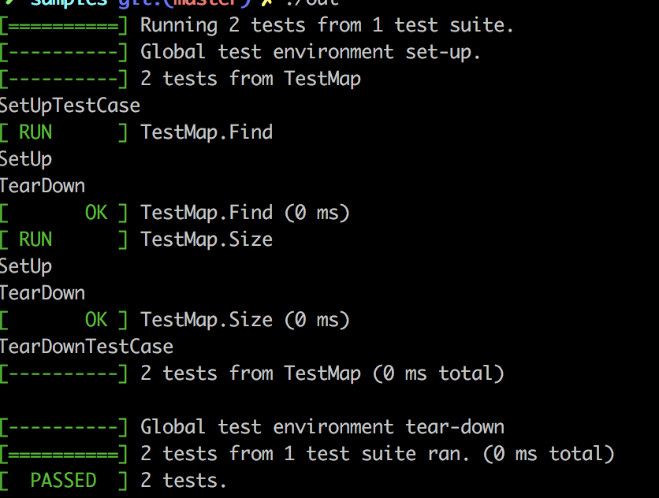

#一、gtest系列之TEST宏

> TEST(test_case_name, test_name)
> TEST_F(test_fixture,test_name)  
> //多个测试场景需要相同数据配置的情况，用TEST_F。
> //TEST_F  test fixture，测试夹具，测试套，承担了一个注册的功能。

TEST宏的作用是创建一个简单测试，它定义了一个测试函数，在这个函数里可以使用任何C++代码并使用提供的断言来进行检查。后续文章还会提到TEST_P这个宏，在这里就先不介绍了。

#二、gtest系列之断言
##2.1 原理
gtest中断言的宏可以分为两类：一类是ASSERT宏，另一类就是EXPECT宏了。
1、ASSERT_系列：如果当前点检测失败则退出当前函数
2、EXPECT_系列：如果当前点检测失败则继续往下执行
如果你对自动输出的错误信息不满意的话，也是可以通过operator<<能够在失败的时候打印日志，将一些自定义的信息输出。
ASSERT_系列：

> bool值检查
> 1>、 ASSERT_TRUE(参数)，期待结果是true
> 2>、ASSERT_FALSE(参数)，期待结果是false
> 数值型数据检查
> 3>、ASSERT_EQ(参数1，参数2)，传入的是需要比较的两个数  equal
> 4>、ASSERT_NE(参数1，参数2)，not equal，不等于才返回true
> 5>、ASSERT_LT(参数1，参数2)，less than，小于才返回true
> 6>、ASSERT_GT(参数1，参数2)，greater than，大于才返回true
> 7>、ASSERT_LE(参数1，参数2)，less equal，小于等于才返回true
> 8>、ASSERT_GE(参数1，参数2)，greater equal，大于等于才返回true
> 字符串检查
> 9>、ASSERT_STREQ(expected_str, actual_str)，两个C风格的字符串相等才正确返回
> 10>、ASSERT_STRNE(str1, str2)，两个C风格的字符串不相等时才正确返回
> 11>、ASSERT_STRCASEEQ(expected_str, actual_str)
> 12>、ASSERT_STRCASENE(str1, str2)
> 13>、EXPECT_系列，也是具有类似的宏结构的
> 
> 

##2.2 详细用法
###（1）布尔值检查

|  Fatal assertion   | Nonfatal assertion  | Verifies |
|  ----  | ----  | ---- |
| ASSERT_TRUE(condition);  | EXPECT_TRUE(condition); | condition is true |
| ASSERT_FALSE(condition);  | EXPECT_FALSE(condition); | condition is false |


### （2）数值型数据检查
|  Fatal assertion   | Nonfatal assertion  | Verifies |
|  ----  | ----  | ---- |
| ASSERT_EQ(expected, actual); | EXPECT_EQ(expected, actual); | expected == actual |
| ASSERT_NE(val1, val2);  | EXPECT_NE(val1, val2); | val1 != val2 |
| ASSERT_LT(val1, val2);  | EXPECT_LT(val1, val2);  | val1 < val2 |
| ASSERT_LE(val1, val2);  | EXPECT_LE(val1, val2); | val1 <= val2 |
| ASSERT_GT(val1, val2);  | EXPECT_GT(val1, val2);  | val1 > val2 |
| ASSERT_GE(val1, val2);  | EXPECT_GE(val1, val2);  | val1 >= val2 |

###（3）字符串比较
|  Fatal assertion   | Nonfatal assertion  | Verifies |
|  ----  | ----  | ---- |
|  ASSERT_STREQ(expected_str, actual_str);  | EXPECT_STREQ(expected_str, actual_str); | 两个C字符串有相同的内容 |
|  ASSERT_STRNE(str1, str2);  | EXPECT_STRNE(str1, str2); | 两个C字符串有不同的内容 |
|  ASSERT_STRCASEEQ(expected_str, actual_str);  | EXPECT_STRCASEEQ(expected_str, actual_str);  | 两个C字符串有相同的内容，忽略大小写 |
|  ASSERT_STRCASENE(str1, str2);  | EXPECT_STRCASENE(str1, str2);  | 两个C字符串有不同的内容，忽略大小写 |

###（4）异常检查
|  Fatal assertion   | Nonfatal assertion  | Verifies |
|  ----  | ----  | ---- |
|  ASSERT_THROW(statement, exception_type); | EXPECT_THROW(statement, exception_type);  | statement throws an exception of the given type |
|  ASSERT_ANY_THROW(statement);  | EXPECT_ANY_THROW(statement);  | statement throws an exception of any type |
|  ASSERT_NO_THROW(statement);  | EXPECT_NO_THROW(statement);  | statement doesn't throw any exception |

###（5）浮点型检查
|  Fatal assertion   | Nonfatal assertion  | Verifies |
|  ----  | ----  | ---- |
|  ASSERT_FLOAT_EQ(expected, actual);  | EXPECT_FLOAT_EQ(expected, actual);  | the two float values are almost equal |
|  ASSERT_DOUBLE_EQ(expected, actual);  | EXPECT_DOUBLE_EQ(expected, actual);  | the two double values are almost equal |


对相近的两个数比较：

|  Fatal assertion   | Nonfatal assertion  | Verifies |
|  ----  | ----  | ---- |
|  ASSERT_NEAR(val1, val2, abs_error);  | EXPECT_NEAR(val1, val2, abs_error);  | the difference between val1 and val2 doesn't exceed the given absolute error |

###（6）此外还有类型检查、谓词检查等

##2.3 一个例子

```cpp
#include<iostream>
using namespace std; 
#include<gtest/gtest.h>

int Abs(int x)
{
     return x > 0 ? x : -x;
}

TEST(IsAbsTest,HandlerTrueReturn)
{
    ASSERT_TRUE(Abs(1) == 1) << "Abs(1)=1";  //ASSERT_TRUE期待结果是true,operator<<输出一些自定义的信息
    ASSERT_TRUE(Abs(-1) == 1) << "Abs(-1)=1";
    ASSERT_FALSE(Abs(-2) == -2);  //期待结果是false
    ASSERT_EQ(Abs(1),Abs(-1));
    ASSERT_NE(Abs(-1),0);
    ASSERT_LT(Abs(-1),2);
    ASSERT_GT(Abs(-1),0);
    ASSERT_LE(Abs(-1),2);
    ASSERT_GE(Abs(-1),0);
}
//要加上最后这段
int main(int argc, char*argv[])
{
    testing::InitGoogleTest(&argc, argv);
    RUN_ALL_TESTS();
}
```
#三、gtest系列之事件机制
##3.1 原理
“事件” 本质是框架给你提供了一个机会, 让你能在这样的几个机会来执行你自己定制的代码, 来给测试用例准备/清理数据。gtest提供了多种事件机制，总结一下gtest的事件一共有三种：
1、TestSuite事件
需要写一个类，继承testing::Test，然后实现两个静态方法：SetUpTestCase方法在第一个TestCase之前执行；TearDownTestCase方法在最后一个TestCase之后执行。
2、TestCase事件
是挂在每个案例执行前后的，需要实现的是SetUp方法和TearDown方法。SetUp方法在每个TestCase之前执行；TearDown方法在每个TestCase之后执行。
3、全局事件
要实现全局事件，必须写一个类，继承testing::Environment类，实现里面的SetUp和TearDown方法。SetUp方法在所有案例执行前执行；TearDown方法在所有案例执行后执行。

##3.2 全局事件例子
例如全局事件可以按照下列方式来使用：
除了要继承testing::Environment类，还要定义一个该全局环境的一个对象并将该对象添加到全局环境测试中去。

```cpp
#include <iostream>
#include <gtest/gtest.h>
using namespace std;

class GlobalTest: public testing::Environment
{
public:
	virtual void SetUp()
	{
		cout<<"SetUp()"<<endl;
	}

	virtual void TearDown()
	{
		cout<<"TearDownp()"<<endl;
	}
};

int main(int argc, char*argv[])
{
    testing::InitGoogleTest(&argc, argv);
	testing::Environment* env = new GlobalTest();
	testing::AddGlobalTestEnvironment(env);
    return RUN_ALL_TESTS();
}
```

##3.3 test fixture例子
```cpp
#include <iostream>
#include <gtest/gtest.h>
using namespace std;

class TestMap:public testing::Test
{
public:
    //添加日志
    static void SetUpTestCase()
    {
        cout<<"SetUpTestCase"<<endl;
    }
    static void TearDownTestCase()
    {
        cout<<"TearDownTestCase"<<endl;
    }
    virtual void SetUp()   //TEST跑之前会执行SetUp
    {
        cout<<"SetUp"<<endl;
        test_map.insert(make_pair(1,0));
        test_map.insert(make_pair(2,1));
        test_map.insert(make_pair(3,2));
        test_map.insert(make_pair(4,3));
        test_map.insert(make_pair(5,4));
    }
    virtual void TearDown() //TEST跑完之后会执行TearDown
    {
        cout<<"TearDown"<<endl;
        test_map.clear();
    }
    map<int,int> test_map;
};

TEST_F(TestMap,Find)   //此时使用的是TEST_F宏
{
    map<int,int>::iterator it=test_map.find(1);
    ASSERT_NE(it,test_map.end());
}

TEST_F(TestMap,Size)
{
    ASSERT_EQ(test_map.size(),5);
}

int main(int argc,char *argv[])
{
    testing::InitGoogleTest(&argc, argv);//将命令行参数传递给gtest
    return RUN_ALL_TESTS();   //RUN_ALL_TESTS()运行所有测试案例
}
```

 {:height="100" width="100"}

#四、gtest系列之死亡测试
这里的”死亡”指的是程序的奔溃。通常在测试的过程中，我们需要考虑各种各样的输入，有的输入可能直接导致程序奔溃，这个时候我们就要检查程序是否按照预期的方式挂掉，这也就是所谓的”死亡测试”。
死亡测试所用到的宏：

> 1>、ASSERT_DEATH(参数1，参数2)，程序挂了并且错误信息和参数2匹配，此时认为测试通过。如果参数2为空字符串，则只需要看程序挂没挂即可。
> 2>、ASSERT_EXIT(参数1，参数2，参数3)，语句停止并且错误信息和被提前给的信息匹配。

下面我们再来做一个测试实例，测试当程序出问题时候死亡测试如何使用？

```cpp
#include <iostream>
using namespace std;
#include <gtest/gtest.h>

int func()
{
	int *ptr = NULL;
	*ptr = 100;
	return 0;
}

TEST(FuncDeathTest, Nullptr)
{
	ASSERT_DEATH(func(), "");
}

int main(int argc, char*argv[])
{
    testing::InitGoogleTest(&argc, argv);
    return RUN_ALL_TESTS();
}
```

#五、一个关于gtest的简单例子

```cpp
#include<iostream>
using namespace std;
#include<gtest/gtest.h>

struct LinkNode
{
    int _data;
    LinkNode *_next;
    LinkNode(const int& data)
        :_data(data)
        ,_next(NULL)
    {}
};

class Link
{
public:
    Link()
        :pHead(new LinkNode(0))
    {}
    void PushBack(const int& data)
    {
        if(pHead == NULL)
            return ;
        LinkNode *newNode=new LinkNode(data);
        if(pHead->_next == NULL){  //第一次插入结点
            pHead->_next=newNode;
        }
        else{  //找到最后一个结点直接尾插
            LinkNode *cur=pHead->_next;
            while(cur->_next){
                cur=cur->_next;
            }
            cur->_next=newNode;
        }
    }

    void PopBack()
    {
        if(pHead == NULL)
            return ;
        LinkNode *cur=pHead;
        LinkNode *prev=NULL;
        while(cur->_next)
        {
            prev=cur;
            cur=cur->_next;
        }
        prev->_next=NULL;
        delete cur;
    }

    LinkNode *FindNode(const int& data)
    {
        if(pHead == NULL)
            return NULL;
        LinkNode *cur=pHead->_next;
        while(cur)
        {
            if(cur->_data == data)
                return cur;
            cur=cur->_next;
        }
        return NULL;
    }

    bool Delete(int data)
    {
        LinkNode *pos=FindNode(data);
        if(pos == NULL)
            return false;
        LinkNode *cur=pHead->_next;
        while(cur->_next != pos)
        {
            cur=cur->_next;
        }
        cur->_next=pos->_next;
        delete pos;
        return true;
    }

    void Destroy()
    {
        if(pHead == NULL)
            return;
        LinkNode *cur=pHead->_next;
        while(cur)
        {
            LinkNode *del=cur;
            cur=cur->_next;
            delete del;
            del=NULL;
        }
        delete pHead;  //删除头结点
    }
    LinkNode *pHead;
};

class TestLink:public testing::Test
{
public:
    virtual void SetUp()
    {
        cout<<"SetUp"<<endl;
        for(int i=1;i<=5;i++){
            link.PushBack(i);
        }
    }
    virtual void TearDown()
    {
        cout<<"TearDown"<<endl;
        link.Destroy();
    }
    Link link;
};

TEST_F(TestLink,PushBack)
{
    ASSERT_FALSE(link.pHead == NULL);
    link.PushBack(9);
    LinkNode *res=link.FindNode(9);
    ASSERT_FALSE(res == NULL);
}

TEST_F(TestLink,PopBack)
{
    for(int i=1;i<=5;i++){
        link.PopBack();
    }
}

TEST_F(TestLink,FindNode)
{
    ASSERT_TRUE(link.FindNode(3));
    ASSERT_TRUE(link.FindNode(2));
    ASSERT_TRUE(link.FindNode(4));
    ASSERT_TRUE(link.FindNode(5));
    ASSERT_TRUE(link.FindNode(1));
    ASSERT_FALSE(link.FindNode(7));
}

TEST_F(TestLink,Delete)
{
    ASSERT_FALSE(link.pHead == NULL);
    ASSERT_TRUE(link.Delete(3) == true);
    ASSERT_TRUE(link.Delete(9) == false);
}

int main(int argc,char *argv[])
{
    testing::InitGoogleTest(&argc,argv);
    return RUN_ALL_TESTS();
}
```
