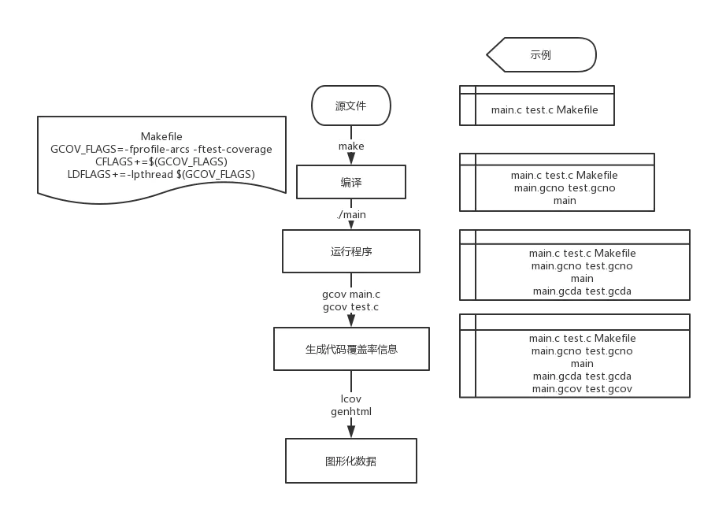

#一、流程梳理：
1.在对源代码进行编译时，我们使用make工具进行，并在编译过程中进行插桩。

编译后，还会获得源代码文件对应的gcno文件。

2.进行过插桩的程序，在被执行时即创建与源文件一一对应的.gcda文件。

.gcda文件会记录源代码的运行数据

3.在既有源文件又有gcda文件的情况下，使用命令gcov *.c，就会生成gcov文件

文件名为xxx.x.gcov

gcov文件包含着代码的覆盖信息

4.使用lcov生成info数据

5.最后使用lcov自带的genhtml工具，生成网页结果报告

总结来说如图所示


#二、应用示例：
##2.1.写个超简单的程序
由main.c和test.c组成

main.c

```cpp
#include <stdio.h>
#include <stdlib.h>

void test(int vount);

int main(int argc, char *argv[])
{
    int i = 0;
    if(argc == 2)
        i = -1;
    else
        i = 10;
    printf("arg is %d\n",i);
    test(i);
    return EXIT_SUCCESS;
}
```

test.c

```cpp
#include <stdio.h>

void test(int count)
{
    if (count == -1)
        printf ("获取到值为2,%d为-1,测试通道二已通过",count);
    else
        printf ("滴滴滴，测试通道一已通过");
}
```

##2.2.编写Makefile文件
使用Makefile文件用于编译

```makefile
GCOV_FLAGS=-fprofile-arcs -ftest-coverage
CFLAGS+=$(GCOV_FLAGS)
LDFLAGS+=-lpthread $(GCOV_FLAGS)

target=main

all:$(target)

main : test.o main.o
    $(CC) $(CFLAGS) $^ -o $@ $(LDFLAGS)
    @echo "gdb-gcov测试程序覆盖率..."

%.o : %.c
    $(CC) -g -c $^ -o $@ $(CFLAGS) $(DEFINES)

.PHONY : clean
clean :
    rm -rf *.o
    rm -rf $(target)
    rm -rf *.gcov *.gcda *.gcno
```
前三行用于设置GCC及插桩

需要注意的是，在这里，我们使用的是C语言。不同语言的源文件在编译时有所区别，具体请学习Makefile相关

##2.3.运行程序
	./main
	
##2.4.GCOV生成覆盖率数据
	gcov main.c
	gcov test.c
	
##2.5.LCOV处理数据并生成结果网页
	lcov -d . -t 'Main Test' -o 'main_test.info' -b . -c
	genhtml -o result main_test.info
最后再在文件夹中找到打开网页，即可查看到代码的覆盖率啦


#三、GCOV
##3.1Gcov常用参数
参数 |	描述
| ---- | ---- |
-a|	输出每个基本块的运行计数, 此选项可用于统计在同一行中的若干语句的各自运行次数
-b|	输出分支语句频率信息到输出文件, 以及概要信息到标准输出, 但不显示无条件分支
-c|	以数字而不是百分比显示分支频率
-n|	不创建输出文件
-l|	创建的输出文件名中包含头文件名, 这对于头文件中包含代码并被多个源文件使用时有用
-p|	在 .gocv 文件名中加入完整的路径信息, 此时路径中的 ‘/’ 用 ‘#’ 表示, ‘..’ 用 ‘^’ 表示
-f|	输出每个函数的概要信息

#四.LCOV&Genhtml
##4.1 LCOV使用格式
	lcov -d . -t '表格名称' -o '文件名称.info' -b . -c
##4.2 Genhtml使用格式
	genhtml -o 输出目录名 文件名.info

