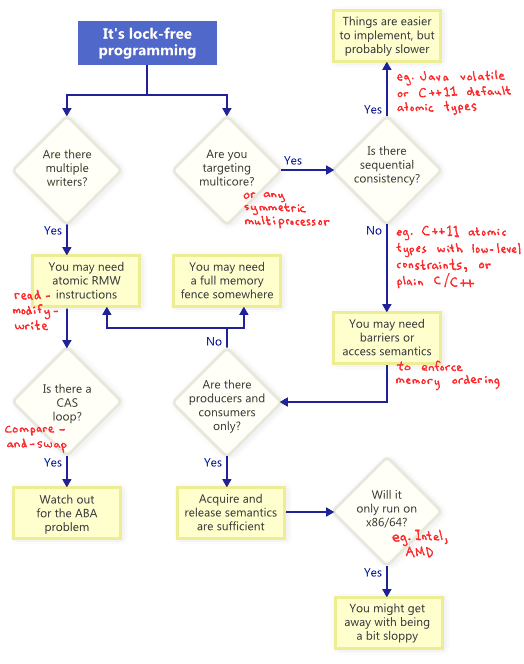

# [Lock-Free 编程](https://www.cnblogs.com/gaochundong/p/lock_free_programming.html)

## 文章索引

*   **[Lock-Free 编程是什么？](#what_is_lock_free_programming)**
*   **[Lock-Free 编程技术](#lock_free_programming_techniques)[  
    ](#memory_model)**
    *   **[读改写原子操作（Atomic Read-Modify-Write Operations）](#atomic_read_modify_write_operations)**
    *   **[Compare-And-Swap 循环（CAS Loops）](#cas_loops)**
    *   **[ABA 问题（ABA Problem）](#aba_problem)**
*   **[内存模型（Memory Model）对细粒度锁的影响](#memory_model)**
*   **[代码实践](#coding_practice)**
    *   **[实现普通的栈 SimpleStack 类](#practice_code_simple_stack)**
    *   **[实现普通的加锁的栈 SimpleLockedStack 类](#practice_code_simple_locked_stack)**
    *   **[实现 Lock-Free 的栈 LockFreeStack 类](#practice_code_lock_free_stack)**
    *   **[实现 ConcurrentStack 类](#practice_code_concurrent_stack)**

## Lock-Free 编程是什么？

当谈及 Lock-Free 编程时，我们常将其概念与 Mutex 或 Lock 联系在一起，描述要在编程中尽量少使用这些锁结构，降低线程间互相阻塞的机会，以提高应用程序的性能。类同的概念还有 "Lockless" 和 "Non-Blocking" 等。实际上，这样的描述只涵盖了 [Lock-Free 编程](http://www.cnblogs.com/gaochundong/p/lock_free_programming.html)的一部分内容。本质上说，Lock-Free 编程仅描述了代码所表述的性质，而没有限定或要求代码该如何编写。

基本上，如果程序中的某一部分符合下面的条件判定描述，则我们称这部分程序是符合 [Lock-Free](http://www.cnblogs.com/gaochundong/p/lock_free_programming.html) 的。反过来说，如果某一部分程序不符合下面的条件描述，则称这部分程序是不符合 Lock-Free 的。


从这个意义上来说，Lock-Free 中的 "Lock" 并没有直接涉及 Mutex 或 Lock 等互斥量结构，而是描述了应用程序因某种原因被锁定的可能性，例如可能因为死锁（DeadLock）、活锁（LiveLock）或线程调度（Thread Scheduling）导致优先级被抢占等。

Lock-Free 编程的一个重要效果就是，在一系列访问 Lock-Free 操作的线程中，如果某一个线程被挂起，那么其绝对不会阻止其他线程继续运行（[Non-Blocking](http://www.cnblogs.com/gaochundong/p/lock_free_programming.html)）。

下面的这段简单的程序片段中，没有使用任何互斥量结构，但却不符合 Lock-Free 的性质要求。如果用两个线程同时执行这段代码，在线程以某种特定的调度方式运行时，非常有可能两个线程同时陷入死循环，也就是互相阻塞了对方。

```plain
  while (x == 0)
  {
    x = 1 - x;
  }
```

所以说，Lock-Free 编程所带来的挑战不仅来自于其任务本身的复杂性，还要始终着眼于对事物本质的洞察。

通常，应该没有人会期待一个大型的应用程序中全部采用 Lock-Free 技术，而都是在有特定需求的类的设计上采用 Lock-Free 技术。例如，如果需要一个 Stack 类应对多线程并发访问的场景，可以使用 Lock-Free 相关技术实现 ConcurrentStack 类，在其 Push 和 Pop 操作中进行具体的实现。所以，在使用 Lock-Free 技术前，需要预先考虑一些软件工程方面的成本：

*   Lock-Free 技术很容易被错误的使用，代码后期的维护中也不容易意识到，所以非常容易引入 Bug，而且这样的 Bug 还非常难定位。
*   Lock-Free 技术的细节上依赖于内存系统模型、编译器优化、CPU架构等，而这在使用 Lock 机制时是不相关的，所以也增加了理解和维护的难度。

## Lock-Free 编程技术

当我们准备要满足 Lock-Free 编程中的非阻塞条件时，有一系列的技术和方法可供使用，如原子操作（Atomic Operations）、内存栅栏（Memory Barrier）、避免 ABA 问题（Avoiding ABA Problem）等。那么我们该如何抉择在何时使用哪种技术呢？可以根据下图中的引导来判断。



## 读改写原子操作（Atomic Read-Modify-Write Operations）

原子操作（Atomic Operations）在操作内存时可以被看做是不可分割的（Indivisible），其他线程不会打断该操作，没有操作只被完成一部分之说。在现代的 CPU 处理器上，很多操作已经被设计为原子的，例如对齐读（Aligned Read）和对齐写（Aligned Write）等。

Read-Modify-Write（RMW）操作的设计则让执行更复杂的事务操作变成了原子的，使得当有多个写入者想对相同的内存进行修改时，保证一次只执行一个操作。

例如，常见的对整型值进行加法操作的 RMW 操作：

*   在 Win32 中有 \_InterlockedIncrement
*   在 iOS 中有 OSAtomicAdd32
*   在 C++11 中有 std::atomic<int>::fetch\_add

RMW 操作在不同的 CPU 家族中是通过不同的方式来支持的。

*   x86/64 和 Itanium 架构通过 [Compare-And-Swap (CAS)](http://en.wikipedia.org/wiki/Compare-and-swap) 方式来实现；
*   PowerPC、MIPS 和 ARM 架构通过 [Load-Link/Store-Conditional (LL/SC)](http://en.wikipedia.org/wiki/Load-link/store-conditional) 方式来实现；

例如在 x86 架构下，通过 LOCK 指令前缀可以使许多指令操作（ADD, ADC, AND, BTC, BTR, BTS, CMPXCHG, CMPXCH8B, DEC, INC, NEG, NOT, OR, SBB, SUB, XOR, XADD, and XCHG）变成原子操作，其中 CMPXCHG 指令可用于实现 [CAS 操作](http://www.cnblogs.com/gaochundong/p/lock_free_programming.html)。


下面是使用 LOCK 和 CMPXCHG 来实现 CAS 操作的代码示例。

```plain
__inline int CAS(volatile int & destination, int exchange, int comperand)
{
  __asm {
    MOV eax, comperand
    MOV ecx, exchange
    MOV edx, destination
    LOCK CMPXCHG[edx], ecx /* 如果eax与edx相等, 则ecx送edx且ZF置1;
                              否则edx送ecx, 且ZF清0.*/
  }
}

/* Accumulator = AL, AX, EAX, or RAX depending on 
   whether a byte, word, doubleword, or
   quadword comparison is being performed */

IF accumulator = DEST
  THEN
    ZF ← 1;
    DEST ← SRC;
  ELSE
    ZF ← 0;
    accumulator ← DEST;
FI;
```

## Compare-And-Swap 循环（CAS Loops）

在 Win32 平台上，CAS 操作有一组原生的实现，例如 [\_InterlockedCompareExchange](http://msdn.microsoft.com/en-us/library/ttk2z1ws.aspx) 等。对 RMW 操作最常见的讨论可能就是，如何通过 CAS Loops 来完成对事务的原子处理。

通常，开发人员会设计在一个循环中重复地执行 CAS 操作以试图完成一个事务操作。这个过程分为 3 步：

1.  从指定的内存位置读取原始的值；
2.  根据读取到的原始的值计算出新的值；
3.  检测如果内存位置仍然是原始的值时，则将新值写入该内存位置；

例如，向 LockFreeStack 中压入新的节点：

```plain
 1 void LockFreeStack::Push(Node* newHead)
 2 {
 3   for (;;)
 4   {
 5     // Read the original value from a memory location.
 6     // Copy a shared variable (m_Head) to a local.
 7     Node* oldHead = m_Head;
 8 
 9     // Compute the new value to be set.
10     // Do some speculative work, not yet visible to other threads.
11     newHead->next = oldHead;
12 
13     // Set the new value only if the memory location is still the original value.
14     // Next, attempt to publish our changes to the shared variable.
15     // If the shared variable hasn't changed, the CAS succeeds and we return.
16     // Otherwise, repeat.
17     if (_InterlockedCompareExchange(&m_Head, newHead, oldHead) == oldHead)
18       return;
19   }
20 }
```

上面代码中的循环操作仍然符合 Lock-Free 条件要求，因为如果 \_InterlockedCompareExchange 条件测试失败，也就意味着另外的线程已经成功修改了值，而当前线程可以再下一个循环周期内继续判断以完成操作。

## ABA 问题（ABA Problem）

在实现 CAS Loops 时，当存在多个线程交错地对共享的内存地址进行处理时，如果实现设计的不正确，将有可能遭遇 [ABA 问题](http://en.wikipedia.org/wiki/ABA_problem)。

若线程对同一内存地址进行了两次读操作，而两次读操作得到了相同的值，通过判断 "值相同" 来判定 "值没变"。然而，在这两次读操作的时间间隔之内，另外的线程可能已经修改了该值，这样就相当于欺骗了前面的线程，使其认为 "值没变"，实际上值已经被篡改了。

下面是 ABA 问题发生的过程：

1.  T1 线程从共享的内存地址读取值 A；
2.  T1 线程被抢占，线程 T2 开始运行；
3.  T2 线程将共享的内存地址中的值由 A 修改成 B，然后又修改回 A；
4.  T1 线程继续执行，读取共享的内存地址中的值仍为 A，认为没有改变然后继续执行；

由于 T1 并不知道在两次读取的值 A 已经被 "隐性" 的修改过，所以可能产生无法预期的结果。

例如，使用 List 来存放 Item，如果将一个 Item 从 List 中移除并释放了其内存地址，然后重新创建一个新的 Item，并将其添加至 List 中，由于优化等因素，有可能新创建的 Item 的内存地址与前面删除的 Item 的内存地址是相同的，导致指向新的 Item 的指针因此也等同于指向旧的 Item 的指针，这将引发 ABA 问题。


举个更生活化的例子：

土豪拿了一个装满钱的 Hermes 黑色钱包去酒吧喝酒，将钱包放到吧台上后，转头和旁边的朋友聊天，小偷趁土豪转头之际拿起钱包，将钱包里的钱取出来并放入餐巾纸保持钱包厚度，然后放回原处，小偷很有职业道德，只偷钱不偷身份证，土豪转过头后发现钱包还在，并且还是他熟悉的 Hermes 黑色钱包，厚度也没什么变化，所以土豪认为什么都没发生，继续和朋友聊天，直到结账时发现钱包中的钱已经被调包成餐巾纸。

所以，我觉得 ABA 问题还可以被俗称为 "调包问题"。那么怎么解决 "调包问题" 呢？土豪开始想办法了。

土豪想的第一个办法是，找根绳子将钱包绑在手臂上，要打开钱包就得先把绳子割断，割绳子就会被发现。这种做法实际上就是 [Load-Link/Store-Conditional (LL/SC)](http://en.wikipedia.org/wiki/Load-link/store-conditional) 架构中所做的工作。

土豪想的另一个办法是，在钱包上安个显示屏，每次打开钱包显示屏上的数字都会 +1，这样当土豪在转头之前可以先记录下显示屏上的数字，在转过头后可以确认数字是否有变化，也就知道钱包是否被打开过。这种做法实际上就是 x86/64 架构中 [Double-Word CAS Tagging](http://en.wikipedia.org/wiki/Compare-and-swap) 所做的工作。

土豪还担心小偷下次会不会买一个一模一样的钱包，直接调包整个钱包，这样连银行卡和身份证都丢了怎么办，土豪决定买一个宇宙独一无二的钱包，除非把它给烧了，否则就不会再有相同的钱包出现。这种做法实际上就是 [Garbage Collection (GC)](http://en.wikipedia.org/wiki/Garbage_collection_(computer_science)) 所做的工作。

## 内存模型（Memory Model）对细粒度锁的影响

在多线程系统中，当多个线程同时访问共享的内存时，就需要一个规范来约束不同的线程该如何与内存交互，这个规范就称之为内存模型（Memory Model）。

[顺序一致性内存模型（Sequential Consistency Memory Model）](http://www.cnblogs.com/gaochundong/p/lock_free_programming.html)则是内存模型规范中的一种。在这个模型中，内存与访问它的线程保持独立，通过一个控制器（Memory Controller）来保持与线程的联系，以进行读写操作。在同一个线程内的，读写操作的顺序也就是代码指定的顺序。但多个线程时，读写操作就会与其他线程中的读写操作发生交错。


如上图中所示，Thread 1 中在写入 Value 和 Inited 的值，而 Thread 2 中在读取 Inited 和 Value 的值到 Ri 和 Rv 中。由于在内存控制器中发生重排（Memory Reordering），最终的结果可能有很多种情况，如下表所示。


顺序一致性内存模型非常的直观，也易于理解。但实际上，由于该模型在内存硬件实现效率上的限制，导致商用的 CPU 架构基本都没有遵循该模型。一个更贴近实际的多处理器内存模型更类似于下图中的效果。


也就是说，每个 CPU 核都会有其自己的缓存模型，例如上图中的 Level 1 Cache 和 Level 2 Cache，用以缓存最近使用的数据，以提升存取效率。同时，所有的写入数据都被缓冲到了 Write Buffer 缓冲区中，在数据在被刷新至缓存前，处理器可以继续处理其他指令。这种架构提升了处理器的效率，但同时也意味着我们不仅要关注 Memory，同时也要关注 Buffer 和 Cache，增加了复杂性。


上图所示为缓存不一致问题（Incoherent Caches），当主存（Main Memory）中存储着 Value=5,Inited=0 时，Processor 1 就存在着新写入 Cache 的值没有被及时刷新至 Memory 的问题，而 Processor 2 则存在着读取了 Cache 中旧值的问题。

显然，上面介绍着内存重排和缓存机制会导致混乱，所以实际的内存模型中会引入锁机制（Locking Protocol）。通常内存模型会遵循以下三个规则：

*   Rule 1：当线程在隔离状态运行时，其行为不会改变；
*   Rule 2：读操作不能被移动到获取锁操作之前；
*   Rule 3：写操作不能被移动到释放锁操作之后；

Rule 3 保证了在释放锁之前，所有写入操作已经完成。Rule 2 保证要读取内存就必须先获取锁，不会再有其他线程修改内存。Rule 1 则保证了获得锁之后的操作行为是顺序的。

在体现锁机制（Locking Protocol）的价值的同时，我们也会意识到它所带来的限制，也就是限制了编译器和 CPU 对程序做优化的自由。

我们知道，.NET Framework 遵循 [ECMA 标准](http://msdn.microsoft.com/vstudio/aa569283.aspx)，而 ECMA 标准中则定义了较为宽松的内存访问模型，将内存访问分为两类：

*   常规内存访问（Ordinary Memory Access）
*   易变内存访问（Volatile Memory Access）

其中，易变内存访问是特意为 "volatile" 设计，它包含如下两个规则：

1.  读和写操作不能被移动到 volatile-read 之前；
2.  读和写操作不能被移动到 volatile-write 之后；

对于那些没有使用 "lock" 和 "volatile" 的程序片段，编译器和硬件可以对常规内存访问做任何合理的优化。反过来讲，内存系统仅需在应对 "lock" 和 "volatile" 时采取缓存失效和刷新缓冲区等措施，这极大地提高了性能。


顺序一致性（Sequential Consistency）的要求描述了程序代码描述的顺序与内存操作执行的顺序间的关系。多数编程语言都提供顺序一致性的支持，例如在 C# 中可以将变量标记为 volatile。

> A volatile read has "acquire semantics" meaning that the read is guaranteed to occur prior to any references to memory that occur after the read instruction in the CIL instruction sequence.  
> A volatile write has "release semantics" meaning that the write is guaranteed to happen after any memory references prior to the write instruction in the CIL instruction sequence.

下面的列表展示了 [.NET 中内存读写操作](http://www.cnblogs.com/gaochundong/p/lock_free_programming.html)的效果。

<table style="border: 1px solid rgba(0, 0, 0, 1); background-color: rgba(255, 255, 255, 1); line-height: 10px" border="1" align="center"><tbody><tr align="left" valign="middle"><td scope="col" align="left" valign="middle"><p style="text-align: center"><span style="font-size: 16px"><strong>Construct</strong></span></p></td><td><p style="text-align: center"><span style="font-size: 16px"><strong>&nbsp;Refreshes&nbsp;</strong></span></p><p style="text-align: center"><span style="font-size: 16px"><strong>Thread</strong></span></p><p style="text-align: center"><span style="font-size: 16px"><strong>Cache</strong></span></p><p style="text-align: center"><span style="font-size: 16px"><strong>Before?</strong></span></p></td><td style="text-align: center"><p><span style="font-size: 16px"><strong>&nbsp;Flushes&nbsp;</strong></span></p><p><span style="font-size: 16px"><strong>Thread</strong></span></p><p><span style="font-size: 16px"><strong>Cache</strong></span></p><p><span style="font-size: 16px"><strong>After?</strong></span></p></td><td style="text-align: left"><span style="font-size: 16px"><strong>Notes</strong></span></td></tr><tr align="left" valign="middle"><td style="text-align: left" scope="col" align="left" valign="middle"><p><span style="font-size: 16px"><strong>&nbsp;Ordinary Read</strong><strong style="font-size: 12px"><br></strong></span></p></td><td style="text-align: left"><p><span style="font-size: 16px">&nbsp;No<a href="#merge_sort"><br></a></span></p></td><td style="text-align: left"><p><span style="font-size: 16px">No</span></p></td><td style="text-align: left"><p><span style="font-size: 16px">Read of a non-volatile field</span></p></td></tr><tr align="left" valign="middle"><td style="text-align: left" scope="col" align="left" valign="middle"><p><span style="font-size: 16px"><strong>&nbsp;Ordinary Write&nbsp;</strong><strong><br></strong></span></p></td><td style="text-align: left"><p><span style="font-size: 16px">&nbsp;No&nbsp;<a href="#intro_sort"><br></a></span></p></td><td style="text-align: left"><p><span style="background-color: rgba(0, 255, 0, 1)"><strong><span style="font-size: 16px">Yes</span></strong></span></p></td><td style="text-align: left"><p><span style="font-size: 16px">Write of a non-volatile field</span></p></td></tr><tr align="left" valign="middle"><td style="text-align: left" scope="col" align="left" valign="middle"><p><span style="font-size: 16px"><strong>&nbsp;Volatile Read</strong></span></p></td><td style="text-align: left"><p><span style="font-size: 16px">&nbsp;<span style="background-color: rgba(0, 255, 0, 1)"><strong>Yes</strong></span></span></p></td><td style="text-align: left"><span style="font-size: 16px">No</span></td><td style="text-align: left"><p><span style="font-size: 16px">Read of volatile field,</span></p><p><span style="font-size: 16px">or Thread.VolitelRead</span></p></td></tr><tr align="left" valign="middle"><td style="text-align: left" scope="col" align="left" valign="middle"><p><span style="font-size: 16px"><strong>&nbsp;Volatile Write</strong></span></p></td><td style="text-align: left"><p><span style="font-size: 16px">&nbsp;No</span></p></td><td style="text-align: left"><p><span style="background-color: rgba(0, 255, 0, 1)"><strong><span style="font-size: 16px">Yes</span></strong></span></p></td><td style="text-align: left"><span style="font-size: 16px">Write of volatile field</span></td></tr><tr align="left" valign="middle"><td style="text-align: left" scope="col" align="left" valign="middle"><p><span style="font-size: 16px"><strong>&nbsp;Thread.MemoryBarrier&nbsp;</strong></span></p></td><td style="text-align: left"><p><span style="font-size: 16px">&nbsp;<span style="background-color: rgba(0, 255, 0, 1)"><strong>Yes</strong></span></span></p></td><td style="text-align: left"><p><span style="background-color: rgba(0, 255, 0, 1)"><strong><span style="font-size: 16px">Yes</span></strong></span></p></td><td style="text-align: left"><span style="font-size: 16px">Special memory barrier method</span></td></tr><tr align="left" valign="middle"><td style="text-align: left" scope="col" align="left" valign="middle"><p><span style="font-size: 16px"><strong>&nbsp;Interlocked Operations</strong></span></p></td><td style="text-align: left"><p><span style="font-size: 16px">&nbsp;<span style="background-color: rgba(0, 255, 0, 1)"><strong>Yes</strong></span></span></p></td><td style="text-align: left"><p><span style="background-color: rgba(0, 255, 0, 1)"><strong><span style="font-size: 16px">Yes</span></strong></span></p></td><td style="text-align: left"><span style="font-size: 16px">Increment, Add, Exchange, etc.</span></td></tr><tr align="left" valign="middle"><td style="text-align: left" scope="col" align="left" valign="middle"><p><span style="font-size: 16px"><strong>&nbsp;Lock Acquire</strong></span></p></td><td style="text-align: left"><p><span style="font-size: 16px">&nbsp;<span style="background-color: rgba(0, 255, 0, 1)"><strong>Yes</strong></span></span></p></td><td style="text-align: left"><span style="font-size: 16px">No</span></td><td style="text-align: left"><p><span style="font-size: 16px">Monitor.Enter</span></p><p><span style="font-size: 16px">or entering a lock {} region</span></p></td></tr><tr align="left" valign="middle"><td style="text-align: left" scope="col" align="left" valign="middle"><p><span style="font-size: 16px"><strong>&nbsp;Lock Release</strong></span></p></td><td style="text-align: left"><p><span style="font-size: 16px">&nbsp;No</span></p></td><td style="text-align: left"><p><span style="background-color: rgba(0, 255, 0, 1)"><strong><span style="font-size: 16px">Yes</span></strong></span></p></td><td style="text-align: left"><p><span style="font-size: 16px">Monitor.Exit</span></p><p><span style="font-size: 16px">or exiting a lock {} region</span></p></td></tr></tbody></table>

## 代码实践

我们需要在实践中体会 [Lock-Free 编程](http://www.cnblogs.com/gaochundong/p/lock_free_programming.html)，方能洞察机制的本质，加深理解。下面用实现栈 Stack 类的过程来完成对 Lock-Free 编程的探索。

栈结构实际上就是 FILO 先入后出队列，通常包括两个操作：

*   Push：向栈顶压入一个元素（Item）；
*   Pop：从栈顶弹出一个元素（Item）；

这里我们选用单链表结构（[Singly Linked List](http://en.wikipedia.org/wiki/Linked_list)）来实现 FILO 栈，每次入栈的都是新的链表头，每次出栈的也是链表头。


## 实现普通的栈 SimpleStack 类

构建一个内部类 Node 用于存放 Item，并包含 Next 引用以指向下一个节点。

```plain
1     private class Node<TNode>
2     {
3       public Node<TNode> Next;
4       public TNode Item;
5       public override string ToString()
6       {
7         return string.Format("{0}", Item);
8       }
9     }
```

这样，实现 Push 操作就是用新压入的节点作为新的链表头部，而实现 Pop 操作则是将链表头部取出后将所指向的下一个节点作为新的链表头。

```plain
 1   public class SimpleStack<T>
 2   {
 3     private class Node<TNode>
 4     {
 5       public Node<TNode> Next;
 6       public TNode Item;
 7       public override string ToString()
 8       {
 9         return string.Format("{0}", Item);
10       }
11     }
12 
13     private Node<T> _head;
14 
15     public SimpleStack()
16     {
17       _head = new Node<T>();
18     }
19 
20     public void Push(T item)
21     {
22       Node<T> node = new Node<T>();
23       node.Item = item;
24 
25       node.Next = _head.Next;
26       _head.Next = node;
27     }
28 
29     public T Pop()
30     {
31       Node<T> node = _head.Next;
32       if (node == null)
33         return default(T);
34 
35       _head.Next = node.Next;
36 
37       return node.Item;
38     }
39   }
```

使用如下代码，先 Push 入栈 1000 个元素，然后在多线程中 Pop 元素。

```plain
 1   class Program
 2   {
 3     static void Main(string[] args)
 4     {
 5       SimpleStack<int> stack = new SimpleStack<int>();
 6 
 7       for (int i = 1; i <= 1000; i++)
 8       {
 9         stack.Push(i);
10       }
11 
12       bool[] poppedItems = new bool[10000];
13 
14       Parallel.For(0, 1000, (i) =>
15         {
16           int item = stack.Pop();
17           if (poppedItems[item])
18           {
19             Console.WriteLine(
20               "Thread [{0:00}] : Item [{1:0000}] was popped before!",
21               Thread.CurrentThread.ManagedThreadId, item);
22           }
23           poppedItems[item] = true;
24         });
25 
26       Console.WriteLine("Done.");
27       Console.ReadLine();
28     }
29   }
```

运行效果如下图所示。


由上图运行结果可知，当多个线程同时 Pop 数据时，可能发生看起来像同一个数据项 Item 被 Pop 出两次的现象。

## 实现普通的加锁的栈 SimpleLockedStack 类

那么为了保持一致性和准确性，首先想到的办法就是加锁。lock 不仅可以保护代码区域内的指令不会被重排，还能在获取锁之后阻止其他线程修改数据。

```plain
 1   public class SimpleLockedStack<T>
 2   {
 3     private class Node<TNode>
 4     {
 5       public Node<TNode> Next;
 6       public TNode Item;
 7       public override string ToString()
 8       {
 9         return string.Format("{0}", Item);
10       }
11     }
12 
13     private Node<T> _head;
14     private object _sync = new object();
15 
16     public SimpleLockedStack()
17     {
18       _head = new Node<T>();
19     }
20 
21     public void Push(T item)
22     {
23       lock (_sync)
24       {
25         Node<T> node = new Node<T>();
26         node.Item = item;
27 
28         node.Next = _head.Next;
29         _head.Next = node;
30       }
31     }
32 
33     public T Pop()
34     {
35       lock (_sync)
36       {
37         Node<T> node = _head.Next;
38         if (node == null)
39           return default(T);
40 
41         _head.Next = node.Next;
42 
43         return node.Item;
44       }
45     }
46   }
```

加锁之后，显然运行结果就不会出错了。


## 实现 Lock-Free 的栈 LockFreeStack 类

但显然我们更关注性能问题，当有多个线程在交错 Push 和 Pop 操作时，

*   首先我们不希望发生等待锁现象，如果线程取得锁后被更高优先级的操作调度抢占，则所有等待锁的线程都被阻塞；
*   其次我们不希望线程等待锁的时间过长；

所以准备采用 Lock-Free 技术，通过引入 CAS 操作通过细粒度锁来实现。此处 CAS 使用 C# 中的 [Interlocked.CompareExchange](http://msdn.microsoft.com/en-us/library/system.threading.interlocked.compareexchange(v=vs.110).aspx) 方法，该操作是原子的，并且有很多重载方法可供使用。

```plain
1     private static bool CAS(
2       ref Node<T> location, Node<T> newValue, Node<T> comparand)
3     {
4       return comparand ==
5         Interlocked.CompareExchange<Node<T>>(
6           ref location, newValue, comparand);
7     }
```

在实现 CAS Loops 时，我们使用 do..while.. 语法来完成。

```plain
 1     public void Push(T item)
 2     {
 3       Node<T> node = new Node<T>();
 4       node.Item = item;
 5 
 6       do
 7       {
 8         node.Next = _head.Next;
 9       }
10       while (!CAS(ref _head.Next, node, node.Next));
11     }
```

这样，新的 LockFreeStack 类就诞生了。

```plain
 1   public class LockFreeStack<T>
 2   {
 3     private class Node<TNode>
 4     {
 5       public Node<TNode> Next;
 6       public TNode Item;
 7       public override string ToString()
 8       {
 9         return string.Format("{0}", Item);
10       }
11     }
12 
13     private Node<T> _head;
14 
15     public LockFreeStack()
16     {
17       _head = new Node<T>();
18     }
19 
20     public void Push(T item)
21     {
22       Node<T> node = new Node<T>();
23       node.Item = item;
24 
25       do
26       {
27         node.Next = _head.Next;
28       }
29       while (!CAS(ref _head.Next, node, node.Next));
30     }
31 
32     public T Pop()
33     {
34       Node<T> node;
35 
36       do
37       {
38         node = _head.Next;
39 
40         if (node == null)
41           return default(T);
42       }
43       while (!CAS(ref _head.Next, node.Next, node));
44 
45       return node.Item;
46     }
47 
48     private static bool CAS(
49       ref Node<T> location, Node<T> newValue, Node<T> comparand)
50     {
51       return comparand ==
52         Interlocked.CompareExchange<Node<T>>(
53           ref location, newValue, comparand);
54     }
55   }
```

这个新的类的测试结果正如我们想象也是正确的。


## 实现 ConcurrentStack 类

那实现 LockFreeStack 类之后，实际已经满足了 Lock-Free 的条件要求，我们还能不能做的更好呢？

我们来观察下上面实现的 Push 方法：

```plain
 1     public void Push(T item)
 2     {
 3       Node<T> node = new Node<T>();
 4       node.Item = item;
 5 
 6       do
 7       {
 8         node.Next = _head.Next;
 9       }
10       while (!CAS(ref _head.Next, node, node.Next));
11     }
```

发现当 CAS 操作判定失败时，立即进入下一次循环判定。而在实践中，当 CAS 判定失败时，是因为其他线程正在更改相同的内存数据，如果立即再进行 CAS 判定则失败几率会更高，我们需要给那些正在修改数据的线程时间以完成操作，所以这里当前线程最好能 "休息" 一会。

"休息" 操作我们选用 .NET 中提供的轻量级（4 Bytes）线程等待机制 SpinWait 类。

```plain
 1     public void Push(T item)
 2     {
 3       Node<T> node = new Node<T>();
 4       node.Item = item;
 5 
 6       SpinWait spin = new SpinWait();
 7 
 8       while (true)
 9       {
10         Node<T> oldHead = _head;
11         node.Next = oldHead.Next;
12 
13         if (Interlocked.CompareExchange(ref _head, node, oldHead) == oldHead)
14           break;
15 
16         spin.SpinOnce();
17       }
18     }
```

实际上 SpinOnce() 方法调用了 Thread.SpinWait() 等若干操作，那么这些操作到底做了什么并且耗时多久呢？

首先，Thread.SpinWait(N) 会在当前 CPU 上紧凑的循环 N 个周期，每个周期都会发送 PAUSE 指令给 CPU，告诉 CPU 当前正在执行等待，不要做其他工作了。所以，重点是 N 的值是多少。在 .NET 中实现的 SpinOne 中根据统计意义的度量，将此处的 N 根据调用次数来变化。

*   第一次调用，N = 4;
*   第二次调用，N = 8；
*   ...
*   第十次调用，N = 2048；

那么在 10 次调用之后呢？

10 次之后 SpinOnce 就不再进行 Spin 操作了，它根据情况选择进入不同的 Yield 流程。

*   Thread.Yield：调用静态方法 Thread.Yield()，如果在相同的 CPU Core 上存在相同或较低优先级的线程正在等待执行，则当前线程让出时间片。如果没有找到这样的线程，则当前线程继续运行。
*   Thread.Sleep(0)：将 0 传递给 Thread.Sleep()，产生的行为与 Thread.Yield() 类似，唯一的区别就是要在所有的 CPU Core 上查找的相同或较低优先级的线程，而不仅限于当前的 CPU Core。如果没有找到这样的线程，则当前线程继续运行。
*   Thread.Sleep(1)：当前线程此时真正的进入了睡眠状态（Sleep State）。虽然指定的是 1 毫秒，但依据不同系统的时间精度不同，这个操作可能花费 10-15 毫秒。

上面三种情况在 SpinOnce 中是根据如下的代码来判断执行的。

```plain
 1   int yieldsSoFar = (m_count >= 10 ? m_count - 10 : m_count);
 2  
 3   if ((yieldsSoFar % 20) == (20 - 1))
 4   {
 5     Thread.Sleep(1);
 6   }
 7   else if ((yieldsSoFar % 5) == (5 - 1))
 8   {
 9     Thread.Sleep(0);
10   }
11   else
12   {
13     Thread.Yield();
14   }
```

这样，我们就可以通过添加失败等待来进一步优化，形成了新的 ConcurrentStack 类。

```plain
  1   // A stack that uses CAS operations internally to maintain 
  2   // thread-safety in a lock-free manner. Attempting to push 
  3   // or pop concurrently from the stack will not trigger waiting, 
  4   // although some optimistic concurrency and retry is used, 
  5   // possibly leading to lack of fairness and/or live-lock. 
  6   // The stack uses spinning and back-off to add some randomization, 
  7   // in hopes of statistically decreasing the possibility of live-lock.
  8   // 
  9   // Note that we currently allocate a new node on every push. 
 10   // This avoids having to worry about potential ABA issues, 
 11   // since the CLR GC ensures that a memory address cannot be
 12   // reused before all references to it have died.
 13 
 14   /// <summary>
 15   /// Represents a thread-safe last-in, first-out collection of objects.
 16   /// </summary>
 17   public class ConcurrentStack<T>
 18   {
 19     // A volatile field should not normally be passed using a ref or out parameter, 
 20     // since it will not be treated as volatile within the scope of the function. 
 21     // There are exceptions to this, such as when calling an interlocked API. 
 22     // As with any warning, you may use the #pragma warning to disable this warning 
 23     // in those rare cases where you are intentionally using a volatile field 
 24     // as a reference parameter.
 25 #pragma warning disable 420
 26 
 27     /// <summary>
 28     /// A simple (internal) node type used to store elements 
 29     /// of concurrent stacks and queues.
 30     /// </summary>
 31     private class Node
 32     {
 33       internal readonly T m_value; // Value of the node.
 34       internal Node m_next;        // Next pointer.
 35 
 36       /// <summary>
 37       /// Constructs a new node with the specified value and no next node.
 38       /// </summary>
 39       /// <param name="value">The value of the node.</param>
 40       internal Node(T value)
 41       {
 42         m_value = value;
 43         m_next = null;
 44       }
 45     }
 46 
 47     // The stack is a singly linked list, and only remembers the head.
 48     private volatile Node m_head;
 49 
 50     /// <summary>
 51     /// Inserts an object at the top of the stack.
 52     /// </summary>
 53     /// <param name="item">The object to push onto the stack. 
 54     /// The value can be a null reference for reference types.
 55     /// </param>
 56     public void Push(T item)
 57     {
 58       // Pushes a node onto the front of the stack thread-safely. 
 59       // Internally, this simply swaps the current head pointer 
 60       // using a (thread safe) CAS operation to accomplish lock freedom. 
 61       // If the CAS fails, we add some back off to statistically 
 62       // decrease contention at the head, and then go back around and retry.
 63 
 64       Node newNode = new Node(item);
 65       newNode.m_next = m_head;
 66       if (Interlocked.CompareExchange(
 67         ref m_head, newNode, newNode.m_next) == newNode.m_next)
 68       {
 69         return;
 70       }
 71 
 72       // If we failed, go to the slow path and loop around until we succeed.
 73       SpinWait spin = new SpinWait();
 74 
 75       // Keep trying to CAS the existing head with 
 76       // the new node until we succeed.
 77       do
 78       {
 79         spin.SpinOnce();
 80         // Reread the head and link our new node.
 81         newNode.m_next = m_head;
 82       }
 83       while (Interlocked.CompareExchange(
 84         ref m_head, newNode, newNode.m_next) != newNode.m_next);
 85     }
 86 
 87     /// <summary>
 88     /// Attempts to pop and return the object at the top of the stack.
 89     /// </summary>
 90     /// <param name="result">
 91     /// When this method returns, if the operation was successful, 
 92     /// result contains the object removed. 
 93     /// If no object was available to be removed, the value is unspecified.
 94     /// </param>
 95     /// <returns>true if an element was removed and returned 
 96     /// from the top of the stack successfully; otherwise, false.</returns>
 97     public bool TryPop(out T result)
 98     {
 99       // Capture the original value from memory
100       Node head = m_head;
101 
102       // Is the stack empty?
103       if (head == null)
104       {
105         result = default(T);
106         return false;
107       }
108 
109       if (Interlocked.CompareExchange(
110         ref m_head, head.m_next, head) == head)
111       {
112         result = head.m_value;
113         return true;
114       }
115 
116       // Fall through to the slow path.
117       SpinWait spin = new SpinWait();
118 
119       // Try to CAS the head with its current next.  
120       // We stop when we succeed or when we notice that 
121       // the stack is empty, whichever comes first.
122       int backoff = 1;
123 
124       // avoid the case where TickCount could return Int32.MinValue
125       Random r = new Random(Environment.TickCount & Int32.MaxValue);
126 
127       while (true)
128       {
129         // Capture the original value from memory
130         head = m_head;
131 
132         // Is the stack empty?
133         if (head == null)
134         {
135           result = default(T);
136           return false;
137         }
138 
139         // Try to swap the new head.  If we succeed, break out of the loop.
140         if (Interlocked.CompareExchange(
141           ref m_head, head.m_next, head) == head)
142         {
143           result = head.m_value;
144           return true;
145         }
146 
147         // We failed to CAS the new head.  Spin briefly and retry.
148         for (int i = 0; i < backoff; i++)
149         {
150           spin.SpinOnce();
151         }
152 
153         // Arbitrary number to cap back-off.
154         backoff = spin.NextSpinWillYield ? r.Next(1, 8) : backoff * 2;
155       }
156     }
157 
158     /// <summary>
159     /// Gets a value that indicates whether the stack is empty.
160     /// </summary>
161     /// <value>true if the stack is empty; otherwise, false.</value>
162     public bool IsEmpty
163     {
164       // Checks whether the stack is empty. Clearly the answer 
165       // may be out of date even prior to
166       // the function returning (i.e. if another thread 
167       // concurrently adds to the stack). It does
168       // guarantee, however, that, if another thread 
169       // does not mutate the stack, a subsequent call
170       // to TryPop will return true 
171       // -- i.e. it will also read the stack as non-empty.
172       get { return m_head == null; }
173     }
174 
175     /// <summary>
176     /// Gets the number of elements contained in the stack.
177     /// </summary>
178     /// <value>The number of elements contained in the stack.</value>
179     public int Count
180     {
181       // Counts the number of entries in the stack. 
182       // This is an O(n) operation. The answer may be out of date before 
183       // returning, but guarantees to return a count that was once valid. 
184       // Conceptually, the implementation snaps a copy of the list and 
185       // then counts the entries, though physically this is not 
186       // what actually happens.
187       get
188       {
189         int count = 0;
190 
191         // Just whip through the list and tally up the number of nodes. 
192         // We rely on the fact that
193         // node next pointers are immutable after being en-queued 
194         // for the first time, even as
195         // they are being dequeued. If we ever changed this 
196         // (e.g. to pool nodes somehow),
197         // we'd need to revisit this implementation.
198 
199         for (Node curr = m_head; curr != null; curr = curr.m_next)
200         {
201           // we don't handle overflow, to be consistent with existing 
202           // generic collection types in CLR
203           count++;
204         }
205 
206         return count;
207       }
208     }
209 
210     /// <summary>
211     /// Removes all objects from the this stack.
212     /// </summary>
213     public void Clear()
214     {
215       // Clear the list by setting the head to null. 
216       // We don't need to use an atomic operation for this: 
217       // anybody who is mutating the head by pushing or popping 
218       // will need to use an atomic operation to guarantee they 
219       // serialize and don't overwrite our setting of the head to null.
220       m_head = null;
221     }
222 
223 #pragma warning restore 420
224   }
```

实际上，上面的 ConcurrentStack<T> 类就是 .NET Framework 中 [System.Collections.Concurrent.ConcurrentStack<T> 类](http://referencesource.microsoft.com/#mscorlib/system/Collections/Concurrent/ConcurrentStack.cs)的基本实现过程。

## 参考资料

*   _[Non-blocking algorithm](http://en.wikipedia.org/wiki/Non-blocking_algorithm)_
*   _[ConcurrentStack Source Code](http://referencesource.microsoft.com/#mscorlib/system/Collections/Concurrent/ConcurrentStack.cs)_
*   _[C# Interlocked functions as a lock mechanism?](http://stackoverflow.com/questions/23842935/c-sharp-interlocked-functions-as-a-lock-mechanism)_
*   _[InterlockedCompareExchangePointer Intrinsic Functions](http://msdn.microsoft.com/en-us/library/windows/desktop/1b4s3xf5(v=vs.85).aspx)_ 
*   _[Improve efficiency and fairness when combining temporally close events](http://stackoverflow.com/questions/14983713/improve-efficiency-and-fairness-when-combining-temporally-close-events)_
*   _[SpinWait and Lock-Free code](http://www.emadomara.com/2011/08/spinwait-and-lock-free-code.html)_
*   _[LOCK-FREE DATA STRUCTURES: THE STACK](http://www.boyet.com/Articles/LockfreeStack.html)_
*   _[THE ABA PROBLEM](http://www.boyet.com/Articles/ABAProblem.html)_
*   _[Interlocked operations don't solve everything](http://blogs.msdn.com/b/oldnewthing/archive/2004/09/15/229915.aspx)_
*   _[Volatile keyword in C# – memory model explained](http://igoro.com/archive/volatile-keyword-in-c-memory-model-explained/)_
*   _[What Interlocked.CompareExchange is used for in the dapper .net method?](http://stackoverflow.com/questions/11110012/what-interlocked-compareexchange-is-used-for-in-the-dapper-net-method)_
*   _[Benefits, drawbacks of lock-free programming for multicore](http://www.eetasia.com/ART_8800649939_499489_TA_d2ad1119_3.HTM)_
*   _[Understand the Impact of Low-Lock Techniques in Multithreaded Apps](http://msdn.microsoft.com/en-us/magazine/cc163715.aspx)_
*   [_Concurrency : What Every Dev Must Know About Multithreaded Apps_](http://msdn.microsoft.com/en-us/magazine/cc163744.aspx)
*   _[Designing Applications for High Performance - Part II](http://blogs.technet.com/b/winserverperformance/archive/2008/05/21/designing-applications-for-high-performance-part-ii.aspx)_
*   _[Intel® 64 and IA-32 Architectures Software Developer’s Manual Volume 2A](http://www.intel.com/Assets/en_US/PDF/manual/253666.pdf)_
*   _[x86 Instruction Set Reference - CMPXCHG](http://x86.renejeschke.de/html/file_module_x86_id_41.html)_
*   _[An Introduction to Lock-Free Programming](http://preshing.com/20120612/an-introduction-to-lock-free-programming/)_
*   _[Lock-Free Programming](https://www.cs.cmu.edu/~410-s05/lectures/L31_LockFree.pdf)_
*   [_Understanding Atomic Operations_](http://jfdube.wordpress.com/2011/11/30/understanding-atomic-operations/)
*   [_Introduction to Lock-free Programming with C++ and Qt_](http://woboq.com/blog/introduction-to-lockfree-programming.html)
*   [_ECMA C# and Common Language Infrastructure Standards_](http://msdn.microsoft.com/en-US/vstudio/aa569283.aspx)
*   [_Lock-Free Concurrent Data Structures, CAS and the ABA-Problem_](http://users.minet.uni-jena.de/~nwk/LockFree.pdf)
*   [_透过 Linux 内核看无锁编程_](http://www.ibm.com/developerworks/cn/linux/l-cn-lockfree/)
*   [_无锁队列的实现_](http://coolshell.cn/articles/8239.html)
*   [_Implementing Lock-Free Queues_](http://citeseerx.ist.psu.edu/viewdoc/download?doi=10.1.1.53.8674&rep=rep1&type=pdf)
*   [_用于并行计算的多线程数据结构，第 2 部分: 设计不使用互斥锁的并发数据结构_](http://www.ibm.com/developerworks/cn/aix/library/au-multithreaded_structures2/index.html)
*   [_Yet another implementation of a lock-free circular array queue_](http://www.codeproject.com/Articles/153898/Yet-another-implementation-of-a-lock-free-circular)
*   [_Writing Lock-Free Code: A Corrected Queue_](http://www.drdobbs.com/parallel/writing-lock-free-code-a-corrected-queue/210604448?pgno=1)

****本文《[Lock Free 编程](http://www.cnblogs.com/gaochundong/p/lock_free_programming.html)》由作者 [Dennis Gao](http://www.cnblogs.com/gaochundong/) 发表自博客园博客，任何未经作者本人允许的人为或爬虫转载均为耍流氓。****

posted @ 2014-10-24 08:31  [sangmado](https://www.cnblogs.com/gaochundong/)  阅读(19194)  评论(11)  [编辑](https://i.cnblogs.com/EditPosts.aspx?postid=4025004)  [收藏](javascript:)

[刷新评论](javascript:)[刷新页面](#)[返回顶部](#top)