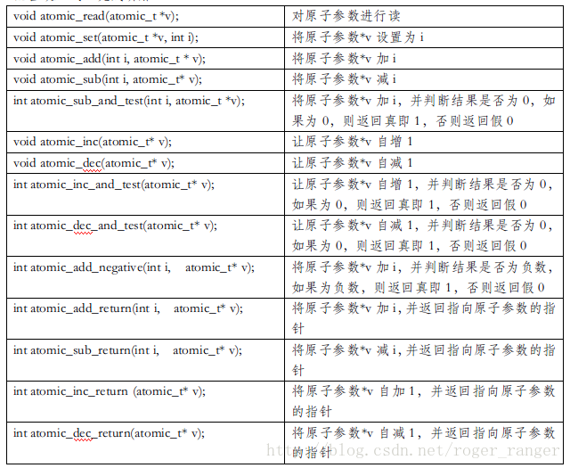

# 多线程基础之四：Linux提供的原子锁类型atomic\_t


[墨篙和小奶猫](https://blog.csdn.net/roger_ranger) 2017-11-15 22:38:42  10195  收藏  23 

分类专栏： [多线程基础](https://blog.csdn.net/roger_ranger/category_7288979.html) 文章标签： [Linux多线程](https://www.csdn.net/tags/MtjaUg0sMzI5NC1ibG9n.html) [atomic-t](https://so.csdn.net/so/search/s.do?q=atomic-t&t=blog&o=vip&s=&l=&f=&viparticle=) [sync](https://www.csdn.net/tags/MtTaEg0sNTA4MjctYmxvZwO0O0OO0O0O.html)

版权

**在x86体系下**，任何处理器平台下都会有一些原子性操作，在单处理器情况下，单步指令的原子性容易实现。但是在SMP多处理器情况下，只有那些单字的读（将变量读进寄存器）或写（从寄存器写入到变量地址）才是原子性的。故而在SMP下，要保证特定指令集合的原子性即不被中断，x86提供lock前缀用来在执行被lock修饰的指令期间锁住总线，从而实现了“禁止中断”的效果。事实上，Linux操作系统便根据这种针对特殊数据对象在操作期间需要提供原子特性的情况专门提供atomic\_t为代表的“原子锁”。

  
**0\. Linux下atomic\_t原子锁和操作函数API**

  
原子操作需要硬件支持，因此是和计算机的具体架构相关的，Linux专门定义了一种原子操作粒度的类型atomic\_t (类似的还有atomic6\_t)，并为该原子类型参数的操作提供相对应的API。故而在Linux下编程使用原子锁，只需要调用该类型声明和相应的操作函数API即可。

原子类型参数定义的典型使用场景便是多进程中共享资源的计数加减，如信号量semaphores中的资源总数便是经典的使用场景。所以atomic\_t原子锁支持的便是声明了一个具有原子操作特性的整数。

下面开始来介绍一下相关的内容。

```
typedef struct{
    volatile int counter; //volatile修饰符高速gcc不要对该类型数据进行优化处理，即对它的访问都是对 
          //内存的访问，而不是对寄存器的访问。即要读，必须重新找个寄存器载入该参数，而不是直接利用该参数
          //此刻在其他高速寄存器中的备份。
} atomic_t;
```

Linux为原子类型参数提供了一些系列的操作函数API，收集列举如下：  



这些操作函数的实现均涉及到在C中使用内嵌汇编语言，以其中`atomic_add(int i, atomic_t)`的具体实现为例

```
static inline void atomic_add(int i, atomic_t *v)
{
    asm volatile(LOCK_PREFIX "addl %1,%0"
             : "+m" (v->counter)
             : "ir" (i));
}
```

事实上，在适用的场景下，采用“原子锁”机制比使用mutex互斥量设计临界区更高效。具体的各函数实现可以参考这篇文章（[http://www.linuxidc.com/Linux/2011-10/44627.htm](http://www.linuxidc.com/Linux/2011-10/44627.htm)）。

  
**1\. Linux下atomic.h的替代者\_\_syn\_\*系列函数**

  
在Linux2.6.18之后，系统便删除了 `<asm/atomic.h>`和 `<asm/bitops.h>`， `<alsa/iatomic.h>`，在Linux操作系统下GCC提供了内置的原子操作函数\_\_sync\_\*，更方便程序员调用。

现在atomic.h在Linux的内核头文件中，即便能搜索到，但依旧不在gcc默认搜索路径下(`/usr/include，/usr/local/include，/usr/lib/gcc-lib/i386-linux/x.xx.x/include`)，即使像下面这样强行指定路径，还是会出现编译错误。

```
#include</usr/src/linux-headers-4.4.0-98/include/asm-generic/atomic.h> 
或在编译时提供编译路径
 -I /usr/src/linux-headers-4.4.0-98/include/asm-generic依旧会出现问题
```

gcc从4.1.2提供了\_\_sync\_\*系列的built-in函数，用于提供加减和逻辑运算的原子操作。可以对1,2,4或8字节长度的数值类型或指针进行原子操作，其声明如下

```
type __sync_fetch_and_add (type *ptr, type value, ...)
type __sync_fetch_and_sub (type *ptr, type value, ...)
type __sync_fetch_and_or (type *ptr, type value, ...)
type __sync_fetch_and_and (type *ptr, type value, ...)
type __sync_fetch_and_xor (type *ptr, type value, ...)
type __sync_fetch_and_nand (type *ptr, type value, ...)


type __sync_add_and_fetch (type *ptr, type value, ...)
type __sync_sub_and_fetch (type *ptr, type value, ...)
type __sync_or_and_fetch (type *ptr, type value, ...)
type __sync_and_and_fetch (type *ptr, type value, ...)
type __sync_xor_and_fetch (type *ptr, type value, ...)
type __sync_nand_and_fetch (type *ptr, type value, ...)
```

故而现在如果要使得`atomic.h`的旧版本代码可以运行在当下较新的Linux版本下，需要在相应的代码文件前面设置宏替换旧版本的atomic\_\*系列函数

```
    #define atomic_inc(x) __sync_fetch_and_add((x),1)  
    #define atomic_dec(x) __sync_fetch_and_sub((x),1)  
    #define atomic_add(x,y) __sync_fetch_and_add((x),(y))  
    #define atomic_sub(x,y) __sync_fetch_and_sub((x),(y))  
```

事实上，随着C++11强推[内存一致性模型](https://gcc.gnu.org/wiki/Atomic/GCCMM)，从GCC4.7开始[`__sync_*`系列函数也被新推出的更安全健壮的`__atomic_*`系列函数取代了](https://gcc.gnu.org/onlinedocs/gcc/_005f_005fatomic-Builtins.html)。

  
**2\. atomic\_t原子锁使用案例**

  
**_normal.cpp_**

```
#include <unistd.h>
#include <pthread.h>
#include <iostream>

using namespace std;

//设计test class带有两个正常的参数a,b；让它们实现正常的自增，看看是否出现因为非原子性操作导致的变量不同步

class test{

    private:
        int a;
        int b;

    public:
        test():a(0),b(0.0){}
        void inc(){//对变量自增,正常来说因为a,b并没有被声明为原子锁参数，故而这种自增操作是非线程安全的
            a++;
            b++;
        }
        void get() const{
            cout<<"a="<<a<<" b="<<b<<endl;
        }

};

static int step=0;

void* worker(void* arg){
    sleep(100-step); //手动延迟，因为创建线程还蛮费时间的，所以要人为创造多线程并发操作目标对象的情况
    step++;
    //每个线程睡眠一定时间以期达到这些线程能同时对变量进行操作，当然这里本身就不是线程安全的，因为结果得到：自增不是线程安全的
    test* local_test =(test*)arg; //将目标对象浅拷贝
    local_test->inc();
}

int main(){
    pthread_t pthd[100]; //声明一个线程指针数组
    test* temp=new test;
    for(int i=0;i<100;i++){
        pthread_create(&pthd[i],NULL,worker,temp);//开启100个线程对变量自增
    }
    for(int i=0;i<100;i++){
        pthread_join(pthd[i],NULL); //等待所有子线程完成操作，否则main线程将提前执行后续操作
    }
    temp->get();//获取结果
    return 0;
}
```

在Linux下编译该文件，如果运气够好，是可以发现该程序是可能出现线程不安全的情况

```
$g++ normal.cpp -o normal -lpthread
$./normal
//可能输出a=99,b=99，也可能输出a=98,b=98
```

**_atomic\_t.cpp_**

```
#include <unistd.h>
#include <pthread.h>
#include <iostream>
#include <stdlib.h>

using namespace std;

#define atomic_inc(x)  __sync_fetch_and_add(x, 1)
//用GCC内嵌的__sync_*系列函数来替代原先的atomic_inc(atomic_t* v)函数

class test{

    private:
        int a;
        int b;

    public:
        test():a(0),b(0){}
        void inc(){//对变量自增,正常来说因为a,b并没有被声明为原子锁参数，故而这种自增操作是非线程安全的
            //__sync_fetch_and_add(&a,1);
            //__sync_fetch_and_add(&b,1);
        atomic_inc(&a);
        atomic_inc(&b);
        }
        void get() const{
            cout<<"a="<<a<<" b="<<b<<endl;
        }

};

static int step=0;

void* worker(void* arg){
    sleep(100-step); //手动延迟，因为创建线程还蛮费时间的，所以要人为创造多线程并发操作目标对象的情况
    step++;
    //每个线程睡眠一定时间以期达到这些线程能同时对变量进行操作，当然这里本身就不是线程安全的，因为结果得到：自增不是线程安全的
    test* local_test =(test*)arg; //将目标对象浅拷贝
    local_test->inc();
}

int main(){
    pthread_t pthd[100]; //声明一个线程指针数组
    test* temp=new test;
    for(int i=0;i<100;i++){
        pthread_create(&pthd[i],NULL,worker,temp);//开启100个线程对变量自增
    }
    for(int i=0;i<100;i++){
        pthread_join(pthd[i],NULL); //等待所有子线程完成操作，否则main线程将提前执行后续操作
    }
    temp->get();//获取结果
    return 0;
}
```

```
$g++ atomic_t.cpp -o atomic_t -lpthread
$./atomic_t
a=100 b=100//但可以明显感到耗时比前面未加锁的版本更多
```