[MySQL性能测试--jemalloc内存管理](http://blog.chinaunix.net/uid-26896862-id-3865087.html)

分类： Mysql/postgreSQL

2013-08-26 01:06:09

# **1.****目的**

测试在jemalloc内存管理方式与glibc库的malloc内存管理方式两种情况下，MySQL的性能情况。通过测试，希望能够从内存管理方式的优化上，提高MySQL的性能。

## 2.测试环境

### 2.1 测试服务器硬件环境

<table border="1" cellspacing="0" cellpadding="0" style="border:none;"><tbody><tr><td width="568" valign="top" style="border:solid windowtext 1.0pt;">
Summary:&nbsp;&nbsp;&nbsp;&nbsp;&nbsp;&nbsp;&nbsp; Dell R720xd, 2 x Xeon E5-2630 0 2.30GHz, 189GB / 192GB 1333MHz DDR3

System:&nbsp;&nbsp;&nbsp;&nbsp;&nbsp;&nbsp;&nbsp;&nbsp; Dell PowerEdge R720xd (Dell 0X6FFV)

Processors:&nbsp;&nbsp;&nbsp;&nbsp; 2 x Xeon E5-2630 0 2.30GHz 7200MHz FSB (HT enabled, 12 cores, 24 threads)

Memory:&nbsp;&nbsp;&nbsp;&nbsp;&nbsp;&nbsp;&nbsp;&nbsp; 189GB / 192GB 1333MHz DDR3 == 12 x 16GB - 16GB PC3-10600 Hynix DDR3-1333 ECC Registered CL9 2Rx4
</td></tr></tbody></table>

### 2.2测试服务器软件环境

<table border="1" cellspacing="0" cellpadding="0" style="border:none;"><tbody><tr><td width="568" valign="top" style="border:solid windowtext 1.0pt;">
Linux 2.6.32-220.23.2.ali878.el6.x86_64

mysql-5.5.18
</td></tr></tbody></table>

### 2.3 MySQL配置

<table border="1" cellspacing="0" cellpadding="0" style="border:none;"><tbody><tr><td width="568" valign="top" style="border:solid windowtext 1.0pt;">
binlog_format[ROW]

max_binlog_cache_size[2G]

max_binlog_size[500M]

sync_binlog[1]

thread_cache_size[256]

innodb_buffer_pool_instances[8]

innodb_buffer_pool_size[74G]

innodb_flush_log_at_trx_commit[1]

innodb_flush_method[O_DIRECT]

innodb_io_capacity[1000]

innodb_log_buffer_size[64M]

innodb_log_file_size[1G]

innodb_log_files_in_group[4]

innodb_max_dirty_pages_pct[60]

innodb_thread_concurrency[16]
</td></tr></tbody></table>

## 3.测试方案

### 3.1测试内容

测试glibc库的malloc与jemalloc的内存管理方式，分别在只读模式和读写混合模式下，随着测试连接线程数的增多，MySQL性能的影响，以及内存的使用情况。

### 3.2测试连接线程数

<table border="1" cellspacing="0" cellpadding="0" width="87%" style="width:87.3%;border:none;"><tbody><tr><td width="27%" valign="top" style="border:solid #4F81BD 2.25pt;">
<b>Connect thread</b>
</td><td width="14%" valign="top" style="border:solid #4F81BD 2.25pt;">
32
</td><td width="14%" valign="top" style="border:solid #4F81BD 2.25pt;">
64
</td><td width="14%" valign="top" style="border:solid #4F81BD 2.25pt;">
128
</td><td width="14%" valign="top" style="border:solid #4F81BD 2.25pt;">
256
</td><td width="14%" valign="top" style="border:solid #4F81BD 2.25pt;">
512
</td></tr></tbody></table>

### 3.3测试内存管理版本

<table border="1" cellspacing="0" cellpadding="0" style="border:none;"><tbody><tr><td width="114" valign="top" style="border:solid #4F81BD 2.25pt;">
<b>Version</b>
</td><td width="114" valign="top" style="border:solid #4F81BD 2.25pt;">
glibc-2.12
</td><td width="114" valign="top" style="border:solid #4F81BD 2.25pt;">
jemalloc-3.4.0
</td></tr></tbody></table>

### 3.4测试指令

测试通过sysbench压测工具进行压力测试，数据量（约为23G）小于innodb\_buffer\_pool\_size的大小，使得IO不成为瓶颈。通过只读和读写混合测试，测试MySQL的性能。

<table border="1" cellspacing="0" cellpadding="0" style="border:none;"><tbody><tr><td width="568" valign="top" style="border:solid windowtext 1.0pt;">
# 初始化数据

./sysbench --test=tests/db/parallel_prepare.lua --max-time=1000 --oltp-dist-type=uniform --max-requests=0 --mysql-user=test --mysql-password=test --mysql-table-engine=innodb --oltp-table-size=3000000 --oltp-tables-count=32 --oltp-range-size=90 --oltp-point-selects=1 --oltp-simple-ranges=1 --oltp-sum-ranHges=1 --oltp-order-ranges=1 --oltp-distinct-ranges=1 --oltp-non-index-updates=10 --num-threads=32&nbsp; --mysql-host=10.207.105.1 --mysql-port=3306 run

# 只读压力测试

./sysbench --test=tests/db/oltp.lua --max-time=3600 --oltp-dist-type=uniform --max-requests=0 --mysql-user=test --mysql-password=test --mysql-table-engi ne=innodb --oltp-table-size=3000000 --oltp-tables-count=32 --oltp-range-size=90 --oltp-point-selects=12 --num-threads=64 --mysql-host=10.207.105.1 --my sql-port=3306&nbsp; --oltp-read-only=on run

# 读写混合压力测试

./sysbench --test=tests/db/oltp.lua --max-time=3600 --oltp-dist-type=uniform --max-requests=0 --mysql-user=test --mysql-password=test --mysql-table-engine=innodb --oltp-table-size=3000000 --oltp-tables-count=32 --oltp-range-size=90 --oltp-point-selects=12 --oltp-index-updates=1 --oltp-non-index-updates=1 --num-threads=32 --mysql-host=10.207.105.1 --mysql-port=3306 run
</td></tr></tbody></table>

## 4.性能指标

性能指标主要包括：

 cpu： %user

 memory：vsize，rss

 mysql：QPS，TPS

其中，vsize表示mysqld进程的虚拟地址空间大小；rss表示驻留物理地址空间的大小。查看原因见参考文档。

## 5.测试结果

### 5.1只读测试

**1****、CPU****利用率**

 MySQL在只读测试下，随着线程数的增加，CPU的%usr的变化。从测试结果来看，jemalloc内存分配方式与glibc的malloc相比，CPU的利用率降低，并且利用率随线程数的增加而差距增大。但是当线程数到达512时，CPU利用率基本一致，分析原因是由于达到CPU的处理上线导致。

<table border="1" cellspacing="0" cellpadding="0" style="border:none;"><tbody><tr><td width="284" valign="top" style="border:solid windowtext 1.0pt;">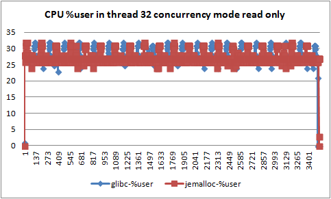

</td><td width="284" valign="top" style="border:solid windowtext 1.0pt;">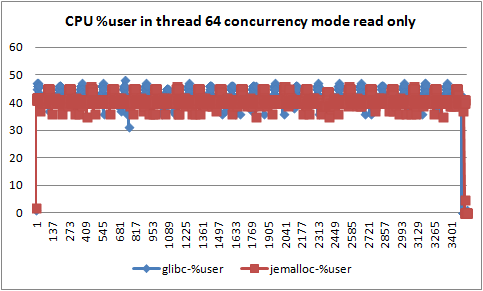

</td></tr><tr><td width="284" valign="top" style="border:solid windowtext 1.0pt;">
1.1 线程数32只读模式的%user利用率
</td><td width="284" valign="top" style="border:solid windowtext 1.0pt;">
1.2 线程数64只读模式的%user利用率
</td></tr><tr><td width="284" valign="top" style="border:solid windowtext 1.0pt;">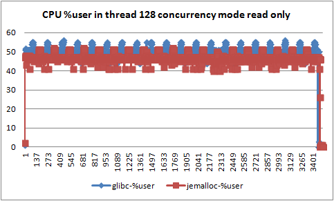

</td><td width="284" valign="top" style="border:solid windowtext 1.0pt;">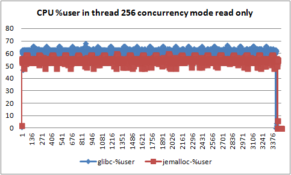

</td></tr><tr><td width="284" valign="top" style="border:solid windowtext 1.0pt;">
1.3 线程数128只读模式的%user利用率
</td><td width="284" valign="top" style="border:solid windowtext 1.0pt;">
1.4 线程数256只读模式的%user利用率
</td></tr><tr><td width="284" valign="top" style="border:solid windowtext 1.0pt;">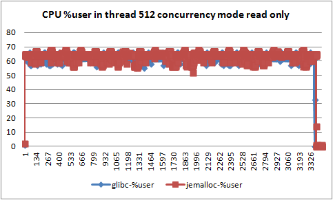

</td><td width="284" valign="top" style="border:solid windowtext 1.0pt;">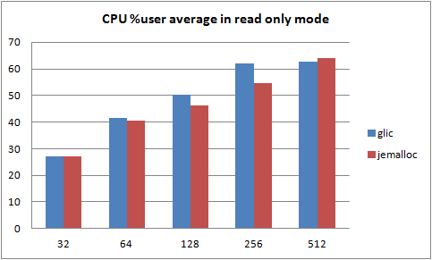

</td></tr><tr><td width="284" valign="top" style="border:solid windowtext 1.0pt;">
1.5 线程数512只读模式的%user利用率
</td><td width="284" valign="top" style="border:solid windowtext 1.0pt;">
1.6 CPU %user利用率随线程数的变化
</td></tr></tbody></table>

**2****、QPS**

 MySQL只读测试下，jemalloc内存分配方式比glic的malloc方式，QPS有较大的提高，并且提高程度随线程数增加而幅度加大。具体如下所示：

<table border="1" cellspacing="0" cellpadding="0" style="border:none;"><tbody><tr><td width="284" valign="top" style="border:solid windowtext 1.0pt;">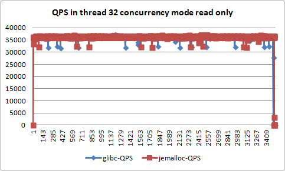

</td><td width="284" valign="top" style="border:solid windowtext 1.0pt;">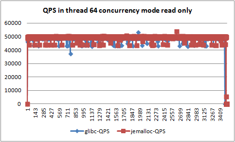

</td></tr><tr><td width="284" valign="top" style="border:solid windowtext 1.0pt;">
2.1 线程数32只读模式的QPS
</td><td width="284" valign="top" style="border:solid windowtext 1.0pt;">
2.2 线程数64只读模式的QPS
</td></tr><tr><td width="284" valign="top" style="border:solid windowtext 1.0pt;">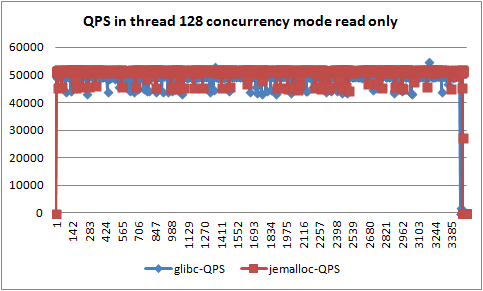

</td><td width="284" valign="top" style="border:solid windowtext 1.0pt;">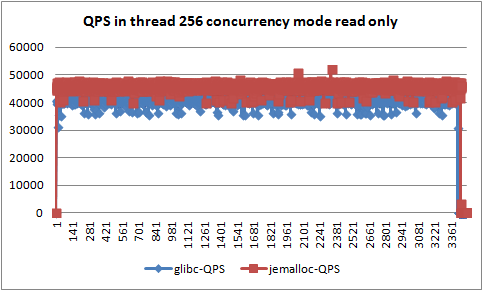

</td></tr><tr><td width="284" valign="top" style="border:solid windowtext 1.0pt;">
2.3 线程数128只读模式的QPS
</td><td width="284" valign="top" style="border:solid windowtext 1.0pt;">
2.4 线程数256只读模式的QPS
</td></tr><tr><td width="284" valign="top" style="border:solid windowtext 1.0pt;">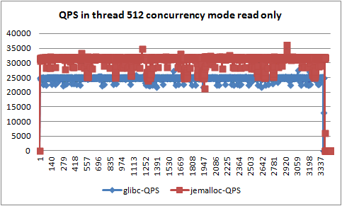
 
</td><td width="284" valign="top" style="border:solid windowtext 1.0pt;">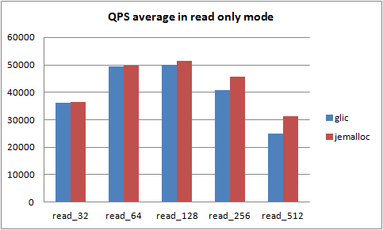</td></tr><tr><td width="284" valign="top" style="border:solid windowtext 1.0pt;">
2.5 线程数512只读模式的QPS
</td><td width="284" valign="top" style="border:solid windowtext 1.0pt;">
2.6 QPS随线程数的变化
</td></tr></tbody></table>

**3****、MySQL****的RSS**

 MySQL只读测试下，随着线程数的增加，MySQL的RSS在jemalloc内存方式下比glic的malloc方式下，占用物理内存的大小差距越来越大。具体如下图所示：

<table border="1" cellspacing="0" cellpadding="0" style="border:none;"><tbody><tr><td width="284" valign="top" style="border:solid windowtext 1.0pt;">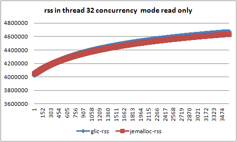

</td><td width="284" valign="top" style="border:solid windowtext 1.0pt;">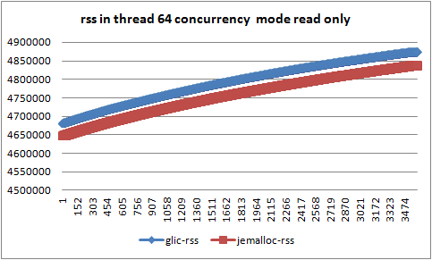

</td></tr><tr><td width="284" valign="top" style="border:solid windowtext 1.0pt;">
3.1 线程数32只读模式的RSS
</td><td width="284" valign="top" style="border:solid windowtext 1.0pt;">
3.2 线程数64只读模式的RSS
</td></tr><tr><td width="284" valign="top" style="border:solid windowtext 1.0pt;">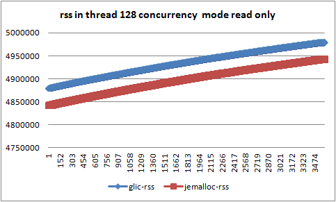

</td><td width="284" valign="top" style="border:solid windowtext 1.0pt;">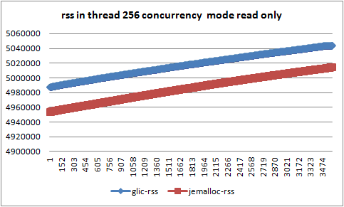

</td></tr><tr><td width="284" valign="top" style="border:solid windowtext 1.0pt;">
3.3 线程数128只读模式的RSS
</td><td width="284" valign="top" style="border:solid windowtext 1.0pt;">
3.4 线程数256只读模式的RSS
</td></tr><tr><td width="284" valign="top" style="border:solid windowtext 1.0pt;">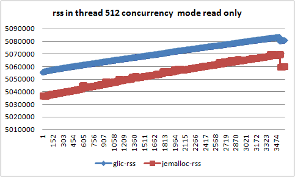

</td><td width="284" valign="top" style="border:solid windowtext 1.0pt;">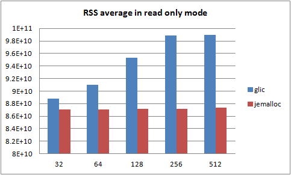

</td></tr><tr><td width="284" valign="top" style="border:solid windowtext 1.0pt;">
3.5 线程数256只读模式的RSS
</td><td width="284" valign="top" style="border:solid windowtext 1.0pt;">
3.6 RSS随线程数的变化
</td></tr></tbody></table>

**4****、MySQL****的VSIZE**

 MySQL只读测试下，jemalloc内存方式与glic的malloc方式相比，MySQL的VSIZE的大小减小了较多，并且随着线程数的增大，差距越来越大。具体如下图所示：

<table border="1" cellspacing="0" cellpadding="0" style="border:none;"><tbody><tr><td width="284" valign="top" style="border:solid windowtext 1.0pt;">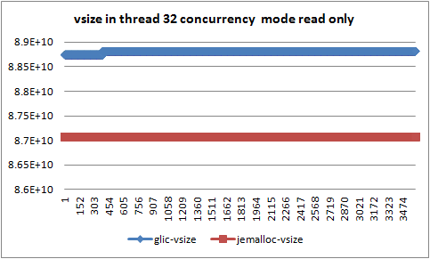

</td><td width="284" valign="top" style="border:solid windowtext 1.0pt;">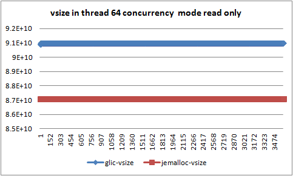

</td></tr><tr><td width="284" valign="top" style="border:solid windowtext 1.0pt;">
4.1 线程数32只读模式的VSIZE
</td><td width="284" valign="top" style="border:solid windowtext 1.0pt;">
4.2 线程数64只读模式的VSIZE
</td></tr><tr><td width="284" valign="top" style="border:solid windowtext 1.0pt;">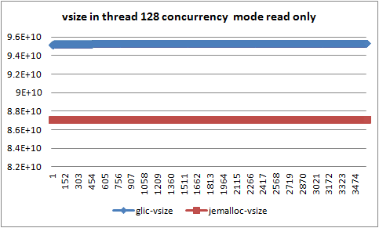

</td><td width="284" valign="top" style="border:solid windowtext 1.0pt;">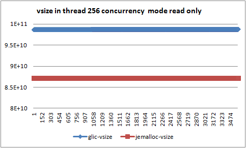

</td></tr><tr><td width="284" valign="top" style="border:solid windowtext 1.0pt;">
4.3 线程数128只读模式的VSIZE
</td><td width="284" valign="top" style="border:solid windowtext 1.0pt;">
4.4 线程数256只读模式的VSIZE
</td></tr><tr><td width="284" valign="top" style="border:solid windowtext 1.0pt;">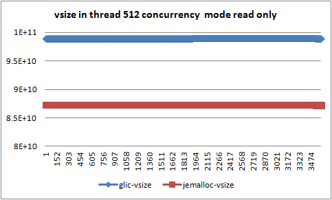

</td><td width="284" valign="top" style="border:solid windowtext 1.0pt;">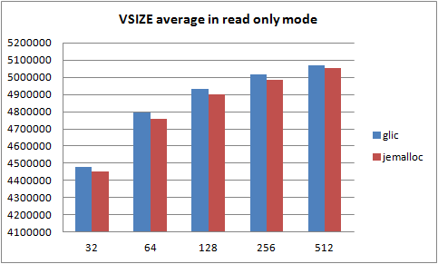

</td></tr><tr><td width="284" valign="top" style="border:solid windowtext 1.0pt;">
4.5 线程数512只读模式的VSIZE
</td><td width="284" valign="top" style="border:solid windowtext 1.0pt;">
4.6 VSIZE随线程数的变化
</td></tr></tbody></table>

### 5.2读写测试

**1****、CPU****利用率**

 MySQL在读写混合模式下（读写比6:1），随着线程数的增加，jemalloc内存分配方式与glic的malloc分配方式相比，CPU的%user利用率无明显变化。从以下结果中可知，在读写混合模式下，MySQL对CPU的利用很快达到瓶颈，线程数的增加没有明显效果。

<table border="1" cellspacing="0" cellpadding="0" style="border:none;"><tbody><tr><td width="284" valign="top" style="border:solid windowtext 1.0pt;">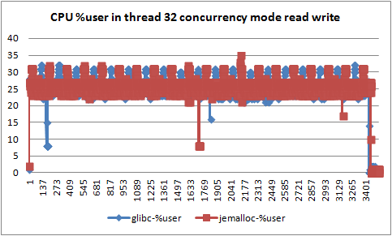

</td><td width="284" valign="top" style="border:solid windowtext 1.0pt;">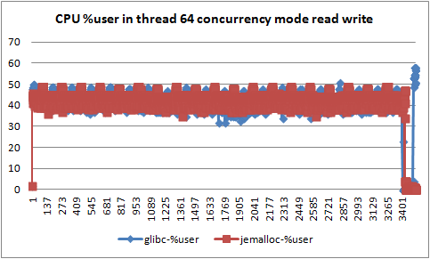

</td></tr><tr><td width="284" valign="top" style="border:solid windowtext 1.0pt;">
5.1 线程数32读写模式的%user利用率
</td><td width="284" valign="top" style="border:solid windowtext 1.0pt;">
5.2 线程数64读写模式的%user利用率
</td></tr><tr><td width="284" valign="top" style="border:solid windowtext 1.0pt;">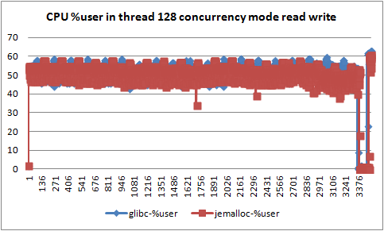

</td><td width="284" valign="top" style="border:solid windowtext 1.0pt;">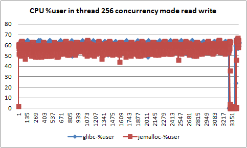

</td></tr><tr><td width="284" valign="top" style="border:solid windowtext 1.0pt;">
5.3 线程数128读写模式的%user利用率
</td><td width="284" valign="top" style="border:solid windowtext 1.0pt;">
5.4 线程数256读写模式的%user利用率
</td></tr><tr><td width="284" valign="top" style="border:solid windowtext 1.0pt;">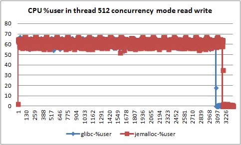

</td><td width="284" valign="top" style="border:solid windowtext 1.0pt;">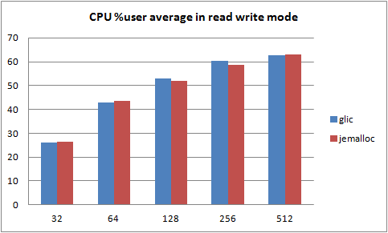

</td></tr><tr><td width="284" valign="top" style="border:solid windowtext 1.0pt;">
5.5 线程数512读写模式的%user利用率
</td><td width="284" valign="top" style="border:solid windowtext 1.0pt;">
5.6 CPU %user利用率随线程数的变化
</td></tr></tbody></table>

**2****、QPS**

 在读写混合模式下，MySQL的QPS随着线程数的增加，有一些提高，但与只读模式测试相比，提高幅度较小。

<table border="1" cellspacing="0" cellpadding="0" style="border:none;"><tbody><tr><td width="284" valign="top" style="border:solid windowtext 1.0pt;">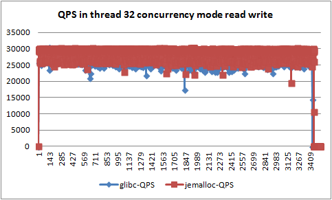

</td><td width="284" valign="top" style="border:solid windowtext 1.0pt;">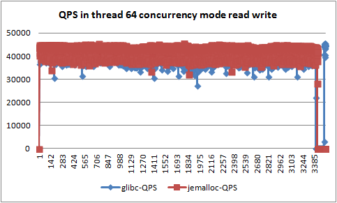

</td></tr><tr><td width="284" valign="top" style="border:solid windowtext 1.0pt;">
6.1 线程数32读写模式的QPS&nbsp;&nbsp;&nbsp;&nbsp;&nbsp;&nbsp;
</td><td width="284" valign="top" style="border:solid windowtext 1.0pt;">
6.2 线程数64读写模式的QPS
</td></tr><tr><td width="284" valign="top" style="border:solid windowtext 1.0pt;">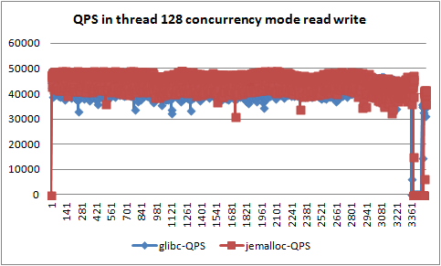

</td><td width="284" valign="top" style="border:solid windowtext 1.0pt;">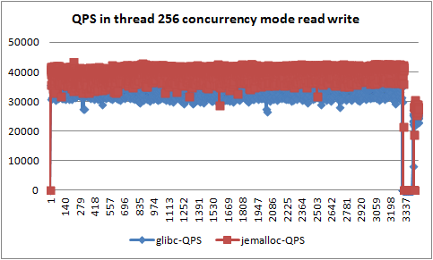

</td></tr><tr><td width="284" valign="top" style="border:solid windowtext 1.0pt;">
6.3 线程数128读写模式的QPS&nbsp;&nbsp;&nbsp;&nbsp;
</td><td width="284" valign="top" style="border:solid windowtext 1.0pt;">
6.4 线程数256读写模式的QPS
</td></tr><tr><td width="284" valign="top" style="border:solid windowtext 1.0pt;">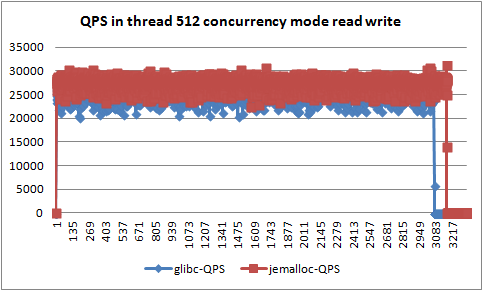

</td><td width="284" valign="top" style="border:solid windowtext 1.0pt;">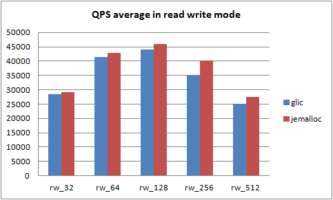

</td></tr><tr><td width="284" valign="top" style="border:solid windowtext 1.0pt;">
6.5 线程数256读写模式的QPS
</td><td width="284" valign="top" style="border:solid windowtext 1.0pt;">
6.6 QPS随线程数的变化
</td></tr></tbody></table>

**3****、TPS**

 在读写混合模式下，MySQL的TPS随着线程数的增加，jemalloc内存分配方式与glic的malloc相比，提高程度不断增大。

<table border="1" cellspacing="0" cellpadding="0" style="border:none;"><tbody><tr><td width="284" valign="top" style="border:solid windowtext 1.0pt;">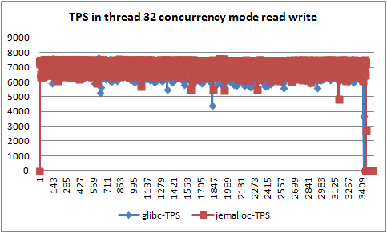

</td><td width="284" valign="top" style="border:solid windowtext 1.0pt;">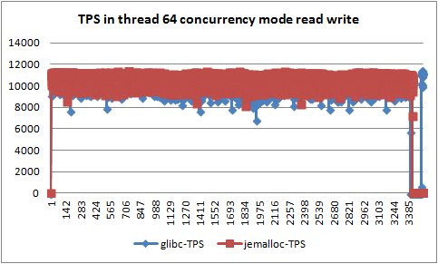

</td></tr><tr><td width="284" valign="top" style="border:solid windowtext 1.0pt;">
7.1 线程数32读写模式的TPS&nbsp;&nbsp;&nbsp;&nbsp;&nbsp;&nbsp;&nbsp;
</td><td width="284" valign="top" style="border:solid windowtext 1.0pt;">
7.2 线程数64读写模式的TPS
</td></tr><tr><td width="284" valign="top" style="border:solid windowtext 1.0pt;">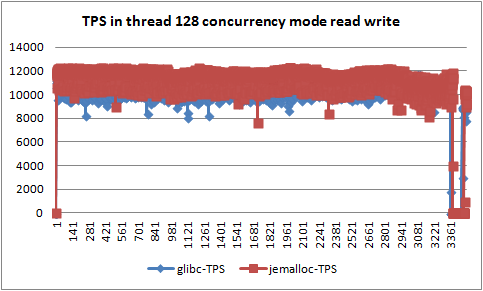

</td><td width="284" valign="top" style="border:solid windowtext 1.0pt;">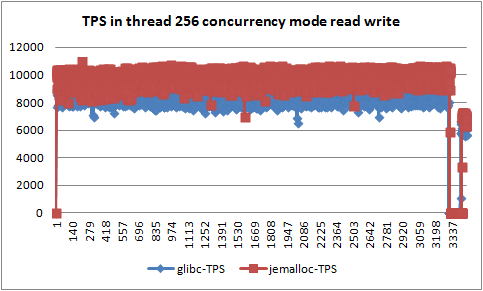

</td></tr><tr><td width="284" valign="top" style="border:solid windowtext 1.0pt;">
7.3 线程数128读写模式的TPS&nbsp;&nbsp;&nbsp;&nbsp;&nbsp;
</td><td width="284" valign="top" style="border:solid windowtext 1.0pt;">
7.4 线程数256读写模式的TPS
</td></tr><tr><td width="284" valign="top" style="border:solid windowtext 1.0pt;">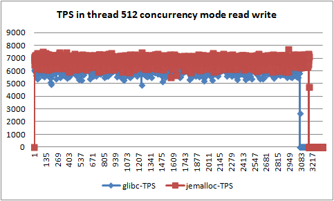

</td><td width="284" valign="top" style="border:solid windowtext 1.0pt;">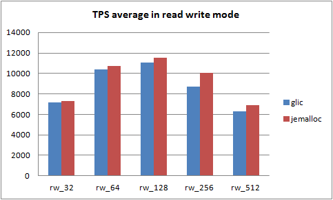

</td></tr><tr><td width="284" valign="top" style="border:solid windowtext 1.0pt;">
7.5 线程数512读写模式的TPS&nbsp;&nbsp;&nbsp;&nbsp;&nbsp;
</td><td width="284" valign="top" style="border:solid windowtext 1.0pt;">
7.6 TPS随线程数的变化
</td></tr></tbody></table>

**4****、RSS**

 在读写混合模式下，随着线程数的增加，jemalloc内存分配方式与glic的malloc相比，MySQL的RSS不断减小。

<table border="1" cellspacing="0" cellpadding="0" style="border:none;"><tbody><tr><td width="284" valign="top" style="border:solid windowtext 1.0pt;">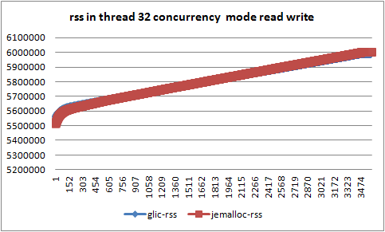

</td><td width="284" valign="top" style="border:solid windowtext 1.0pt;">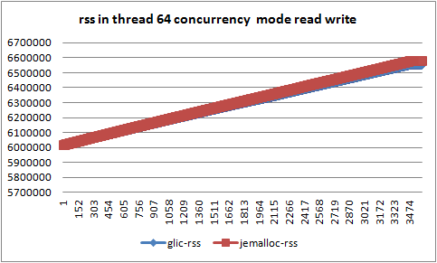

</td></tr><tr><td width="284" valign="top" style="border:solid windowtext 1.0pt;">
8.1 线程数32读写模式的RSS
</td><td width="284" valign="top" style="border:solid windowtext 1.0pt;">
8.2 线程数64读写模式的RSS
</td></tr><tr><td width="284" valign="top" style="border:solid windowtext 1.0pt;">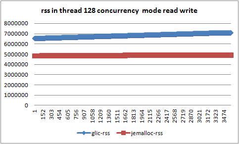

</td><td width="284" valign="top" style="border:solid windowtext 1.0pt;">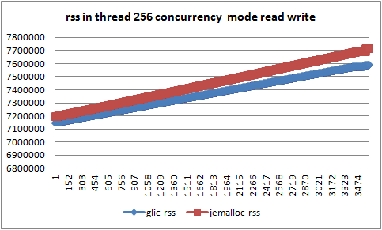

</td></tr><tr><td width="284" valign="top" style="border:solid windowtext 1.0pt;">
8.3 线程数128读写模式的RSS
</td><td width="284" valign="top" style="border:solid windowtext 1.0pt;">
8.4 线程数256读写模式的RSS
</td></tr><tr><td width="284" valign="top" style="border:solid windowtext 1.0pt;">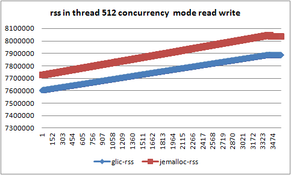

</td><td width="284" valign="top" style="border:solid windowtext 1.0pt;">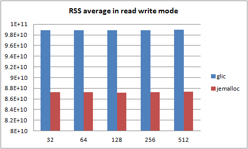

</td></tr><tr><td width="284" valign="top" style="border:solid windowtext 1.0pt;">
8.5 线程数512读写模式的RSS
</td><td width="284" valign="top" style="border:solid windowtext 1.0pt;">
8.6 RSS随线程数的变化
</td></tr></tbody></table>

**5****、VSIZE**

 在读写混合模式下，随着线程数的增加，jemalloc内存分配方式与glic的malloc相比，MySQL的VSIZE大小差距不断增加。

<table border="1" cellspacing="0" cellpadding="0" style="border:none;"><tbody><tr><td width="284" valign="top" style="border:solid windowtext 1.0pt;">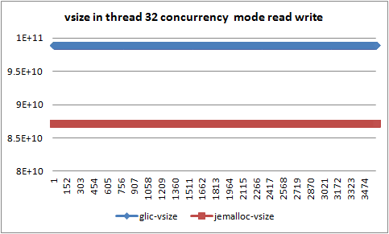

</td><td width="284" valign="top" style="border:solid windowtext 1.0pt;"></td></tr><tr><td width="284" valign="top" style="border:solid windowtext 1.0pt;">
9.1 线程数32读写模式的VSIZE
</td><td width="284" valign="top" style="border:solid windowtext 1.0pt;">
9.2 线程数64读写模式的VSIZE
</td></tr><tr><td width="284" valign="top" style="border:solid windowtext 1.0pt;">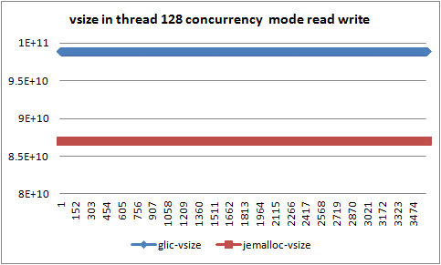</td><td width="284" valign="top" style="border:solid windowtext 1.0pt;"></td></tr><tr><td width="284" valign="top" style="border:solid windowtext 1.0pt;">
9.3 线程数128读写模式的VSIZE
</td><td width="284" valign="top" style="border:solid windowtext 1.0pt;">
9.4 线程数256读写模式的VSIZE
</td></tr><tr><td width="284" valign="top" style="border:solid windowtext 1.0pt;">

</td><td width="284" valign="top" style="border:solid windowtext 1.0pt;">

</td></tr><tr><td width="284" valign="top" style="border:solid windowtext 1.0pt;">
9.5 线程数512读写模式的VSIZE
</td><td width="284" valign="top" style="border:solid windowtext 1.0pt;">
9.6 VSIZE随线程数的变化
</td></tr></tbody></table>

## 6.结论

 通过测试，发现jemalloc内存分配方式与glic的malloc内存分配方式相比，在只读模式下，CPU利用率最大降低了10%左右；MySQL的RSS最大降低了12%左右；MySQL的VSIZE最大降低了1%左右；MySQL的QPS最大提高了25%左右。

 在读写混合模式下，CPU利用率基本无变化，是由于MySQL的CPU利用很快达到瓶颈的原因；MySQL的RSS最大降低了11%左右；MySQL的VSIZE最大降低了28%；MySQL的QPS最大提高了15%；MySQL的TPS最大提高了15%左右。

 整体来看，jemalloc内存分配方式与glic的malloc内存分配方式相比，提高了MySQL的性能，降低了系统CPU和内存资源的利用。从压测情况来看，基本达到测试的期望。

## 参考

\[1\].[http://www.mysqlperformanceblog.com/2012/07/05/impact-of-memory-allocators-on-mysql-performance/](http://www.mysqlperformanceblog.com/2012/07/05/impact-of-memory-allocators-on-mysql-performance/)

\[2\]. [http://www.mysqlperformanceblog.com/2013/03/08/mysql-performance-impact-of-memory-allocators-part-2/](http://www.mysqlperformanceblog.com/2013/03/08/mysql-performance-impact-of-memory-allocators-part-2/)

阅读(13922) | 评论(1) | 转发(2) |

0

上一篇：[CGroup的BLKIO资源隔离--结论](http://blog.chinaunix.net/uid-26896862-id-3847079.html)

下一篇：[MySQL学习分享--机型选择与配置](http://blog.chinaunix.net/uid-26896862-id-3947862.html)