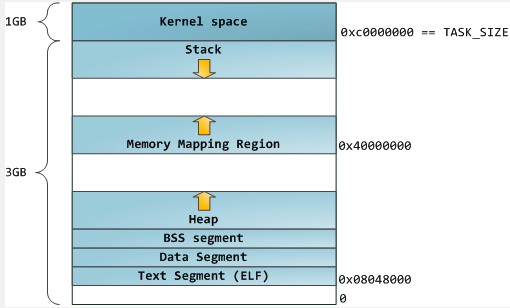
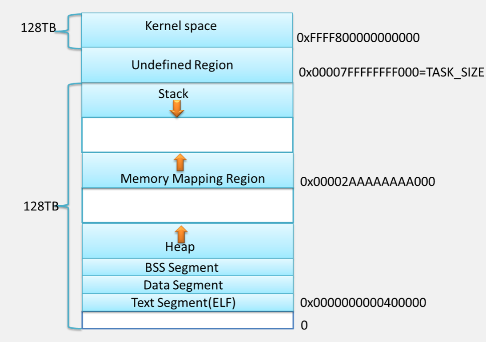
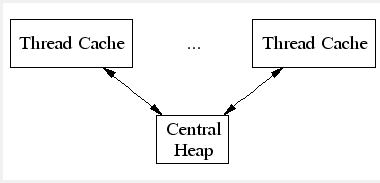
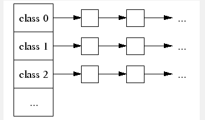
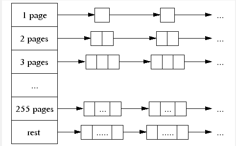
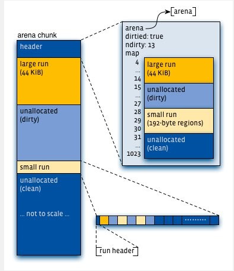
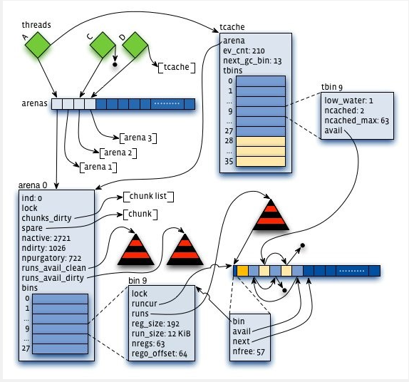

# ptmalloc,tcmalloc和jemalloc内存分配策略研究

2018-08-01阅读 4.7K0

最近看了glibc的ptmaoolc，Goolge的tcmalloc和jemalloc，顺便做了一点记录。可能有些地方理解地不太对，如有发现还请大神指出。

## 操作系统内存布局

各种malloc的内存分配管理方式离不开操作系统的内存布局策略。

### 32位经典内存布局

32位系统下经典内存布局如上，程序起始的1GB地址为内核空间，接下来是向下增长的栈空间和由0x40000000向上增长的mmap地址。而堆地址是从底部开始，去除ELF、数据段、代码段、常量段之后的地址并向上增长。但是这种布局有几个问题，首先是**容易遭受溢出攻击**；其次是，**堆地址空间只有不到1G**有木有？如果mmap内存比较少地址很浪费有木有？所以后来就有了另一种内存布局。

### 32位默认内存布局

这幅图描述地比较清楚也比较完整。首先是加入了几种Random offset随机偏移，导致内存溢出攻击不那么容易了，其次是**堆仍然向上**，但是**mmap向下增长**。但是这样的话栈空间就不是动态增长的了，所以现在的操作系统都有栈大小限制来着（Windows好像默认是2MB对吧？Linux可以ulimit –s查看）。这种内存布局地址利用度比较高。

### 64位内存布局

64位系统的寻址空间比较大，所以仍然沿用了32位的经典布局，但是加上了随机的mmap起始地址，以防止溢出攻击。反正一时半会是用不了这么大的内存地址了，所以至少N多年不会变了（话说要生产出40TB+的内存条，把堆内存地址用光，一时半会也搞不定吧）。

### 总结

纵观各种内存布局，对于大内存各种malloc基本上都是直接mmap的。而对于小数据，则通过向操作系统申请扩大堆顶，这时候操作系统会把需要的内存分页映射过来，然后再由这些malloc管理这些堆内存块，减少系统调用。而在free内存的时候，不同的malloc有不同的策略，**不一定会把内存真正地还给系统**，所以很多时候，如果访问了free掉的内存，并不会立即Run Time Error，只有访问的地址没有对应的内存分页，才会崩掉。

## Ptmalloc

Ptmalloc采用主-从分配区的模式，当一个线程需要分配资源的时候，从链表中找到一个没加锁的分配区，在进行内存分配。

### 小内存分配

在ptmalloc内部，内存块采用**chunk**管理，并且将大小相似的chunk用链表管理，一个链表被称为一个bin。前64个bin里，相邻的bin内的chunk大小相差8字节，称为**small bin**，后面的是**large bin**，large bin里的chunk按先大小，再最近使用的顺序排列，每次分配都找一个最小的能够使用的chunk。

Chunk的结构如上所示，**A位表示是不是在主分配区**，**M表示是不是mmap出来滴**，**P表示上一个内存紧邻的chunk是否在使用**，如果没在使用，则size of previous chunk是上一个chunk的大小，否则无意义（而且被用作被分配出去的内存了），正式根据P标记位和**size of previous chunk**在free内存块的时候来进行chunk合并的。当然，如果chunk空闲，mem里还记录了一些指针用于索引临近大小的chunk的，实现原理就不复述了，知道大致作用就行。

在free的时候，ptmalloc会检查附近的chunk，并尝试把连续空闲的chunk合并成一个大的chunk，放到unstored bin里。但是当很小的chunk释放的时候，ptmalloc会把它并入fast bin中。同样，某些时候，fast bin里的连续内存块会被合并并加入到一个unsorted bin里，然后再才进入普通bin里。所以malloc小内存的时候，是**先查找fast bin，再查找unsorted bin，最后查找普通的bin**，如果unsorted bin里的chunk不合适，则会把它扔到bin里。

### 大内存分配

Ptmalloc的分配的内存顶部还有一个top chunk，如果**前面的bin里的空闲chunk都不足以满足需要，就是尝试从top chunk里分配内存**。如果top chunk里也不够，就要**从操作系统里拿**了。

还有就是**特别大的内存，会直接从系统mmap出来**，不受chunk管理，这样的内存在回收的时候也会munmap还给操作系统。

### 简而言之，就是：\*\*

\*\*小内存： \[获取分配区(arena)并加锁\] -> fast bin -> unsorted bin -> small bin -> large bin -> top chunk -> 扩展堆

大内存： 直接mmap

### 总结

释放的时候，几乎是和分配反过来，再加上可一些chunk合并和从一个bin转移到另一个bin的操作。并且如果顶部有足够大的空闲chunk，则收缩堆顶并还给操作系统。

介于此，对于ptmalloc的内存分配使用有几个**注意事项**：

1.  Ptmalloc默认后分配内存先释放，因为内存回收是从top chunk开始的。
2.  避免多线程频繁分配和释放内存，会造成频繁加解锁。
3.  不要分配长生命周期的内存块，容易造成内碎片，影响内存回收。

## Tcmalloc

Ptmalloc在性能上还是存在一些问题的，比如不同分配区（arena）的内存不能交替使用，比如每个内存块分配都要浪费8字节内存等等，所以一般倾向于使用第三方的malloc。

Tcmalloc是Google gperftools里的组件之一。全名是 thread cache malloc（线程缓存分配器）其内存管理分为**线程内存**和**中央堆**两部分。

### 小内存分配

对于小块内存分配，其内部维护了**60个不同大小的分配器**（实际源码中看到的是86个），和ptmalloc不同的是，它的每个分配器的大小差是不同的，依此按8字节、16字节、32字节等间隔开。在内存分配的时候，会找到最小复合条件的，比如833字节到1024字节的内存分配请求都会分配一个1024大小的内存块。如果这些分配器的剩余内存不够了，会向中央堆申请一些内存，打碎以后填入对应分配器中。同样，如果中央堆也没内存了，就向中央内存分配器申请内存。

在线程缓存内的60个分配器（\_文档上说60个，但是我在2.0的代码里看到得是86个\_）分别维护了一个大小固定的自由空间链表，直接由这些链表分配内存的时候是不加锁的。但是中央堆是所有线程共享的，在由其分配内存的时候会加自旋锁(spin lock)。

在线程内存池每次从中央堆申请内存的时候，分配多少内存也直接影响分配性能。申请地太少会导致频繁访问中央堆，也就会频繁加锁，而申请地太多会导致内存浪费。在tcmalloc里，这个**每次申请的内存量是动态调整的**，调整方式使用了类似把tcp窗口反过来用的**慢启动（slow start）**算法调整max\_length， 每次申请内存是申请max\_length和每个分配器对应的num\_objects\_to\_move中取小的值的个数的内存块。

**num\_objects\_to\_move**取值比较简单，是**以64K为基准**，并且**最小不低于2，最大不高于32的值**。也就是说，对于大于等于32K的分配器这个值为2（好像没有这样的分配器 class），对于小于2K的分配器，统一为32。其他的会把数据调整到64K / size 的个数。（可能是经验数值，目前2.0版本里的代码是这么写的）

对于max\_length就比较复杂了，而且其更多是用于释放内存。max\_length由1开始，在其小于num\_objects\_to\_move的时候每次累加1，大于等于的时候累加num\_objects\_to\_move。释放内存的时候，首先max\_length会对齐到num\_objects\_to\_move，然后在大于num\_objects\_to\_move的释放次数超过一定阀值，则会按num\_objects\_to\_move缩减大小。

### 大内存分配

对于大内存分配(大于8个分页, 即32K)，tcmalloc直接在中央堆里分配。**中央堆的内存管理是以分页为单位的**，同样按大小维护了256个空闲空间链表，前255个分别是1个分页、2个分页到255个分页的空闲空间，最后一个是更多分页的小的空间。这里的空间如果不够用，就会直接从系统申请了。

### 分页管理 – span

Tcmalloc使用一种叫**span**的东东来管理内存分页，一个span可以包含几个连续分页。一个span的状态只有**未分配**(这时候在空闲链表中)，**作为大对象分配**，或**作为小对象分配**（这时候span内记录了小对象的class size）。

在32位系统中，span分为两级由中央分配器管理。第一级有2^5个节点，第二级是2^15个。32位总共只能有2^20个分页（每个分页4KB = 2^12）。(骗纸，我在代码里明明看到的是2^7和2^13，定义了TCMALLOC\_LARGE\_PAGES宏之后才是 2^5和2^15，可是所有的代码或者编辑脚本里都没定义这个宏，可能是文档没更新)

在64为系统中，有三级。

在**资源释放的时候**，首先计算其分页编号，然后再查找出它对应的span，如果它是一个小对象，则直接归入小对象分配器的空闲链表。等到空闲空间足够大以后划入中央堆。如果是大对象，则会把物理地址连续的前后的span也找出来，如果空闲则合并，并归入中央堆中。

而线程缓存内的分配器，会根据max\_length、num\_objects\_to\_move和上一次垃圾收集到现在为止的最小链表长度，按一定的策略回收资源到中央堆中，具体的算法不再复述tcmalloc的文档写得比较清楚。同样可以在需要时减少某一个线程的max\_length来转移内存，但是要等到那个线程下一次执行free，触发垃圾回收之后才会真正把内存返还中央堆。

### 简而言之，就是：

\*\*小内存： 线程缓存队列 -> 中央堆 -> 中央页分配器（从系统分配）

大内存： 中央堆 -> 向系统请求

Tcmalloc的管理策略和ptmalloc有很大区别，理论上性能提高的主要原因在线程缓存不加锁和少量操作的自旋锁上。不过按照它的实现方式，不适合多线程频繁分配大于8个分页（32KB）的内存。否则自旋锁争用会相当厉害，不过这种情况也比较少。而减少和中央堆交互又依赖于他的线程缓存长度自适应算法。

还有就是它使用了外部的数据结构来管理span list，这样不会每次分配内存都要浪费header的长度。但是他的对齐操作又比ptmalloc多浪费了一些内存。（有点空间换时间的意思）

所以无论是ptmalloc还是tcmalloc都应该尽量减少大内存的分配和释放。尽量先分配、后释放。

## Jemalloc

最后来看看第三个神器，jemalloc。这是FreeBSD、NetBSD和Firefox的默认malloc。据作者说，在高CPU核心数的情况下比tcmalloc性能还好。

Jemalloc的设计目标是：

1.  快速分配和回收
2.  低内存碎片
3.  支持堆性能分析

Jemalloc 把内存分配分为了**三个部分**，第一部分类似tcmalloc，是分别以8字节、16字节、64字节等分隔开的**small class**；第二部分以分页为单位，等差间隔开的**large class**；然后就是**huge class**。内存块的管理也通过一种chunk进行，一个chunk的大小是2^k (默认4 MB)。通过这种分配实现常数时间地分配small和large对象，对数时间地查询huge对象的meta（使用红黑树）。

默认64位系统的划分方式如下：

\*\*Small: \*\*\[8\], \[16, 32, 48, …, 128\], \[192, 256, 320, …, 512\], \[768, 1024, 1280, …, 3840\]

**Large:** \[4 KiB, 8 KiB, 12 KiB, …, 4072 KiB\]

**Huge:** \[4 MiB, 8 MiB, 12 MiB, …\]

Jemalloc也使用了**分配区（arena）**来维护内存。线程按第一次分配small或者large内存请求的顺序Round-Robin地选择一个分配区。每个分配区都维护了一系列分页，来提供small和large的内存分配请求。并且从一个分配区分配出去的内存块，在释放的时候一定会回到该分配区。

### 内存分配

每个**分配区内都会包含meta信息**，记录了其对应的**chunk列表**，每个chunk的头部都记录了chunk的分配信息。在使用某一个chunk的时候，会把**它分割成很多个run**，并**记录到bin中**。不同size的class对应着不同的bin，这点和前面两种分配器一样。在**bin里，都会有一个红黑树来维护空闲的run**，并且**在run里，使用了bitmap来记录了分配状态**。

和前面两种分配器不同的是，**分配区会同时维护两组run的红黑树**，一组是未被分配过内存（clean区域），另一组是回收的内存（dirty区域）。而且不是前面那两种分配器所使用的链表。

同样，每次分配，都是选取最小且符合条件的内存块。但是优先从dirty区域查找。

由于分配区的设计和ptmalloc差不多。在**访问分配区的时候需要对其加锁**，或者对某一个size的bin加粒度更小的锁。为了减少锁征用，这里又参照tcmalloc引入了线程缓存。并且其线程缓存的垃圾回收机制和tcmalloc一样，也是基于分配请求的频率自动调整的。

线程缓存的结构就像一个简化版的arena，加了一些垃圾回收的控制信息。

### 简而言之，就是：

\*\*小内存（small class）： 线程缓存bin -> 分配区bin(bin加锁) -> 问系统要

中型内存（large class）：分配区bin(bin加锁) -> 问系统要

大内存（huge class）： 直接mmap组织成N个chunk+全局huge红黑树维护(带缓存)

### 总结

Jemalloc设计上比前两个复杂地多，其内部使用了红黑树管理分页和内存块。并且对内存分配粒度分类地更细。这导致一方面比ptmalloc的锁争用要少，另一方面很多索引和查找都能回归到指数级别，方便了很多复杂功能的实现。而且在大内存分配上，内存碎片也会比tcmalloc少。但是也正是因为他的结构比较复杂，记录了很多meta，所以在分配很多小内存的时候记录meta数据的空间会略微多于tcmalloc。但是又不像ptmalloc那样每一个内存块都有一个header，而采用全局的bitmap记录状态，所以大量小内存的时候，会比ptmalloc消耗的额外内存小。

## 大总结

看这些个分配器的分配机制，可见这些内存管理机制都是针对小内存分配和管理。对大块内存还是直接用了系统调用。所以在程序中应该尽量避免大内存的malloc/new、free/delete操作。另外这个分配器的**最小粒度都是以8字节为单位的**，所以频繁分配小内存，像int啊bool啊什么的，仍然会浪费空间。经过测试无论是对bool、int、short进行new的时候，实际消耗的内存在ptmalloc和tcmalloc下64位系统地址间距都是32个字节。大量new测试的时候，**ptmalloc平均每次new消耗32字节，tcmalloc消耗8字节**（我想说ptmalloc弱爆啦，而且tcmalloc）。所以大量使用这些数据的时候不妨用数组自己维护一个内存池，可以减少很多的内存浪费。（原来STL的map和set一个节点要消耗近80个字节有这么多浪费在这里了啊）

而多线程下对于比较大的数据结构，为了减少分配时的锁争用，最好是自己维护内存池。单线程的话无所谓了，呵呵。不过自己维护内存池是增加代码复杂度，减少内存管理复杂度。但是我觉得，255个分页以下（1MB）的内存话，tcmalloc的分配和管理机制已经相当nice，没太大必要自己另写一个。

另外，Windows下内存分配方式不知道，不同类型(int、short和bool)连续new的地址似乎是隔开的，可能是内部实现的粒度更小，不同size的class更多。测试10M次new的时候，debug模式下明显卡顿了一下，**平均每次new的内存消耗是52字节（32位）和72字节（64位）**\[header更复杂?\]。但是**Release模式下很快，并且平均每次new的内存消耗是20字节（32位）和24字节（64位）**。可以猜测VC的malloc的debug模式还含有挺大的debug信息。是不是可以得出他的header里，Release版本只有1个指针，Debug里有5个指针呢？

## 参考文献：

1.  glibc内存管理ptmalloc源代码分析 [http://rdc.taobao.com/blog/cs/?p=1015](http://rdc.taobao.com/blog/cs/?p=1015)
2.  tcmalloc [http://gperftools.googlecode.com/svn/trunk/doc/tcmalloc.html](http://gperftools.googlecode.com/svn/trunk/doc/tcmalloc.html)
3.  Scalable memory allocation using jemalloc [http://www.facebook.com/notes/facebook-engineering/scalable-memory-allocation-using-jemalloc/480222803919](http://www.facebook.com/notes/facebook-engineering/scalable-memory-allocation-using-jemalloc/480222803919)
4.  A Scalable Concurrent malloc(3) Implementation for FreeBSD [http://people.freebsd.org/~jasone/jemalloc/bsdcan2006/jemalloc.pdf](http://people.freebsd.org/~jasone/jemalloc/bsdcan2006/jemalloc.pdf)
5.  jemalloc原理分析 [http://club.alibabatech.org/article\_detail.htm?articleId=36](http://club.alibabatech.org/article_detail.htm?articleId=36)
6.  Tcmalloc 2.0源码
7.  Jemalloc 3.4.0 源码

本文参与[腾讯云自媒体分享计划](https://cloud.tencent.com/developer/support-plan)，欢迎正在阅读的你也加入，一起分享。

[Windows](https://cloud.tencent.com/developer/tag/10806?entry=article)

[举报](javascript:)

点赞 2分享

### 我来说两句

0 条评论

[登录](javascript:) 后参与评论