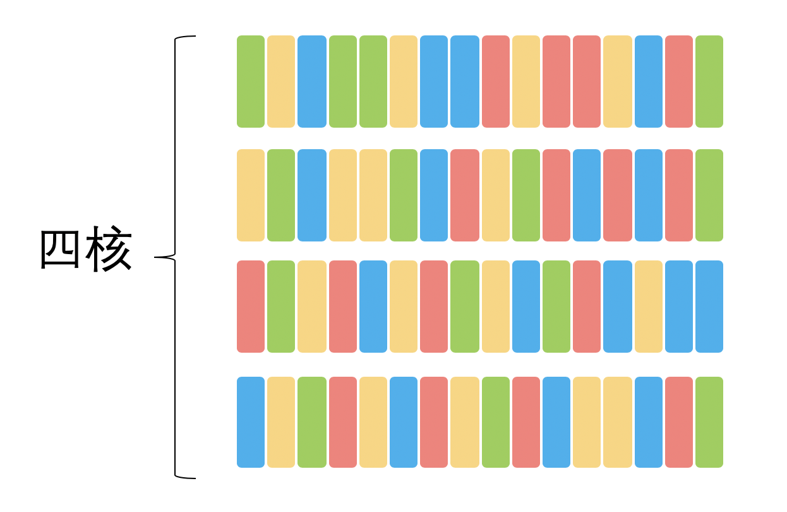
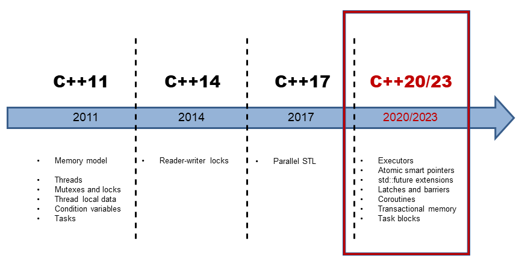
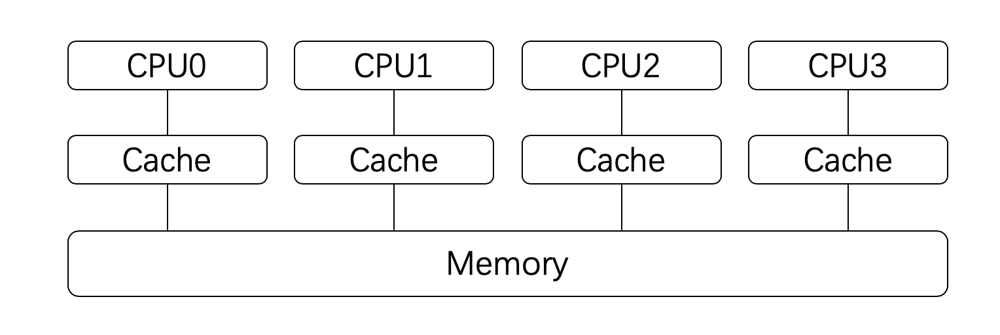
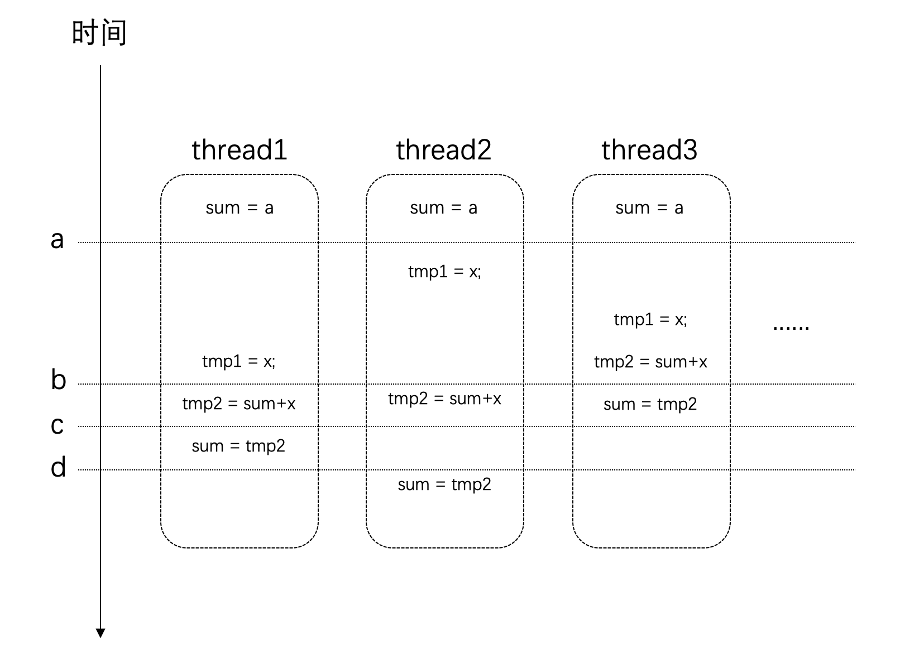
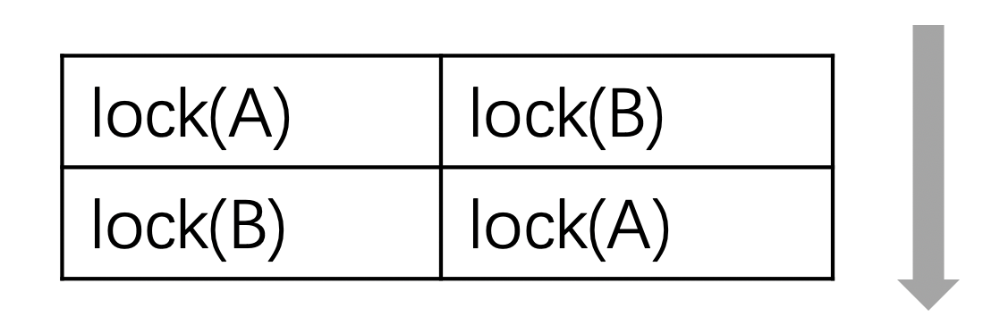

## C++ 并发编程（从C++11到C++17）

Posted on Nov 15, 2019

 [C++](https://paul.pub/category/#C++)  [Thread](https://paul.pub/tags/#Thread) [ Concurrency](https://paul.pub/tags/#Concurrency) [ Synchronize](https://paul.pub/tags/#Synchronize) [ Lock](https://paul.pub/tags/#Lock) [ Mutex](https://paul.pub/tags/#Mutex)

* * *

自C++11标准以来，C++语言开始支持多线程模型。借助多线程模型，我们可以开发出更好的并发系统。本文以C++语言为例，讲解如何进行并发编程。并尽可能涉及C++11，C++14以及C++17中的主要内容。


# 为什么要并发编程

大型的软件项目常常包含非常多的任务需要处理。例如：对于大量数据的数据流处理，或者是包含复杂GUI界面的应用程序。如果将所有的任务都以串行的方式执行，则整个系统的效率将会非常低下，应用程序的用户体验会非常的差。

另一方面，自上个世纪六七十年代英特尔创始人之一 [Gordon Moore](https://en.wikipedia.org/wiki/Gordon_Moore) 提出 [摩尔定义](https://en.wikipedia.org/wiki/Moore%27s_law) 以来，CPU频率以每18个月翻一番的指数速度增长。但这一增长在最近的十年已经基本停滞，大家会发现曾经有过一段时间CPU的频率从3G到达4G，但在这之后就停滞不前了。因此最近的新款CPU也基本上都是3G左右的频率。相应的，CPU以更多核的形式在增长。目前的Intel i7有8核的版本，Xeon处理器达到了28核。并且，最近几年手机上使用的CPU也基本上是4核或者8核的了。

由此，掌握并发编程技术，利用多处理器来提升软件项目的性能将是软件工程师的一项基本技能。

本文以C++语言为例，讲解如何进行并发编程。并尽可能涉及C++11，C++14以及C++17中的主要内容。

## 并发与并行

并发（Concurrent）与并行（Parallel）都是很常见的术语。

Erlang之父Joe Armstrong曾经以人们使用咖啡机的场景为例描述了这两个术语。如下图所示：


*   **并发**：如果多个队列可以交替使用某台咖啡机，则这一行为就是并发的。
*   **并行**：如果存在多台咖啡机可以被多个队列交替使用，则就是并行。

这里队列中的每个人类比于计算机的任务，咖啡机类比于计算机处理器。因此：并发和并行都是在多任务的环境下的讨论。

更严格的来说：如果一个系统支持多个动作同时存在，那么这个系统就是一个并发系统。如果这个系统还支持多个动作（物理时间上）同时执行，那么这个系统就是一个并行系统。

你可能已经看出，“并行”其实是“并发”的子集。它们的区别在于是否具有多个处理器。如果存在多个处理器同时执行多个线程，就是并行。

在不考虑处理器数量的情况下，我们统称之为“并发”。

## 进程与线程

进程与线程是操作系统的基本概念。无论是桌面系统：MacOS，Linux，Windows，还是移动操作系统：Android，iOS，都存在进程和线程的概念。

> **进程**（英语：process），是指计算机中已运行的程序。进程为曾经是分时系统的基本运作单位。在面向进程设计的系统（如早期的UNIX，Linux 2.4及更早的版本）中，进程是程序的基本执行实体；
> 
> **线程**（英语：thread）是操作系统能够进行运算调度的最小单位。它被包含在进程之中，是进程中的实际运作单位。
> 
> – 维基百科

关于这两个概念在任何一本操作系统书上都可以找到定义。网上也有很多文章对它们进行了解释。因此这里不再赘述，这里仅仅提及一下它们与编程的关系。

对于绝大部分编程语言或者编程环境来说，我们所写的程序都会在一个进程中运行。一个进程至少会包含一个线程。这个线程我们通常称之为主线程。

在默认的情况下，我们写的代码都是在进程的主线程中运行，除非开发者在程序中创建了新的线程。

不同编程语言的线程环境会不一样，Java语言在很早就支持了多线程接口。（Java程序在Java虚拟机中运行，虚拟机通常还会包含自己特有的线程，例如垃圾回收线程。）。而对于JavaScript这样的语言来说，它就没有多线程的概念。

当我们只有一个处理器时，所有的进程或线程会分时占用这个处理器。但如果系统中存在多个处理器时，则就可能有多个任务并行的运行在不同的处理器上。

下面两幅图以不同颜色的矩形代表不同的任务（可能是进程，也可能是线程）来描述它们可能在处理器上执行的顺序。

下图是单核处理器的情况：


下面是四核处理器的情况：



任务会在何时占有处理器，通常是由操作系统的调度策略决定的。在[《Android系统上的进程管理：进程的调度》](https://paul.pub/android-process-schedule/)一文中，我们介绍过Linux的调度策略。

当我们在开发跨平台的软件时，我们不应当对调度策略做任何假设，而应该抱有“系统可能以任意顺序来调度我的任务”这样的想法。

## 并发系统的性能

开发并发系统最主要的动机就是提升系统性能（事实上，这是以增加复杂度为代价的）。

但我们需要知道，单纯的使用多线程并不一定能提升系统性能（当然，也并非线程越多系统的性能就越好）。从上面的两幅图我们就可以直观的感受到：线程（任务）的数量要根据具体的处理器数量来决定。假设只有一个处理器，那么划分太多线程可能会适得其反。因为很多时间都花在任务切换上了。

因此，在设计并发系统之前，一方面我们需要做好对于硬件性能的了解，另一方面需要对我们的任务有足够的认识。

关于这一点，你可能需要了解一下[阿姆达尔定律](https://en.wikipedia.org/wiki/Amdahl%27s_law)了。对于这个定律，简单来说：我们想要预先意识到那些任务是可以并行的，那些是无法并行的。只有明确了任务的性质，才能有的放矢的进行优化。这个定律告诉了我们将系统并行之后性能收益的上限。

关于阿姆达尔定律在[Linux系统监测工具sysstat介绍](https://paul.pub/sysstat/#id-%E9%98%BF%E5%A7%86%E8%BE%BE%E5%B0%94%E5%AE%9A%E5%BE%8B)一文中已经介绍过，因此这里不再赘述。

# C++与并发编程

前面我们已经了解到，并非所有的语言都提供了多线程的环境。

即便是C++语言，直到[C++11](https://en.wikipedia.org/wiki/C%2B%2B11)标准之前，也是没有多线程支持的。在这种情况下，Linux/Unix平台下的开发者通常会使用[POSIX Threads](https://en.wikipedia.org/wiki/POSIX_Threads)，Windows上的开发者也会有[相应的接口](https://docs.microsoft.com/en-us/cpp/parallel/multithreading-with-cpp-and-mfc?view=vs-2019)。但很明显，这些API都只针对特定的操作系统平台，可移植性较差。如果要同时支持Linux和Windows系统，你可能要写两套代码。

> 相较而言，Java自JDK 1.0就包含了多线程模型。

这个状态在C++ 11标准发布之后得到了改变。并且，在C++ 14和C++ 17标准中又对并发编程机制进行了增强。

下图是最近几个版本的C++标准特性的线路图。



## 编译器与C++标准

编译器对于语言特性的支持是逐步完成的。想要使用特定的特性你需要相应版本的编译器。

*   GCC对于C++特性的支持请参见这里：[C++ Standards Support in GCC](https://www.gnu.org/software/gcc/projects/cxx-status.html)。
*   Clang对于C++特性的支持请参见这里：[C++ Support in Clang](https://clang.llvm.org/cxx_status.html)。

下面两个表格列出了C++标准和相应编译器的版本对照：

*   C++标准与相应的GCC版本要求如下：

| C++版本 | GCC版本 |
| --- | --- |
| C++11 | 4.8 |
| C++14 | 5.0 |
| C++17 | 7.0 |

*   C++标准与相应的Clang版本要求如下：

| C++版本 | Clang版本 |
| --- | --- |
| C++11 | 3.3 |
| C++14 | 3.4 |
| C++17 | 5.0 |

默认情况下编译器是以较低的标准来进行编译的，如果希望使用新的标准，你需要通过编译参数`-std=c++xx`告知编译器，例如：

```plaintext
g++ -std=c++17 your_file.cpp -o your_program
```

# 测试环境

本文的源码可以到下载我的github上获取，地址：[paulQuei/cpp-concurrency](https://github.com/paulQuei/cpp-concurrency)。

你可以直接通过下面这条命令获取源码：

```sh
git clone https://github.com/paulQuei/cpp-concurrency.git
```

源码下载之后，你可以通过任何文本编辑器浏览源码。如果希望编译和运行程序，你还需要按照下面的内容来准备环境。

本文中的源码使用[cmake](https://cmake.org/)编译，只有cmake 3.8以上的版本才支持C++ 17，所以你需要安装这个或者更新版本的cmake。

另外，截止目前（2019年10月）为止，`clang`编译器还不支持[并行算法](#id-%E5%B9%B6%E8%A1%8C%E7%AE%97%E6%B3%95)。

但是[gcc-9](https://gcc.gnu.org/gcc-9/changes.html)是支持的。因此想要编译和运行这部分代码，你需要安装gcc 9.0或更新的版本。并且，gcc-9还要依赖[Intel Threading Building Blocks](https://github.com/intel/tbb)才能使用并行算法以及`<execution>`头文件。

具体的安装方法见下文。

> 具体编译器对于C++特性支持的情况请参见这里：[C++ compiler support](https://en.cppreference.com/w/cpp/compiler_support)。

安装好之后运行根目录下的下面这个命令即可：

```plaintext
 ./make_all.sh
```

它会完成所有的编译工作。

本文的源码在下面两个环境中经过测试，环境的准备方法如下。

## MacOS

在Mac上，我使用[brew](https://brew.sh/)工具安装`gcc`以及`tbb`库。

考虑到其他人与我的环境可能会有所差异，所以需要手动告知`tbb`库的安装路径。

读者需要执行下面这些命令来准备环境：

```sh
brew install gcc
brew install tbb

export tbb_path=/usr/local/Cellar/tbb/2019_U8/
./make_all.sh
```

注意，请通过运行`g++-9`命令以确认gcc的版本是否正确，如果版本较低，则需要通过`brew`命令将其升级到新版本：

```sh
brew upgrade gcc
```

## Ubuntu

Ubuntu上，通过下面的命令安装`gcc-9`。

```sh
sudo add-apt-repository ppa:ubuntu-toolchain-r/test
sudo apt-get update
sudo apt install  gcc-9 g++-9
```

但安装`tbb`库就有些麻烦了。这是因为[Ubuntu 16.04默认关联的版本是较低的](https://launchpad.net/ubuntu/+source/tbb)，直接安装是无法使用的。我们需要安装[更新的版本](https://launchpad.net/ubuntu/+source/tbb/2019~U8-1)。

联网安装的方式[步骤繁琐](https://medium.com/@george.shuklin/how-to-install-packages-from-a-newer-distribution-without-installing-unwanted-6584fa93208f)，所以可以通过下载包的方式进行安装，我已经将这需要的两个文件放到的这里：

*   [libtbb2\_2019~U8-1\_amd64.deb](https://paul-pub.oss-cn-beijing.aliyuncs.com/2019/2019-11-26-cpp-concurrency/libtbb2_2019~U8-1_amd64.deb)
*   [libtbb-dev\_2019~U8-1\_amd64.deb](https://paul-pub.oss-cn-beijing.aliyuncs.com/2019/2019-11-26-cpp-concurrency/libtbb-dev_2019~U8-1_amd64.deb)

如果需要，你可以下载后通过`apt`命令安装即可：

```sh
sudo apt install ~/Downloads/libtbb2_2019~U8-1_amd64.deb 
sudo apt install ~/Downloads/libtbb-dev_2019~U8-1_amd64.deb 
```

# 线程

## 创建线程

创建线程非常的简单的，下面就是一个使用了多线程的Hello World示例：

```c
// 01_hello_thread.cpp

#include <iostream>
#include <thread> // ①

using namespace std; // ②

void hello() { // ③
  cout << "Hello World from new thread." << endl;
}

int main() {
  thread t(hello); // ④
  t.join(); // ⑤

  return 0;
}
```

对于这段代码说明如下：

1.  为了使用多线程的接口，我们需要`#include <thread>`头文件。
2.  为了简化声明，本文中的代码都将`using namespace std;`。
3.  新建线程的入口是一个普通的函数，它并没有什么特别的地方。
4.  创建线程的方式就是构造一个`thread`对象，并指定入口函数。与普通对象不一样的是，此时编译器便会为我们创建一个新的操作系统线程，并在新的线程中执行我们的入口函数。
5.  关于`join`函数在下文中讲解。

`thread`可以和`callable`类型一起工作，因此如果你熟悉[lambda表达式](https://en.cppreference.com/w/cpp/language/lambda)，你可以直接用它来写线程的逻辑，像这样：

```c++
// 02_lambda_thread.cpp

#include <iostream>
#include <thread>

using namespace std;

int main() {
  thread t([] {
    cout << "Hello World from lambda thread." << endl;
  });

  t.join();

  return 0;
}
```

> 为了减少不必要的重复，若无必要，下文中的代码将不贴出`include`指令以及`using`声明。

当然，你可以传递参数给入口函数，像下面这样：

```c++
// 03_thread_argument.cpp

void hello(string name) {
  cout << "Welcome to " << name << endl;
}

int main() {
  thread t(hello, "https://paul.pub");
  t.join();

  return 0;
}
```

不过需要注意的是，参数是以拷贝的形式进行传递的。因此对于拷贝耗时的对象你可能需要传递指针或者引用类型作为参数。但是，如果是传递指针或者引用，你还需要考虑参数对象的生命周期。因为线程的运行长度很可能会超过参数的生命周期（见下文`detach`），这个时候如果线程还在访问一个已经被销毁的对象就会出现问题。

## join与detach

*   主要API

| API | 说明 |
| --- | --- |
| join | 等待线程完成其执行 |
| detach | 允许线程独立执行 |

一旦启动线程之后，我们必须决定是要等待直接它结束（通过`join`），还是让它独立运行（通过`detach`），我们必须二者选其一。如果在`thread`对象**销毁的时候**我们还没有做决定，则`thread`对象在析构函数出将调用`std::terminate()`从而导致我们的进程异常退出。

> 请思考在上面的代码示例中，`thread`对象在何时会销毁。

需要注意的是：在我们做决定的时候，很可能线程已经执行完了（例如上面的示例中线程的逻辑仅仅是一句打印，执行时间会很短）。新的线程创建之后，究竟是新的线程先执行，还是当前线程的下一条语句先执行这是不确定的，因为这是由操作系统的调度策略决定的。不过这不要紧，我们只要在`thread`对象销毁前做决定即可。

*   `join`：调用此接口时，当前线程会一直阻塞，直到目标线程执行完成（当然，很可能目标线程在此处调用之前就已经执行完成了，不过这不要紧）。因此，如果目标线程的任务非常耗时，你就要考虑好是否需要在主线程上等待它了，因此这很可能会导致主线程卡住。
*   `detach`：`detach`是让目标线程成为守护线程（daemon threads）。一旦`detach`之后，目标线程将独立执行，即便其对应的`thread`对象销毁也不影响线程的执行。并且，你无法再与之通信。

对于这两个接口，都必须是可执行的线程才有意义。你可以通过`joinable()`接口查询是否可以对它们进行`join`或者`detach`。

## 管理当前线程

*   主要API

| API | C++标准 | 说明 |
| --- | --- | --- |
| yield | C++11 | 让出处理器，重新调度各执行线程 |
| get\_id | C++11 | 返回当前线程的线程 id |
| sleep\_for | C++11 | 使当前线程的执行停止指定的时间段 |
| sleep\_until | C++11 | 使当前线程的执行停止直到指定的时间点 |

上面是一些在线程内部使用的API，它们用来对当前线程做一些控制。

*   `yield` 通常用在自己的主要任务已经完成的时候，此时希望让出处理器给其他任务使用。
*   `get_id` 返回当前线程的id，可以以此来标识不同的线程。
*   `sleep_for` 是让当前线程停止一段时间。
*   `sleep_until` 和`sleep_for`类似，但是是以具体的时间点为参数。这两个API都以[chrono](https://en.cppreference.com/w/cpp/header/chrono) API（由于篇幅所限，这里不展开这方面内容）为基础。

下面是一个代码示例：

```c++
// 04_thread_self_manage.cpp

void print_time() {
  auto now = chrono::system_clock::now();
  auto in_time_t = chrono::system_clock::to_time_t(now);

  std::stringstream ss;
  ss << put_time(localtime(&in_time_t), "%Y-%m-%d %X");
  cout << "now is: " << ss.str() << endl;
}

void sleep_thread() {
  this_thread::sleep_for(chrono::seconds(3));
  cout << "[thread-" << this_thread::get_id() << "] is waking up" << endl;
}

void loop_thread() {
  for (int i = 0; i < 10; i++) {
    cout << "[thread-" << this_thread::get_id() << "] print: " << i << endl;
  }
}

int main() {
  print_time();

  thread t1(sleep_thread);
  thread t2(loop_thread);

  t1.join();
  t2.detach();

  print_time();
  return 0;
}
```

这段代码应该还是比较容易理解的，这里创建了两个线程。它们都会有一些输出，其中一个会先停止3秒钟，然后再输出。主线程调用`join`会一直卡住等待它运行结束。

这段程序的输出如下：

```sh
now is: 2019-10-13 10:17:48
[thread-0x70000cdda000] print: 0
[thread-0x70000cdda000] print: 1
[thread-0x70000cdda000] print: 2
[thread-0x70000cdda000] print: 3
[thread-0x70000cdda000] print: 4
[thread-0x70000cdda000] print: 5
[thread-0x70000cdda000] print: 6
[thread-0x70000cdda000] print: 7
[thread-0x70000cdda000] print: 8
[thread-0x70000cdda000] print: 9
[thread-0x70000cd57000] is waking up
now is: 2019-10-13 10:17:51
```

## 一次调用

*   主要API

| API | C++标准 | 说明 |
| --- | --- | --- |
| call\_once | C++11 | 即便在多线程环境下，也能保证只调用某个函数一次 |
| once\_flag | C++11 | 与`call_once`配合使用 |

在一些情况下，我们有些任务需要执行一次，并且我们只希望它执行一次，例如资源的初始化任务。这个时候就可以用到上面的接口。这个接口会保证，即便在多线程的环境下，相应的函数也只会调用一次。

下面就是一个示例：有三个线程都会使用`init`函数，但是只会有一个线程真正执行它。

```c++
// 05_call_once.cpp

void init() {
  cout << "Initialing..." << endl;
  // Do something...
}

void worker(once_flag* flag) {
  call_once(*flag, init);
}

int main() {
  once_flag flag;

  thread t1(worker, &flag);
  thread t2(worker, &flag);
  thread t3(worker, &flag);

  t1.join();
  t2.join();
  t3.join();

  return 0;
}
```

我们无法确定具体是哪一个线程会执行`init`。而事实上，我们也不关心，因为只要有某个线程完成这个初始化工作就可以了。

> 请思考一下，为什么要在main函数中创建`once_flag flag`。如果是在`worker`函数中直接声明一个`once_flag`并使用行不行？为什么？

# 并发任务

下面以一个并发任务为示例讲解如何引入多线程。

任务示例：现在假设我们需要计算某个范围内所有自然数的平方根之和，例如`[1, 10e8]`。

在单线程模型下，我们的代码可能是这样的：

```c++
// 06_naive_multithread.cpp

static const int MAX = 10e8; // ①
static double sum = 0; // ②

void worker(int min, int max) { // ③
  for (int i = min; i <= max; i++) {
    sum += sqrt(i);
  }
}

void serial_task(int min, int max) { // ④
  auto start_time = chrono::steady_clock::now();
  sum = 0;
  worker(0, MAX);
  auto end_time = chrono::steady_clock::now();
  auto ms = chrono::duration_cast<chrono::milliseconds>(end_time - start_time).count();
  cout << "Serail task finish, " << ms << " ms consumed, Result: " << sum << endl;
}
```

这段代码说明如下：

1.  通过一个常量指定数据范围，这个是为了方便调整。
2.  通过一个全局变量来存储结果。
3.  通过一个任务函数来计算值。
4.  统计任务的执行时间。

这段程序输出如下：

```plaintext
Serail task finish, 6406 ms consumed, Result: 2.10819e+13
```

很显然，上面单线程的做法性能太差了。我们的任务完全是可以并发执行的。并且任务很容易划分。

下面我们就尝试以多线程的方式来改造原先的程序。

改造后的程序如下：

```c++
// 06_naive_multithread.cpp

void concurrent_task(int min, int max) {
  auto start_time = chrono::steady_clock::now();

  unsigned concurrent_count = thread::hardware_concurrency(); // ①
  cout << "hardware_concurrency: " << concurrent_count << endl;
  vector<thread> threads;
  min = 0;
  sum = 0;
  for (int t = 0; t < concurrent_count; t++) { // ②
    int range = max / concurrent_count * (t + 1);
    threads.push_back(thread(worker, min, range)); // ③
    min = range + 1;
  }
  for (auto& t : threads) {
    t.join(); // ④
  }

  auto end_time = chrono::steady_clock::now();
  auto ms = chrono::duration_cast<chrono::milliseconds>(end_time - start_time).count();
  cout << "Concurrent task finish, " << ms << " ms consumed, Result: " << sum << endl;
}
```

这段代码说明如下：

1.  `thread::hardware_concurrency()`可以获取到当前硬件支持多少个线程并行执行。
2.  根据处理器的情况决定线程的数量。
3.  对于每一个线程都通过`worker`函数来完成任务，并划分一部分数据给它处理。
4.  等待每一个线程执行结束。

很好，似乎很简单就完成了并发的改造。然后我们运行一下这个程序：

```plaintext
hardware_concurrency: 16
Concurrent task finish, 6246 ms consumed, Result: 1.78162e+12
```

很抱歉，我们会发现这里的性能并没有明显的提升。更严重的是，这里的结果是错误的。

要搞清楚为什么结果不正确我们需要更多的背景知识。

我们知道，对于现代的处理器来说，为了加速处理的速度，每个处理器都会有自己的高速缓存（Cache），这个高速缓存是与每个处理器相对应的，如下图所示：

> 事实上，目前大部分CPU的缓存已经不只一层。



处理器在进行计算的时候，高速缓存会参与其中，例如数据的读和写。而高速缓存和系统主存（Memory）是有可能存在不一致的。即：某个结果计算后保存在处理器的高速缓存中了，但是没有同步到主存中，此时这个值对于其他处理器就是不可见的。

事情还远不止这么简单。我们对于全局变量值的修改：`sum += sqrt(i);`这条语句，它并非是原子的。它其实是很多条指令的组合才能完成。假设在某个设备上，这条语句通过下面这几个步骤来完成。它们的时序可能如下所示：



在时间点a的时候，所有线程对于`sum`变量的值是一致的。

但是在时间点b之后，thread3上已经对`sum`进行了赋值。而这个时候其他几个线程也同时在其他处理器上使用了这个值，那么这个时候它们所使用的值就是旧的（错误的）。最后得到的结果也自然是错的。

## 竞争条件与临界区

当多个进程或者线程同时访问共享数据时，只要有一个任务会修改数据，那么就可能会发生问题。此时结果依赖于这些任务执行的相对时间，这种场景称为[**竞争条件**（race condition）](https://en.wikipedia.org/wiki/Race_condition)。

访问共享数据的代码片段称之为**临界区**（critical section）。具体到上面这个示例，临界区就是读写`sum`变量的地方。

要避免竞争条件，就需要对临界区进行数据保护。

很自然的，现在我们能够理解发生竞争条件是因为这些线程在同时访问共享数据，其中有些线程的改动没有让其他线程知道，导致其他线程在错误的基础上进行处理，结果自然也就是错误的。

那么，如果一次只让一个线程访问共享数据，访问完了再让其他线程接着访问，这样就可以避免问题的发生了。

接下来介绍的API提供的就是这样的功能。

# 互斥体与锁

## mutex

开发并发系统的目的主要是为了提升性能：将任务分散到多个线程，然后在不同的处理器上同时执行。这些分散开来的线程通常会包含两类任务：

1.  独立的对于划分给自己的数据的处理
2.  对于处理结果的汇总

其中第1项任务因为每个线程是独立的，不存在竞争条件的问题。而第2项任务，由于所有线程都可能往总结果（例如上面的`sum`变量）汇总，这就需要做保护了。在某一个具体的时刻，只应当有一个线程更新总结果，即：保证每个线程对于共享数据的访问是“互斥”的。`mutex` 就提供了这样的功能。

`mutex`是**mut**ual **ex**clusion（互斥）的简写。

*   主要API

| API | C++标准 | 说明 |
| --- | --- | --- |
| mutex | C++11 | 提供基本互斥设施 |
| timed\_mutex | C++11 | 提供互斥设施，带有超时功能 |
| recursive\_mutex | C++11 | 提供能被同一线程递归锁定的互斥设施 |
| recursive\_timed\_mutex | C++11 | 提供能被同一线程递归锁定的互斥设施，带有超时功能 |
| shared\_timed\_mutex | C++14 | 提供共享互斥设施并带有超时功能 |
| shared\_mutex | C++17 | 提供共享互斥设施 |

很明显，在这些类中，`mutex`是最基础的API。其他类都是在它的基础上的改进。所以这些类都提供了下面三个方法，并且它们的功能是一样的：

<table><tbody><tr><td>方法</td><td>说明</td></tr><tr><td>lock</td><td>锁定互斥体，如果不可用，则阻塞</td></tr><tr><td>try_lock</td><td>尝试锁定互斥体，如果不可用，直接返回</td></tr><tr><td>unlock</td><td>解锁互斥体</td></tr></tbody></table>

这三个方法提供了基础的锁定和解除锁定的功能。使用`lock`意味着你有很强的意愿一定要获取到互斥体，而使用`try_lock`则是进行一次尝试。这意味着如果失败了，你通常还有其他的路径可以走。

在这些基础功能之上，其他的类分别在下面三个方面进行了扩展：

*   **超时**：`timed_mutex`，`recursive_timed_mutex`，`shared_timed_mutex`的名称都带有`timed`，这意味着它们都支持超时功能。它们都提供了`try_lock_for`和`try_lock_until`方法，这两个方法分别可以指定超时的时间长度和时间点。如果在超时的时间范围内没有能获取到锁，则直接返回，不再继续等待。
*   **可重入**：`recursive_mutex`和`recursive_timed_mutex`的名称都带有`recursive`。可重入或者叫做可递归，是指在同一个线程中，同一把锁可以锁定多次。这就避免了一些不必要的死锁。
*   **共享**：`shared_timed_mutex`和`shared_mutex`提供了共享功能。对于这类互斥体，实际上是提供了两把锁：一把是共享锁，一把是互斥锁。一旦某个线程获取了互斥锁，任何其他线程都无法再获取互斥锁和共享锁；但是如果有某个线程获取到了共享锁，其他线程无法再获取到互斥锁，但是还有获取到共享锁。这里互斥锁的使用和其他的互斥体接口和功能一样。而共享锁可以同时被多个线程同时获取到（使用共享锁的接口见下面的表格）。共享锁通常用在[读者写者模型](https://en.wikipedia.org/wiki/Readers%E2%80%93writers_problem)上。

使用共享锁的接口如下：

<table><tbody><tr><td>方法</td><td>说明</td></tr><tr><td>lock_shared</td><td>获取互斥体的共享锁，如果无法获取则阻塞</td></tr><tr><td>try_lock_shared</td><td>尝试获取共享锁，如果不可用，直接返回</td></tr><tr><td>unlock_shared</td><td>解锁共享锁</td></tr></tbody></table>

接下来，我们就借助刚学到的`mutex`来改造我们的并发系统，改造后的程序如下：

```c++
// 07_mutex_lock.cpp

static const int MAX = 10e8;
static double sum = 0;

static mutex exclusive;

void concurrent_worker(int min, int max) {
  for (int i = min; i <= max; i++) {
    exclusive.lock(); // ①
    sum += sqrt(i);
    exclusive.unlock(); // ②
  }
}

void concurrent_task(int min, int max) {
  auto start_time = chrono::steady_clock::now();

  unsigned concurrent_count = thread::hardware_concurrency();
  cout << "hardware_concurrency: " << concurrent_count << endl;
  vector<thread> threads;
  min = 0;
  sum = 0;
  for (int t = 0; t < concurrent_count; t++) {
    int range = max / concurrent_count * (t + 1);
    threads.push_back(thread(concurrent_worker, min, range)); // ③
    min = range + 1;
  }
  for (int i = 0; i < threads.size(); i++) {
    threads[i].join();
  }

  auto end_time = chrono::steady_clock::now();
  auto ms = chrono::duration_cast<chrono::milliseconds>(end_time - start_time).count();
  cout << "Concurrent task finish, " << ms << " ms consumed, Result: " << sum << endl;
}
```

这里只有三个地方需要关注：

1.  在访问共享数据之前加锁
2.  访问完成之后解锁
3.  在多线程中使用带锁的版本

执行之后结果输出如下：

```plaintext
hardware_concurrency: 16
Concurrent task finish, 74232 ms consumed, Result: 2.10819e+13
```

这下结果是对了，但是我们却发现这个版本比原先单线程的版本性能还要差很多。这是为什么？

这是因为加锁和解锁是有代价的，这里计算最耗时的地方在锁里面，每次只能有一个线程串行执行，相比于单线程模型，它不但是串行的，还增加了锁的负担，因此就更慢了。

这就是为什么前面说多线程系统会增加系统的复杂度，而且并非多线程系统一定就有更好的性能。

不过，对于这里的问题是可以改进的。我们仔细思考一下：我们划分给每个线程的数据其实是独立的，对于数据的处理是耗时的，但其实这部分逻辑每个线程可以单独处理，没必要加锁。只有在最后汇总数据的时候进行一次锁保护就可以了。

于是我们改造`concurrent_worker`，像下面这样：

```c++
// 08_improved_mutex_lock.cpp

void concurrent_worker(int min, int max) {
  double tmp_sum = 0;
  for (int i = min; i <= max; i++) {
    tmp_sum += sqrt(i); // ①
  }
  exclusive.lock(); // ②
  sum += tmp_sum;
  exclusive.unlock();
}
```

这段代码的改变在于两处：

1.  通过一个局部变量保存当前线程的处理结果
2.  在汇总总结过的时候进行锁保护

运行一下改进后的程序，其结果输出如下：

```plaintext
hardware_concurrency: 16
Concurrent task finish, 451 ms consumed, Result: 2.10819e+13
```

可以看到，性能一下就提升了好多倍。我们终于体验到多线程带来的好处了。

我们用锁的**粒度**（granularity）来描述锁的范围。**细粒度**（fine-grained）是指锁保护较小的范围，**粗粒度**（coarse-grained）是指锁保护较大的范围。出于性能的考虑，我们应该保证锁的粒度尽可能的细。并且，不应该在获取锁的范围内执行耗时的操作，例如执行IO。如果是耗时的运算，也应该尽可能的移到锁的外面。

> In general, a lock should be held for only the minimum possible time needed to perform the required operations.
> 
> –《C++ Concurrency in Action》

## 死锁

死锁是并发系统很常见的一类问题。

死锁是指：两个或以上的运算单元，每一方都在等待其他方释放资源，但是所有方都不愿意释放资源。结果是没有任何一方能继续推进下去，于是整个系统无法再继续运转。

死锁在现实中也很常见，例如：两个孩子分别拿着玩具的一半然后哭着要从对方手里得到另外一半玩具，但是谁都不肯让步。

在成年人的世界里也会发生类似的情况，例如下面这个交通状况：


下面我们来看一个编程示例。

现在假设我们在开发一个银行的系统，这个系统包含了转账的功能。

首先我们创建一个`Account`类来描述银行账号。由于这仅仅是一个演示使用的代码，所以我们希望代码足够的简单。`Account`类仅仅包含名称和金额两个字段。

另外，为了支持并发，这个类包含了一个`mutex`对象，用来保护账号金额，在读写账号金额时需要先加锁保护。

```c++
// 09_deadlock_bank_transfer.cpp

class Account {
public:
  Account(string name, double money): mName(name), mMoney(money) {};

public:
  void changeMoney(double amount) {
    mMoney += amount;
  }
  string getName() {
    return mName;
  }
  double getMoney() {
    return mMoney;
  }
  mutex* getLock() {
    return &mMoneyLock;
  }

private:
  string mName;
  double mMoney;
  mutex mMoneyLock;
};
```

`Account`类很简单，我想就不用多做说明了。

接下来，我们再创建一个描述银行的`Bank`类。

```c++
// 09_deadlock_bank_transfer.cpp

class Bank {
public:
  void addAccount(Account* account) {
    mAccounts.insert(account);
  }

  bool transferMoney(Account* accountA, Account* accountB, double amount) {
    lock_guard guardA(*accountA->getLock()); // ①
    lock_guard guardB(*accountB->getLock());

    if (amount > accountA->getMoney()) { // ②
      return false;
    }

    accountA->changeMoney(-amount); // ③
    accountB->changeMoney(amount);
    return true;
  }

  double totalMoney() const {
    double sum = 0;
    for (auto a : mAccounts) {
      sum += a->getMoney();
    }
    return sum;
  }

private:
  set<Account*> mAccounts;
};
```

银行类中记录了所有的账号，并且提供了一个方法用来查询整个银行的总金额。

这其中，我们最主要要关注转账的实现：`transferMoney`。该方法的几个关键点如下：

1.  为了保证线程安全，在修改每个账号之前，需要获取相应的锁。
2.  判断转出账户金额是否足够，如果不够此次转账失败。
3.  进行转账。

有了银行和账户结构之后就可以开发转账系统了，同样的，由于是为了演示所用，我们的转账系统也会尽可能的简单：

```c++
// 09_deadlock_bank_transfer.cpp

void randomTransfer(Bank* bank, Account* accountA, Account* accountB) {
  while(true) {
    double randomMoney = ((double)rand() / RAND_MAX) * 100;
    if (bank->transferMoney(accountA, accountB, randomMoney)) {
      cout << "Transfer " << randomMoney << " from " << accountA->getName()
           << " to " << accountB->getName()
           << ", Bank totalMoney: " << bank->totalMoney() << endl;
    } else {
      cout << "Transfer failed, "
           << accountA->getName() << " has only $" << accountA->getMoney() << ", but "
           << randomMoney << " required" << endl;
    }
  }
}
```

这里每次生成一个随机数，然后通过银行进行转账。

最后我们在`main`函数中创建两个线程，互相在两个账号之间来回转账：

```c++
// 09_deadlock_bank_transfer.cpp

int main() {
  Account a("Paul", 100);
  Account b("Moira", 100);

  Bank aBank;
  aBank.addAccount(&a);
  aBank.addAccount(&b);

  thread t1(randomTransfer, &aBank, &a, &b);
  thread t2(randomTransfer, &aBank, &b, &a);

  t1.join();
  t2.join();

  return 0;
}
```

至此，我们的银行转账系统就开发完成了。然后编译并运行，其结果可能像下面这样：

```plaintext
...
Transfer 13.2901 from Paul to Moira, Bank totalMoney: 20042.6259 from Moira to Paul, Bank totalMoney: 200
Transfer failed, Moira has only $34.7581, but 66.3208 required
Transfer failed, Moira has only $34.7581, but 
Transfer 93.191 from 53.9176 required
Transfer 60.6146 from Moira to Paul, Bank totalMoney: 200
Transfer 49.7304 from Moira to Paul, Bank totalMoney: 200Paul to Moira, Bank totalMoney: 
Transfer failed, Moira has only $17.6041, but 18.1186 required
Transfer failed, Moira has only $17.6041, but 18.893 required
Transfer failed, Moira has only $17.6041, but 34.7078 required
Transfer failed, Moira has only $17.6041, but 33.9569 required
Transfer 12.7899 from 200
Moira to Paul, Bank totalMoney: 200
Transfer failed, Moira has only $63.9373, but 80.9038 required
Transfer 50.933 from Moira to Paul, Bank totalMoney: 200
Transfer failed, Moira has only $13.0043, but 30.2056 required
Transfer failed, Moira has only $Transfer 59.123 from Paul to Moira, Bank totalMoney: 200
Transfer 29.0486 from Paul to Moira, Bank totalMoney: 20013.0043, but 64.7307 required
```

如果你运行了这个程序，你会发现很快它就卡住不动了。为什么？

因为发生了死锁。

我们仔细思考一下这两个线程的逻辑：这两个线程可能会同时获取其中一个账号的锁，然后又想获取另外一个账号的锁，此时就发生了死锁。如下图所示：



当然，发生死锁的原因远不止上面这一种情况。如果两个线程互相`join`就可能发生死锁。还有在一个线程中对一个不可重入的互斥体（例如`mutex`而非`recursive_mutex`）多次加锁也会死锁。

你可能会觉得，我可不会这么傻，写出这样的代码。但实际上，很多时候是由于代码的深层次嵌套导致了死锁的发生，由于调用关系的复杂导致发现这类问题并不容易。

如果仔细看一下上面的输出，我们会发现还有另外一个问题：这里的输出是乱的。两个线程的输出混杂在一起了。究其原因也很容易理解：两个线程可能会同时输出，没有做好隔离。

下面我们就来逐步解决上面的问题。

对于输出混乱的问题很好解决，专门用一把锁来保护输出逻辑即可：

```c++
// 10_improved_bank_transfer.cpp

mutex sCoutLock;
void randomTransfer(Bank* bank, Account* accountA, Account* accountB) {
  while(true) {
    double randomMoney = ((double)rand() / RAND_MAX) * 100;
    if (bank->transferMoney(accountA, accountB, randomMoney)) {
      sCoutLock.lock();
      cout << "Transfer " << randomMoney << " from " << accountA->getName()
          << " to " << accountB->getName()
          << ", Bank totalMoney: " << bank->totalMoney() << endl;
      sCoutLock.unlock();
    } else {
      sCoutLock.lock();
      cout << "Transfer failed, "
           << accountA->getName() << " has only " << accountA->getMoney() << ", but "
           << randomMoney << " required" << endl;
      sCoutLock.unlock();
    }
  }
}
```

> 请思考一下两处`lock`和`unlock`调用，并考虑为什么不在`while(true)`下面写一次整体的加锁和解锁。

## 通用锁定算法

*   主要API

| API | C++标准 | 说明 |
| --- | --- | --- |
| lock | C++11 | 锁定指定的互斥体，若任何一个不可用则阻塞 |
| try\_lock | C++11 | 试图通过重复调用 try\_lock 获得互斥体的所有权 |

要避免死锁，需要仔细的思考和设计业务逻辑。

有一个比较简单的原则可以避免死锁，即：对所有的锁进行排序，每次一定要按照顺序来获取锁，不允许乱序。例如：要获取某个玩具，一定要先拿到锁A，再拿到锁B，才能玩玩具。这样就不会死锁了。

这个原则虽然简单，但却不容易遵守。因为数据常常是分散在很多地方的。

不过好消息是，C++ 11标准中为我们提供了一些工具来避免因为多把锁而导致的死锁。我们只要直接调用这些接口就可以了。这个就是上面提到的两个函数。它们都支持传入多个[Lockable](https://en.cppreference.com/w/cpp/named_req/Lockable)对象。

接下来我们用它来改造之前死锁的转账系统：

```c++
// 10_improved_bank_transfer.cpp

bool transferMoney(Account* accountA, Account* accountB, double amount) {
  lock(*accountA->getLock(), *accountB->getLock());    // ①
  lock_guard lockA(*accountA->getLock(), adopt_lock);  // ②
  lock_guard lockB(*accountB->getLock(), adopt_lock);  // ③

  if (amount > accountA->getMoney()) {
    return false;
  }

  accountA->changeMoney(-amount);
  accountB->changeMoney(amount);
  return true;
}
```

这里只改动了3行代码。

1.  这里通过`lock`函数来获取两把锁，标准库的实现会保证不会发生死锁。
2.  `lock_guard`在下面我们还会详细介绍。这里只要知道它会在自身对象生命周期的范围内锁定互斥体即可。创建`lock_guard`的目的是为了在`transferMoney`结束的时候释放锁，`lockB`也是一样。但需要注意的是，这里传递了 `adopt_lock`表示：现在是已经获取到互斥体了的状态了，不用再次加锁（如果不加`adopt_lock`就是二次锁定了）。

运行一下这个改造后的程序，其输出如下所示：

```plaintext
...
Transfer failed, Paul has only $1.76243, but 17.5974 required
Transfer failed, Paul has only $1.76243, but 59.2104 required
Transfer failed, Paul has only $1.76243, but 49.6379 required
Transfer failed, Paul has only $1.76243, but 63.6373 required
Transfer failed, Paul has only $1.76243, but 51.8742 required
Transfer failed, Paul has only $1.76243, but 50.0081 required
Transfer failed, Paul has only $1.76243, but 86.1041 required
Transfer failed, Paul has only $1.76243, but 51.3278 required
Transfer failed, Paul has only $1.76243, but 66.5754 required
Transfer failed, Paul has only $1.76243, but 32.1867 required
Transfer failed, Paul has only $1.76243, but 62.0039 required
Transfer failed, Paul has only $1.76243, but 98.7819 required
Transfer failed, Paul has only $1.76243, but 27.046 required
Transfer failed, Paul has only $1.76243, but 62.9155 required
Transfer 98.8478 from Moira to Paul, Bank totalMoney: 200
Transfer 80.0722 from Moira to Paul, Bank totalMoney: 200
Transfer 73.7035 from Moira to Paul, Bank totalMoney: 200
Transfer 34.4476 from Moira to Paul, Bank totalMoney: 200
Transfer failed, Moira has only $10.0142, but 61.3033 required
Transfer failed, Moira has only $10.0142, but 24.5595 required
...
```

现在这个转账程序会一直运行下去，不会再死锁了。输出也是正常的了。

## 通用互斥管理

*   主要API

| API | C++标准 | 说明 |
| --- | --- | --- |
| lock\_guard | C++11 | 实现严格基于作用域的互斥体所有权包装器 |
| unique\_lock | C++11 | 实现可移动的互斥体所有权包装器 |
| shared\_lock | C++14 | 实现可移动的共享互斥体所有权封装器 |
| scoped\_lock | C++17 | 用于多个互斥体的免死锁 RAII 封装器 |

| 锁定策略 | C++标准 | 说明 |
| --- | --- | --- |
| defer\_lock | C++11 | 类型为 `defer_lock_t`，不获得互斥的所有权 |
| try\_to\_lock | C++11 | 类型为`try_to_lock_t`，尝试获得互斥的所有权而不阻塞 |
| adopt\_lock | C++11 | 类型为`adopt_lock_t`，假设调用方已拥有互斥的所有权 |

互斥体（`mutex`相关类）提供了对于资源的保护功能，但是手动的锁定（调用`lock`或者`try_lock`）和解锁（调用`unlock`）互斥体是要耗费比较大的精力的，我们需要精心考虑和设计代码才行。因为我们需要保证，在任何情况下，解锁要和加锁配对，因为假设出现一条路径导致获取锁之后没有正常释放，就会影响整个系统。如果考虑方法还可以会抛出异常，这样的代码写起来会很费劲。

鉴于这个原因，标准库就提供了上面的这些API。它们都使用了叫做RAII的编程技巧，来简化我们手动加锁和解锁的“体力活”。

请看下面的例子：

```c++
// https://en.cppreference.com/w/cpp/thread/lock_guard

#include <thread>
#include <mutex>
#include <iostream>
 
int g_i = 0;
std::mutex g_i_mutex;  // ①
 
void safe_increment()
{
  std::lock_guard<std::mutex> lock(g_i_mutex);  // ②
  ++g_i;

  std::cout << std::this_thread::get_id() << ": " << g_i << '\n';
  // ③
}
 
int main()
{
  std::cout << "main: " << g_i << '\n';
 
  std::thread t1(safe_increment); // ④
  std::thread t2(safe_increment);
 
  t1.join();
  t2.join();
 
  std::cout << "main: " << g_i << '\n';
}
```

这段代码中：

1.  全局的互斥体`g_i_mutex`用来保护全局变量`g_i`
2.  这是一个设计为可以被多线程环境使用的方法。因此需要通过互斥体来进行保护。这里没有调用`lock`方法，而是直接使用`lock_guard`来锁定互斥体。
3.  在方法结束的时候，局部变量`std::lock_guard<std::mutex> lock`会被销毁，它对互斥体的锁定也就解除了。
4.  在多个线程中使用这个方法。

### RAII

上面的几个类（`lock_guard`，`unique_lock`，`shared_lock`，`scoped_lock`）都使用了一个叫做RAII的编程技巧。

RAII全称是Resource Acquisition Is Initialization，直译过来就是：资源获取即初始化。

RAII是一种[C++编程技术](http://www.stroustrup.com/bs_faq2.html#finally)，它将必须在使用前请求的资源（例如：分配的堆内存、执行线程、打开的套接字、打开的文件、锁定的互斥体、磁盘空间、数据库连接等——任何存在受限供给中的事物）的生命周期与一个对象的生存周期相绑定。 RAII保证资源可用于任何会访问该对象的函数。它亦保证所有资源在其控制对象的生存期结束时，以获取顺序的逆序释放。类似地，若资源获取失败（构造函数以异常退出），则为已构造完成的对象和基类子对象所获取的所有资源，会以初始化顺序的逆序释放。这有效地利用了语言特性以消除内存泄漏并保证异常安全。

RAII 可总结如下:

*   将每个资源封装入一个类，其中：
    *   构造函数请求资源，并建立所有类不变式，或在它无法完成时抛出异常，
    *   析构函数释放资源并决不抛出异常；
*   始终经由 RAII 类的实例使用满足要求的资源，该资源
    *   自身拥有自动存储期或临时生存期，或
    *   具有与自动或临时对象的生存期绑定的生存期

回想一下上文中的`transferMoney`方法中的三行代码：

```c++
lock(*accountA->getLock(), *accountB->getLock());
lock_guard lockA(*accountA->getLock(), adopt_lock);
lock_guard lockB(*accountB->getLock(), adopt_lock);
```

如果使用`unique_lock`这三行代码还有一种等价的写法：

```c++
unique_lock lockA(*accountA->getLock(), defer_lock);
unique_lock lockB(*accountB->getLock(), defer_lock);
lock(*accountA->getLock(), *accountB->getLock());
```

请注意这里`lock`方法的调用位置。这里先定义`unique_lock`指定了`defer_lock`，因此实际没有锁定互斥体，而是到第三行才进行锁定。

最后，借助`scoped_lock`，我们可以将三行代码合成一行，这种写法也是等价的。

```c++
scoped_lock lockAll(*accountA->getLock(), *accountB->getLock());
```

`scoped_lock`会在其生命周期范围内锁定互斥体，销毁的时候解锁。同时，它可以锁定多个互斥体，并且避免死锁。

目前，只还有`shared_lock`我们没有提到。它与其他几个类的区别在于：它是以共享的方式锁定互斥体。

## 条件变量

| API | C++标准 | 说明 |
| --- | --- | --- |
| condition\_variable | C++ 11 | 提供与 std::unique\_lock 关联的条件变量 |
| condition\_variable\_any | C++ 11 | 提供与任何锁类型关联的条件变量 |
| notify\_all\_at\_thread\_exit | C++ 11 | 安排到在此线程完全结束时对 notify\_all 的调用 |
| cv\_status | C++ 11 | 列出条件变量上定时等待的可能结果 |

至此，我们还有一个地方可以改进。那就是：转账金额不足的时候，程序直接返回了`false`。这很难说是一个好的策略。因为，即便虽然当前账号金额不足以转账，但只要别的账号又转账进来之后，当前这个转账操作也许就可以继续执行了。

这在很多业务中是很常见的一个需求：每一次操作都要正确执行，如果条件不满足就停下来等待，直到条件满足之后再继续。而不是直接返回。

条件变量提供了一个可以让多个线程间同步协作的功能。这对于[生产者-消费者模型](https://en.wikipedia.org/wiki/Producer%E2%80%93consumer_problem)很有意义。在这个模型下：

*   生产者和消费者共享一个工作区。这个区间的大小是有限的。
*   生产者总是产生数据放入工作区中，当工作区满了。它就停下来等消费者消费一部分数据，然后继续工作。
*   消费者总是从工作区中拿出数据使用。当工作区中的数据全部被消费空了之后，它也会停下来等待生产者往工作区中放入新的数据。

从上面可以看到，无论是生产者还是消费者，当它们工作的条件不满足时，它们并不是直接报错返回，而是停下来等待，直到条件满足。

下面我们就借助于条件变量，再次改造之前的银行转账系统。

这个改造主要在于账号类。我们重点是要调整`changeMoney`方法。

```c++
// 11_bank_transfer_wait_notify.cpp

class Account {
public:
  Account(string name, double money): mName(name), mMoney(money) {};

public:
  void changeMoney(double amount) {
    unique_lock lock(mMoneyLock); // ②
    mConditionVar.wait(lock, [this, amount] { // ③
      return mMoney + amount > 0; // ④
    });
    mMoney += amount;
    mConditionVar.notify_all(); // ⑤
  }

  string getName() {
    return mName;
  }

  double getMoney() {
    return mMoney;
  }

private:
  string mName;
  double mMoney;
  mutex mMoneyLock;
  condition_variable mConditionVar; // ①
};
```

这几处改动说明如下：

1.  这里声明了一个条件变量，用来在多个线程之间协作。
2.  这里使用的是`unique_lock`，这是为了与条件变量相配合。因为条件变量会解锁和重新锁定互斥体。
3.  这里是比较重要的一个地方：通过条件变量进行等待。此时：会通过后面的lambda表达式判断条件是否满足。如果满足则继续；如果不满足，则**此处会解锁互斥体，并让当前线程等待**。**解锁**这一点非常重要，因为只有这样，才能让其他线程获取互斥体。
4.  这里是条件变量等待的条件。如果你不熟悉lambda表达式，请自行网上学习，或者阅读[我之前写的文章](https://paul.pub/cpp-lambda-function-bind/)。
5.  此处也很重要。当金额发生变动之后，我们需要通知所有在条件变量上等待的其他线程。此时所有调用`wait`线程都会再次唤醒，然后尝试获取锁（当然，只有一个能获取到）并再次判断条件是否满足。除了`notify_all`还有`notify_one`，它只通知一个等待的线程。`wait`和`notify`就构成了线程间互相协作的工具。

请注意：`wait`和`notify_all`虽然是写在一个函数中的，但是在运行时它们是在多线程环境中执行的，因此对于这段代码，需要能够从不同线程的角度去思考代码的逻辑。这也是开发并发系统比较难的地方。

有了上面的改动之后，银行的转账方法实现起来就很简单了，不用再考虑数据保护的问题了：

```c++
// 11_bank_transfer_wait_notify.cpp

void Bank::transferMoney(Account* accountA, Account* accountB, double amount) {
    accountA->changeMoney(-amount);
    accountB->changeMoney(amount);
}
```

当然，转账逻辑也会变得简单，不用再管转账失败的情况发生。

```c++
// 11_bank_transfer_wait_notify.cpp

mutex sCoutLock;
void randomTransfer(Bank* bank, Account* accountA, Account* accountB) {
  while(true) {
    double randomMoney = ((double)rand() / RAND_MAX) * 100;
    {
      lock_guard guard(sCoutLock);
      cout << "Try to Transfer " << randomMoney
           << " from " << accountA->getName() << "(" << accountA->getMoney()
           << ") to " << accountB->getName() << "(" << accountB->getMoney()
           << "), Bank totalMoney: " << bank->totalMoney() << endl;
    }
    bank->transferMoney(accountA, accountB, randomMoney);
  }
}
```

修改完之后的程序运行输出如下：

```sh
...
Try to Transfer 13.72 from Moira(10.9287) to Paul(189.071), Bank totalMoney: 200
Try to Transfer 28.6579 from Paul(189.071) to Moira(10.9287), Bank totalMoney: 200
Try to Transfer 91.8049 from Paul(160.413) to Moira(39.5866), Bank totalMoney: 200
Try to Transfer 5.56383 from Paul(82.3285) to Moira(117.672), Bank totalMoney: 200
Try to Transfer 11.3594 from Paul(76.7646) to Moira(123.235), Bank totalMoney: 200
Try to Transfer 16.9557 from Paul(65.4053) to Moira(134.595), Bank totalMoney: 200
Try to Transfer 74.998 from Paul(48.4495) to Moira(151.55), Bank totalMoney: 200
Try to Transfer 65.3005 from Moira(151.55) to Paul(48.4495), Bank totalMoney: 200
Try to Transfer 90.6084 from Moira(86.25) to Paul(113.75), Bank totalMoney: 125.002
Try to Transfer 99.6425 from Moira(70.6395) to Paul(129.36), Bank totalMoney: 200
Try to Transfer 55.2091 from Paul(129.36) to Moira(70.6395), Bank totalMoney: 200
Try to Transfer 92.259 from Paul(74.1513) to Moira(125.849), Bank totalMoney: 200
...
```

这下比之前都要好了。

但是细心的读者会发现，Bank totalMoney的输出有时候是200，有时候不是。但不管怎样，即便这一次不是，下一次又是了。关于这一点，请读者自行思考一下为什么，以及如何改进。

# future

| API | C++标准 | 说明 |
| --- | --- | --- |
| async | C++11 | 异步运行一个函数，并返回保有其结果的`std::future` |
| future | C++11 | 等待被异步设置的值 |
| packaged\_task | C++11 | 打包一个函数，存储其返回值以进行异步获取 |
| promise | C++11 | 存储一个值以进行异步获取 |
| shared\_future | C++11 | 等待被异步设置的值（可能为其他 future 所引用） |

这一小节中，我们来熟悉更多的可以在并发环境中使用的工具，它们都位于`<future>`头文件中。

## async

很多语言都提供了异步的机制。异步使得耗时的操作不影响当前主线程的执行流。

在C++11中，`async`便是完成这样的功能的。下面是一个代码示例：

```c++
// 12_async_task.cpp

static const int MAX = 10e8;
static double sum = 0;

void worker(int min, int max) {
  for (int i = min; i <= max; i++) {
    sum += sqrt(i);
  }
}

int main() {
  sum = 0;
  auto f1 = async(worker, 0, MAX);
  cout << "Async task triggered" << endl;
  f1.wait();
  cout << "Async task finish, result: " << sum << endl << endl;
}
```

这仍然是我们之前熟悉的例子。这里有两个地方需要说明：

1.  这里以异步的方式启动了任务。它会返回一个`future`对象。`future`用来存储异步任务的执行结果，关于`future`我们在后面`packaged_task`的例子中再详细说明。在这个例子中我们仅仅用它来等待任务执行完成。
2.  此处是等待异步任务执行完成。

需要注意的是，默认情况下，`async`是启动一个新的线程，还是以同步的方式（不启动新的线程）运行任务，这一点标准是没有指定的，由具体的编译器决定。如果希望一定要以新的线程来异步执行任务，可以通过`launch::async`来明确说明。`launch`中有两个常量：

*   `async`：运行新线程，以异步执行任务。
*   `deferred`：调用方线程上第一次请求其结果时才执行任务，即惰性求值。

除了通过函数来指定异步任务，还可以lambda表达式的方式来指定。如下所示：

```c++
// 12_async_task.cpp

int main() {

  double result = 0;
  cout << "Async task with lambda triggered, thread: " << this_thread::get_id() << endl;
  auto f2 = async(launch::async, [&result]() {
    cout << "Lambda task in thread: " << this_thread::get_id() << endl;
    for (int i = 0; i <= MAX; i++) {
      result += sqrt(i);
    }
  });
  f2.wait();
  cout << "Async task with lambda finish, result: " << result << endl << endl;
  
  return 0;
}
```

在上面这段代码中，我们使用一个lambda表达式来编写异步任务的逻辑，并通过`launch::async`明确指定要通过独立的线程来执行任务，同时我们打印出了线程的id。

这段代码输出如下：

```plaintext
Async task with lambda triggered, thread: 0x11290d5c0
Lambda task in thread: 0x700007aa1000
Async task with lambda finish, result: 2.10819e+13
```

对于面向对象编程来说，很多时候肯定希望以对象的方法来指定异步任务。下面是一个示例：

```c++
// 12_async_task.cpp

class Worker {
public:
  Worker(int min, int max): mMin(min), mMax(max) {} // ①
  double work() { // ②
    mResult = 0;
    for (int i = mMin; i <= mMax; i++) {
      mResult += sqrt(i);
    }
    return mResult;
  }
  double getResult() {
    return mResult;
  }

private:
  int mMin;
  int mMax;
  double mResult;
};

int main() {
  Worker w(0, MAX);
  cout << "Task in class triggered" << endl;
  auto f3 = async(&Worker::work, &w); // ③
  f3.wait();
  cout << "Task in class finish, result: " << w.getResult() << endl << endl;

  return 0;
}
```

这段代码有三处需要说明：

1.  这里通过一个类来描述任务。这个类是对前面提到的任务的封装。它包含了任务的输入参数，和输出结果。
2.  `work`函数是任务的主体逻辑。
3.  通过`async`执行任务：这里指定了具体的任务函数以及相应的对象。请注意这里是`&w`，因此传递的是对象的指针。如果不写`&`将传入`w`对象的临时复制。

## packaged\_task

在一些业务中，我们可能会有很多的任务需要调度。这时我们常常会设计出任务队列和线程池的结构。此时，就可以使用`packaged_task`来包装任务。

> 如果你了解设计模式，你应该会知道[命令模式](https://en.wikipedia.org/wiki/Command_pattern)。

`packaged_task`绑定到一个函数或者可调用对象上。当它被调用时，它就会调用其绑定的函数或者可调用对象。并且，可以通过与之相关联的`future`来获取任务的结果。调度程序只需要处理`packaged_task`，而非各个函数。

`packaged_task`对象是一个可调用对象，它可以被封装成一个`std::fucntion`，或者作为线程函数传递给`std::thread`，或者直接调用。

下面是一个代码示例：

```c++
// 13_packaged_task.cpp

double concurrent_worker(int min, int max) {
  double sum = 0;
  for (int i = min; i <= max; i++) {
    sum += sqrt(i);
  }
  return sum;
}

double concurrent_task(int min, int max) {
  vector<future<double>> results; // ①

  unsigned concurrent_count = thread::hardware_concurrency();
  min = 0;
  for (int i = 0; i < concurrent_count; i++) { // ②
    packaged_task<double(int, int)> task(concurrent_worker); // ③
    results.push_back(task.get_future()); // ④

    int range = max / concurrent_count * (i + 1);
    thread t(std::move(task), min, range); // ⑤
    t.detach();

    min = range + 1;
  }

  cout << "threads create finish" << endl;
  double sum = 0;
  for (auto& r : results) {
    sum += r.get(); // ⑥
  }
  return sum;
}

int main() {
  auto start_time = chrono::steady_clock::now();

  double r = concurrent_task(0, MAX);

  auto end_time = chrono::steady_clock::now();
  auto ms = chrono::duration_cast<chrono::milliseconds>(end_time - start_time).count();
  cout << "Concurrent task finish, " << ms << " ms consumed, Result: " << r << endl;
  return 0;
}
```

在这段代码中：

1.  首先创建一个集合来存储`future`对象。我们将用它来获取任务的结果。
2.  同样的，根据CPU的情况来创建线程的数量。
3.  将任务包装成`packaged_task`。请注意，由于`concurrent_worker`被包装成了任务，我们无法直接获取它的`return`值。而是要通过`future`对象来获取。
4.  获取任务关联的`future`对象，并将其存入集合中。
5.  通过一个新的线程来执行任务，并传入需要的参数。
6.  通过`future`集合，逐个获取每个任务的计算结果，将其累加。这里`r.get()`获取到的就是每个任务中`concurrent_worker`的返回值。

为了简单起见，这里的示例只使用了我们熟悉的例子和结构。但在实际上的工程中，调用关系通常更复杂，你可以借助于`packaged_task`将任务组装成队列，然后通过[线程池](https://en.wikipedia.org/wiki/Thread_pool)的方式进行调度：


## promise与future

在上面的例子中，`concurrent_task`的结果是通过`return`返回的。但在一些时候，我们可能不能这么做：在得到任务结果之后，可能还有一些事情需要继续处理，例如清理工作。

这个时候，就可以将`promise`与`future`配对使用。这样就可以将返回结果和任务结束两个事情分开。

下面是对上面代码示例的改写：

```c++
// 14_promise_future.cpp

double concurrent_worker(int min, int max) {
  double sum = 0;
  for (int i = min; i <= max; i++) {
    sum += sqrt(i);
  }
  return sum;
}

void concurrent_task(int min, int max, promise<double>* result) { // ①
  vector<future<double>> results;

  unsigned concurrent_count = thread::hardware_concurrency();
  min = 0;
  for (int i = 0; i < concurrent_count; i++) {
    packaged_task<double(int, int)> task(concurrent_worker);
    results.push_back(task.get_future()); 

    int range = max / concurrent_count * (i + 1);
    thread t(std::move(task), min, range);
    t.detach();

    min = range + 1;
  }

  cout << "threads create finish" << endl;
  double sum = 0;
  for (auto& r : results) {
    sum += r.get();
  }
  result->set_value(sum); // ②
  cout << "concurrent_task finish" << endl;
}

int main() {
  auto start_time = chrono::steady_clock::now();

  promise<double> sum; // ③
  concurrent_task(0, MAX, &sum);

  auto end_time = chrono::steady_clock::now();
  auto ms = chrono::duration_cast<chrono::milliseconds>(end_time - start_time).count();
  cout << "Concurrent task finish, " << ms << " ms consumed." << endl;
  cout << "Result: " << sum.get_future().get() << endl; // ④
  return 0;
}
```

这段代码和上面的示例在很大程度上是一样的。只有小部分内容做了改动：

1.  `concurrent_task`不再直接返回计算结果，而是增加了一个`promise`对象来存放结果。
2.  在任务计算完成之后，将总结过设置到`promise`对象上。一旦这里调用了`set_value`，其相关联的`future`对象就会就绪。
3.  这里是在`main`中创建一个`promoise`来存放结果，并以指针的形式传递进`concurrent_task`中。
4.  通过`sum.get_future().get()`来获取结果。第2点中已经说了：一旦调用了`set_value`，其相关联的`future`对象就会就绪。

需要注意的是，`future`对象只有被一个线程获取值。并且在调用`get()`之后，就没有可以获取的值了。如果从多个线程调用`get()`会出现数据竞争，其结果是未定义的。

如果真的需要在多个线程中获取`future`的结果，可以使用`shared_future`。

# 并行算法

从C++17开始。[<algorithm>](https://en.cppreference.com/w/cpp/algorithm)和[<numeric>](https://en.cppreference.com/w/cpp/numeric#Numeric_algorithms) 头文件的中的很多算法都添加了一个新的参数：`sequenced_policy`。

借助这个参数，开发者可以直接使用这些算法的并行版本，不用再自己创建并发系统和划分数据来调度这些算法。

`sequenced_policy`可能的取值有三种，它们的说明如下：

| 变量 | 类型 | C++版本 | 说明 |
| --- | --- | --- | --- |
| execution::seq | execution::sequenced\_policy | C++17 | 要求并行算法的执行可以不并行化 |
| execution::par | execution::parallel\_policy | C++17 | 指示并行算法的执行可以并行化 |
| execution::par\_unseq | execution::parallel\_unsequenced\_policy | C++17 | 指示并行算法的执行可以并行化、向量化 |

> 注意：[本文的前面](#id-%E6%B5%8B%E8%AF%95%E7%8E%AF%E5%A2%83)已经提到，目前clang编译器还不支持这个功能。因此想要编译这部分代码，你需要使用gcc 9.0或更高版本，同时还需要安装[Intel Threading Building Blocks](https://github.com/intel/tbb)。

下面还是通过一个示例来进行说明：

```c++
// 15_parallel_algorithm.cpp

void generateRandomData(vector<double>& collection, int size) {
  random_device rd;
  mt19937 mt(rd());
  uniform_real_distribution<double> dist(1.0, 100.0);
  for (int i = 0; i < size; i++) {
    collection.push_back(dist(mt));
  }
}

int main() {
  vector<double> collection;
  generateRandomData(collection, 10e6); // ①

  vector<double> copy1(collection); // ②
  vector<double> copy2(collection);
  vector<double> copy3(collection);

  auto time1 = chrono::steady_clock::now(); // ③
  sort(execution::seq, copy1.begin(), copy1.end()); // ④
  auto time2 = chrono::steady_clock::now();
  auto duration = chrono::duration_cast<chrono::milliseconds>(time2 - time1).count();
  cout << "Sequenced sort consuming " << duration << "ms." << endl; // ⑤

  auto time3 = chrono::steady_clock::now();
  sort(execution::par, copy2.begin(),copy2.end()); // ⑥
  auto time4 = chrono::steady_clock::now();
  duration = chrono::duration_cast<chrono::milliseconds>(time4 - time3).count();
  cout << "Parallel sort consuming " << duration << "ms." << endl;

  auto time5 = chrono::steady_clock::now();
  sort(execution::par_unseq, copy2.begin(),copy2.end()); // ⑦
  auto time6 = chrono::steady_clock::now();
  duration = chrono::duration_cast<chrono::milliseconds>(time6 - time5).count();
  cout << "Parallel unsequenced sort consuming " << duration << "ms." << endl;
}
```

这段代码很简单：

1.  通过一个函数生成1000,000个随机数。
2.  将数据拷贝3份，以备使用。
3.  接下来将通过三个不同的`parallel_policy`参数来调用同样的`sort`算法。每次调用记录开始和结束的时间。
4.  第一次调用使用`std::execution::seq`参数。
5.  输出本次测试所使用的时间。
6.  第二次调用使用`std::execution::par`参数。
7.  第三次调用使用`std::execution::par_unseq`参数。

该程序的输出如下：

```plaintext
Sequenced sort consuming 4464ms.
Parallel sort consuming 459ms.
Parallel unsequenced sort consuming 168ms.
```

可以看到，性能最好的和最差的相差了超过26倍。

# 结束语

在本篇文章中，我们介绍了C++语言中新增的并发编程API。虽然这部分内容已经不少（大部分人很难一次性搞懂所有这些内容，包括我自己），但实际上还有一个很重要的话题我们没有触及，那就是“内存模型”。

C++内存模型是C++11标准中最重要的特性之一。它是多线程环境能够可靠工作的基础。考虑到这部分内容还需要比较多的篇幅来说明，因此我们会在下一篇文章中继续讨论。

# 参考资料与推荐读物

*   [C++ Concurrency in Action 2nd](https://www.amazon.com/C-Concurrency-Action-Anthony-Williams/dp/1617294691/)
*   [Wikipedia](http://wikipedia.org/)
*   [cpprefernce: Thread support library](https://en.cppreference.com/w/cpp/thread)
*   [Effective Modern C++: 42 Specific Ways to Improve Your Use of C++11 and C++14](https://www.amazon.com/Effective-Modern-Specific-Ways-Improve/dp/1491903996)
*   [Threads Cannot be Implemented as a Library](https://www.hpl.hp.com/techreports/2004/HPL-2004-209.pdf)
*   [I’m Proud to Present: Modern C++ Concurrency is available as interactive course](https://www.modernescpp.com/index.php/i-m-proud-to-present-modern-c-concurrency-is-available-as-interactive-course)
*   [How do I enable C++17?](https://intellij-support.jetbrains.com/hc/en-us/community/posts/115000682210-How-do-I-enable-C-17-)
*   [C++17 STL Parallel Algorithms - with GCC 9.1 and Intel TBB on Linux and macOS](https://solarianprogrammer.com/2019/05/09/cpp-17-stl-parallel-algorithms-gcc-intel-tbb-linux-macos/)
*   [How to install packages from a newer distribution without installing unwanted](https://medium.com/@george.shuklin/how-to-install-packages-from-a-newer-distribution-without-installing-unwanted-6584fa93208f)

  
原文地址：[《C++ 并发编程（从C++11到C++17）》](https://paul.pub/cpp-concurrency/) by [保罗的酒吧](https://paul.pub/)

* * *

[8](https://github.com/paulQuei/gitment/issues/89) 条评论

未登录用户

[支持 Markdown 语法](https://guides.github.com/features/mastering-markdown/)预览使用 GitHub 登录


[jesterbiu](https://github.com/jesterbiu)发表于12 个月前

谢谢你，讲得很清晰好懂


[liheyi960622](https://github.com/liheyi960622)发表于11 个月前

感谢博主，讲的很清晰


[peguine](https://github.com/peguine)发表于6 个月前

谢谢，讲解的很细致。


[jim-yefeng](https://github.com/jim-yefeng)发表于6 个月前

sort(execution::par, copy2.begin(),copy2.end()); // ⑥  
并行排序没有并行执行  
我在mac上用的gcc 10编译的，运行结果如下，  
Sequenced sort consuming 9151ms.  
Parallel sort consuming 9171ms.  
Parallel unsequenced sort consuming 9190ms.


[oncealong](https://github.com/oncealong)发表于4 个月前

大佬，好文。可以转载么？会标明出处


[huqianshan](https://github.com/huqianshan)发表于3 个月前

收益颇丰


[afinal](https://github.com/afinal)发表于3 个月前

感谢博主


[ZaccurLi](https://github.com/ZaccurLi)发表于18 天前

Mark！点赞优秀！

 Contents

*   [为什么要并发编程](#id-%E4%B8%BA%E4%BB%80%E4%B9%88%E8%A6%81%E5%B9%B6%E5%8F%91%E7%BC%96%E7%A8%8B)
    *   [并发与并行](#id-%E5%B9%B6%E5%8F%91%E4%B8%8E%E5%B9%B6%E8%A1%8C)
    *   [进程与线程](#id-%E8%BF%9B%E7%A8%8B%E4%B8%8E%E7%BA%BF%E7%A8%8B)
    *   [并发系统的性能](#id-%E5%B9%B6%E5%8F%91%E7%B3%BB%E7%BB%9F%E7%9A%84%E6%80%A7%E8%83%BD)
*   [C++与并发编程](#id-c%E4%B8%8E%E5%B9%B6%E5%8F%91%E7%BC%96%E7%A8%8B)
    *   [编译器与C++标准](#id-%E7%BC%96%E8%AF%91%E5%99%A8%E4%B8%8Ec%E6%A0%87%E5%87%86)
*   [测试环境](#id-%E6%B5%8B%E8%AF%95%E7%8E%AF%E5%A2%83)
    *   [MacOS](#id-macos)
    *   [Ubuntu](#id-ubuntu)
*   [线程](#id-%E7%BA%BF%E7%A8%8B)
    *   [创建线程](#id-%E5%88%9B%E5%BB%BA%E7%BA%BF%E7%A8%8B)
    *   [join与detach](#id-join%E4%B8%8Edetach)
    *   [管理当前线程](#id-%E7%AE%A1%E7%90%86%E5%BD%93%E5%89%8D%E7%BA%BF%E7%A8%8B)
    *   [一次调用](#id-%E4%B8%80%E6%AC%A1%E8%B0%83%E7%94%A8)
*   [并发任务](#id-%E5%B9%B6%E5%8F%91%E4%BB%BB%E5%8A%A1)
    *   [竞争条件与临界区](#id-%E7%AB%9E%E4%BA%89%E6%9D%A1%E4%BB%B6%E4%B8%8E%E4%B8%B4%E7%95%8C%E5%8C%BA)
*   [互斥体与锁](#id-%E4%BA%92%E6%96%A5%E4%BD%93%E4%B8%8E%E9%94%81)
    *   [mutex](#id-mutex)
    *   [死锁](#id-%E6%AD%BB%E9%94%81)
    *   [通用锁定算法](#id-%E9%80%9A%E7%94%A8%E9%94%81%E5%AE%9A%E7%AE%97%E6%B3%95)
    *   [通用互斥管理](#id-%E9%80%9A%E7%94%A8%E4%BA%92%E6%96%A5%E7%AE%A1%E7%90%86)
        *   [RAII](#id-raii)
    *   [条件变量](#id-%E6%9D%A1%E4%BB%B6%E5%8F%98%E9%87%8F)
*   [future](#id-future)
    *   [async](#id-async)
    *   [packaged\_task](#id-packaged_task)
    *   [promise与future](#id-promise%E4%B8%8Efuture)
*   [并行算法](#id-%E5%B9%B6%E8%A1%8C%E7%AE%97%E6%B3%95)
*   [结束语](#id-%E7%BB%93%E6%9D%9F%E8%AF%AD)
*   [参考资料与推荐读物](#id-%E5%8F%82%E8%80%83%E8%B5%84%E6%96%99%E4%B8%8E%E6%8E%A8%E8%8D%90%E8%AF%BB%E7%89%A9)