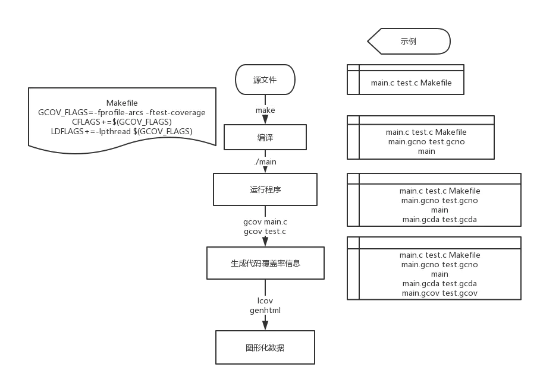

#一、流程梳理：
1.在对源代码进行编译时，我们使用make工具进行，并在编译过程中进行插桩。

编译后，还会获得源代码文件对应的gcno文件。

2.进行过插桩的程序，在被执行时即创建与源文件一一对应的.gcda文件。

.gcda文件会记录源代码的运行数据

3.在既有源文件又有gcda文件的情况下，使用命令gcov *.c，就会生成gcov文件

文件名为xxx.x.gcov

gcov文件包含着代码的覆盖信息

4.使用lcov生成info数据

5.最后使用lcov自带的genhtml工具，生成网页结果报告

总结来说如图所示


#二、应用示例：
##2.1.写个超简单的程序
由main.c和test.c组成

main.c

```cpp
#include <stdio.h>
#include <stdlib.h>

void test(int vount);

int main(int argc, char *argv[])
{
    int i = 0;
    if(argc == 2)
        i = -1;
    else
        i = 10;
    printf("arg is %d\n",i);
    test(i);
    return EXIT_SUCCESS;
}
```

test.c

```cpp
#include <stdio.h>

void test(int count)
{
    if (count == -1)
        printf ("获取到值为2,%d为-1,测试通道二已通过",count);
    else
        printf ("滴滴滴，测试通道一已通过");
}
```

##2.2.编写Makefile文件
使用Makefile文件用于编译

```makefile
GCOV_FLAGS=-fprofile-arcs -ftest-coverage
CFLAGS+=$(GCOV_FLAGS)
LDFLAGS+=-lpthread $(GCOV_FLAGS)

target=main

all:$(target)

main : test.o main.o
    $(CC) $(CFLAGS) $^ -o $@ $(LDFLAGS)
    @echo "gdb-gcov测试程序覆盖率..."

%.o : %.c
    $(CC) -g -c $^ -o $@ $(CFLAGS) $(DEFINES)

.PHONY : clean
clean :
    rm -rf *.o
    rm -rf $(target)
    rm -rf *.gcov *.gcda *.gcno
```
前三行用于设置GCC及插桩

需要注意的是，在这里，我们使用的是C语言。不同语言的源文件在编译时有所区别，具体请学习Makefile相关

##2.3.运行程序
	./main
	
##2.4.GCOV生成覆盖率数据
	gcov main.c
	gcov test.c
	
##2.5.LCOV处理数据并生成结果网页
	lcov -d . -t 'Main Test' -o 'main_test.info' -b . -c
	genhtml -o result main_test.info
最后再在文件夹中找到打开网页，即可查看到代码的覆盖率啦


#三、GCOV
##3.1 Gcov常用参数
参数 |	描述
| ---- | ---- |
-a|	输出每个基本块的运行计数, 此选项可用于统计在同一行中的若干语句的各自运行次数
-b|	输出分支语句频率信息到输出文件, 以及概要信息到标准输出, 但不显示无条件分支
-c|	以数字而不是百分比显示分支频率
-n|	不创建输出文件
-l|	创建的输出文件名中包含头文件名, 这对于头文件中包含代码并被多个源文件使用时有用
-p|	在 .gocv 文件名中加入完整的路径信息, 此时路径中的 ‘/’ 用 ‘#’ 表示, ‘..’ 用 ‘^’ 表示
-f|	输出每个函数的概要信息


#四.LCOV&Genhtml
##4.1 LCOV使用格式
	lcov -d . -t '表格名称' -o '文件名称.info' -b . -c
	
参数 |	描述
| ---- | ---- |
-d | 项目路径，即.gcda .gcno所在的路径
-a |合并（归并）多个lcov生成的info文件
-c |捕获，也即收集代码运行后所产生的统计计数信息
--external |捕获其它目录产生的统计计数文件
-i/--initial |初始化所有的覆盖率信息，作为基准数据
-o |生成处理后的文件
-r/--remove |移除不需要关注的覆盖率信息文件
-z |重置所有执行程序所产生的统计信息为0


** 注：如果使用CMake编译和构建的话，可以在指定路径的时候，统一使用项目的编译构建路径，即项目下源文件下创建的build目录作为路径，（运行lcov在项目的根路径）举例如下：

	lcov -c -i -d ./build -o init.info
	lcov -c -d ./build -o cover.info
	等等... ... 
	
##4.2 Genhtml使用格式
	genhtml -o 输出目录名 文件名.info

#五、demo2
##5.1 代码
###5.1.1 a.cpp

```cpp
int add (int a , int b ) {
    return a+b ;
}

int minus(int a , int b ) {
    return a-b ;
}
```
###5.1.2 a.hpp

```cpp
int add (int a , int b ) ;
int minus(int a , int b ) ;
```
###5.1.3 testa.cpp

```cpp
#include <iostream>

#include "a.hpp"

using namespace std ;

int main() {

    cout << add(10,20) << endl ;

    return 0 ;
}
```

这里的a.cpp和a.hpp中定义了两个接口 add 和 minus（暂不考虑溢出问题）。我们在testa.cpp中调用add这个接口。我们的代码覆盖率应该是50%，因为总共两个接口，我们只使用（调用）了其中一个。

##5.2 命令步骤

###5.2.1 编译

	g++ testa.cpp a.cpp -fprofile-arcs -ftest-coverage -lgcov -o test_cover
	
该命令在mac环境下，-lgcov换成-lpthread

> 这步可有可无，即归零所有执行过的产生覆盖率信息的统计文件:
> lcov -d ./ -z

###5.2.2 初始化并创建基准数据文件
	# -c 捕获，-i初始化，-d应用目录，-o输出文件
	lcov -c -i -d ./ -o init.info
	
###5.2.3 执行编译后的测试文件
	./test_cover
	
###5.2.4 收集测试文件运行后产生的覆盖率文件
	lcov -c -d ./ -o cover.info
	
###5.2.5 合并基准数据和执行测试文件后生成的覆盖率数据
	# -a 合并文件
	lcov -a init.info -a cover.info -o total.info
	
###5.2.6 过滤不需要关注的源文件路径和信息
	# --remove 删除统计信息中如下的代码或文件，支持正则
	lcov --remove total.info '*/usr/include/*' '*/usr/lib/*' '*/usr/lib64/*' '*/usr/local/include/*' '*/usr/local/lib/*' '*/usr/local/lib64/*' '*/third/*' 'testa.cpp' -o final.info
	
###5.2.7 通过final.info生成html文件

	#如果是git目录，可以获取此次版本的commitID，如果不是，忽略此步
	# commitId=$(git log | head -n1 | awk '{print $2}')
	# 这里可以带上项目名称和提交ID，如果没有，忽略此步
	#genhtml -o cover_report --legend --title "${project_name} commit SHA1:${commitId}" --prefix=${curr_path} final.info
	# -o 生成的html及相关文件的目录名称，--legend 简单的统计信息说明
	# --title 项目名称，--prefix 将要生成的html文件的路径 
	genhtml -o cover_report --legend --title "lcov"  --prefix=./ final.info


a.gcda、a.gcno、testa.gcda、testa.gcno就是运行可执行文件后gcov产生的统计信息文件。
cover_report目录就是生成的html信息目录。

这样，我们就可以通过firefox或者chrome打开cover_report/index.html来查看我们的代码覆盖率。

